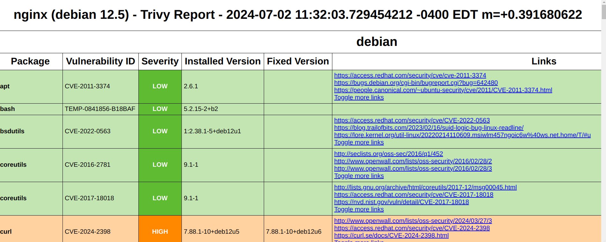

[Trivy](https://github.com/aquasecurity/trivy) is a vulnerability scanner for a wide variety of software artifacts and deployments. Trivy is written in the Go programming language and is maintained by [Aqua Security](https://www.aquasec.com/). Trivy targets container images, VMs, filesystems, remote GitHub repositories, and Kubernetes and Amazon Web Services deployments. The tool can be used to detect known vulnerabilities (CVEs), generate SBOMs, analyze licenses, and scan for misconfigurations and exposed secrets. Trivy can be installed from [package managers](#package-managers) or as a [binary](#binary-installation), and can also be run as a [container image](#container-image).

## Installation

### Package Managers

For Homebrew, use:

```bash
brew install trivy
```
Aqua Security [maintains sources and packages for a variety of additional operating systems and distributions](https://aquasecurity.github.io/trivy/latest/getting-started/installation/) on their installation page.

### Binary Installation

Aqua Security provides an [installation script for Trivy](https://raw.githubusercontent.com/aquasecurity/trivy/main/contrib/install.sh). To install Trivy with the script, change the `/usr/local/bin` argument to the desired installation location on your path before running the following command:

```bash
curl -sfL https://raw.githubusercontent.com/aquasecurity/trivy/main/contrib/install.sh | sh -s -- -b /usr/local/bin v0.52.2
```

On many system configurations, you may need to provide elevated permissions via `sudo`:

```bash
curl -sfL https://raw.githubusercontent.com/aquasecurity/trivy/main/contrib/install.sh | sudo sh -s -- -b /usr/local/bin v0.52.2
```

You can also manually install Trivy by downloading the binary for your operating system and architecture from the [Trivy releases page](https://github.com/aquasecurity/trivy/releases/tag/v0.52.2) and manually placing the binary on your path.

### Container Image

Container images for Trivy are hosted on a variety of registries. When running Trivy as a container image, it is recommended to mount a cache directory as a volume. For scanning container images, it is also recommended to mount `docker.sock`.

The following command will pull Trivy from Docker Hub, mount the two volumes, run the Trivy container, and use the running container to scan the official nginx image on Docker Hub:

```bash
docker run \
  -v /var/run/docker.sock:/var/run/docker.sock \
  -v $HOME/Library/Caches:/root/.cache/ \
  aquasec/trivy:0.52.2 \
  image nginx
```

## Basic Usage

Throughout this tutorial, we'll use the `trivy` command to run Trivy. If you're running Trivy as a container image, replace this command with the [appropriate `docker run` command](#container-image).

To use Trivy, provide a subcommand indicating the type of artifact or deployment to be scanned along with the location of the target. For example, to scan the official Python image on Docker Hub:

```bash
trivy image python
```

Trivy will output a series of informational messages, a short summary of CVEs found, including severity, and an itemized list of CVEs.

### Valid Targets

Trivy can scan a wide variety of artifacts, collections, or deployments, collectively called targets. Each type of software artifact has a specific set of Trivy scanners enabled by default. For example, when scanning container images, Trivy will look for vulnerabilities and exposed secrets by default.

### Scanning a Container Image

To scan a container image on Docker Hub, use the `image` subcommand and the name of the image as an  argument:

```bash
trivy image nginx
```

For images on other registries:

```bash
trivy image cgr.dev/chainguard/nginx:latest
```

#### Scanning a Filesystem

Trivy can recursively scan directories on a local machine.. To start a filesystem scan, run:

```bash
trivy fs <path>
```

where `<path>` indicates the root folder where the scan will begin. Trivy looks out for specific files containing lists of packages, such as Python's `requirements.txt` or `poetry.lock`, PHP's `composer.lock`, or Node's `package-lock.json`.

The following creates a Python project folder with virtual environment, installs a set of older packages, generates a `requirements.txt` file itemizing all transitive dependencies, and scans the project folder using Trivy:

```
mkdir python-project && cd python-project
python -m venv venv
./venv/bin/pip install WTForms==2.3.3 Werkzeug==2.0.1
./venv/bin/pip freeze > requirements.txt
trivy fs .
```
The following creates a default Node project, installs an older package with `npm`, and scans the project with Trivy:

```bash
mkdir node_project && cd node_project
npm init -y
npm install qs@6.5.2
trivy fs .
```

You should see a summary and itemized list of CVEs for the outdated Node package.

#### Scanning Clusters

To scan a Kubernetes cluster:

```bash
trivy k8s --report summary <cluster-name>
```

To try out the above command on a test Kubernetes cluster, First install [Kind](https://kind.sigs.k8s.io/docs/user/quick-start/#installation), a utility allowing Kubernetes to be run on your local machine.

Once Kind is installed and accessible on your path, run the following to create a cluster:

```bash
kind create cluster --name test-cluster
```

Run the following to scan the new cluster with Trivy:

```bash
trivy k8s --report summary kind-test-cluster
```

When scanning clusters, requesting only summary output is recommended, as tables in more verbose output may not display correctly.

### Scanning SBOMs

Trivy can both generate and scan SBOMs.





First, generate an SBOM file in CycloneDX format to scan

```bash
trivy image -f cyclonedx -o results.cdx.json nginx
```

Trivy can scan this generated CycloneDX SBOM with the following:

```bash
trivy sbom results.cdx.json
```

By default, the `sbom` subcommand scans only for vulnerabilities. License scanning can be enabled using the `--scanners license` flag.

Some image providers, such as Chainguard, associate images with an [SBOM attestation](https://edu.chainguard.dev/open-source/sbom/sboms-and-attestations/) verifying that the image has not been tampered with since the time of creation. Trivy provides functionality to query attestations registered in the [Rekor transparency log](https://github.com/sigstore/rekor). To retrieve an SBOM attestation from a Rekor transparency log, set the `--sbom-sources` flag to `rekor` and provide the `--rekor-url` flag to the instance of the transparency log you wish to query against. The following will perform a scan using the SBOM attestation for Chainguard's `nginx` image as registered on the [Rekor public server](https://rekor.sigstore.dev/):

```bash
trivy image --sbom-sources rekor --rekor-url https://rekor.sigstore.dev/ cgr.dev/chainguard/nginx
```

Learn more about SBOMs and other output formats in the section on [specifying output formats](#specifying-output-formats).

## Comprehending Trivy Output

When run with default output and formatting, Trivy first prints a series of informational messages and warnings, then the name of the image and a one-line summary of the number and severity of issues found, and finally a table itemizing each issue.

 In this section, we'll use an Alpine version of the official Python image as an example. Since we're specifying an older version, you may encounter more CVEs when following the examples than are shown here, as CVEs will accumulate on an image over time.

Scan the image with the following command:

```bash
trivy image python:3.10.14-alpine3.20
```

You will receive output similar to the following:


### Interpreting Trivy Output

The initial logging portion of Trivy's output indicates which [scanners](#scanners) are enabled and shows warnings if Trivy has an issue performing the scan.

In the initial portion of its results output, Trivy summarizes information on the scanned artifact and gives an overview of known vulnerabilities. In the case of a scanned image, the output includes the image digest. This is a unique hash of the image that can be used as an identifier.

Following the log, Trivy shows the name of the image and a count of issues by severity.

```
Total: 8 (UNKNOWN: 0, LOW: 0, MEDIUM: 8, HIGH: 0, CRITICAL: 0)
```

 When scanning for vulnerabilities, this severity categorization sorts CVEs into four categories based on the Common Vulnerability Scoring System (CVSS).





In the case of a license scan, Trivy instead uses its own assessment of the business risk posed by specific license clauses. Similarly, explosed secrets and misconfigurations have their own severity mapping as determined by Aqua Security.

### Itemized CVEs

In addition to the log and brief summary, Trivy provides an itemized list of issues. By default, these are in table format, and for a vulnerability scan list the library, vulnerability, severity, status, installed version, and fixed version of each issue. Other types of scan list different data—for example, a license scan lists the package, license, license classification, and perceived severity of business risk.

When scanning for vulnerabilities, information on fixed version can show which CVEs can be resolved by bumping the library version. Trivy also provides a short prose description of the nature of each issue.

By default, Trivy's table output is relatively verbose, and Trivy does not respect the traditional 80-character line limit on terminal output. See [Output Formats and Verbosity](#output-formats-and-verbosity) for information on more granular control over Trivy's output.

## Scanners

### Specifying Scanners

Trivy can scan not only for known vulnerabilities, but also for misconfigurations, exposed secrets, and license risks. When scanning container images or filesystems, Trivy scans for vulnerabilities and exposed secrets by default.

Individual scanners can be selected by passing a comma-separated list after the `--scanners` flag. To add a misconfigurations scan to an analysis of a container image:

```bash
trivy image --scanners vuln,misconfig,secret nginx
```

To recursively scan only for exposed secrets on a filesystem:

```bash
trivy fs --scanners secret .
```

This will perform a recursive scan of all files and folders in the current working directory.

### License Scanning

Trivy provides an opinionated license scan that flags license clauses that may pose a business risk. To perform a license scan on a container image:

```
trivy image --scanners license nginx
```

By default, the Trivy license scan only looks at packages installed by managers such as `apt` or `apk`. To scan other files, add the `--license-full` flag:

```bash
trivy image --scanners license --license-full nginx
```
Using the `--license-full`flag will also show results for "loose" licenses, such as those provided as text files in project folders.

## Output Formats and Verbosity

### Specifying Output Formats

Trivy allows output in JSON, SARIF, CycloneDX, SPDX, SPDX-JSON, and GitHub formats. If no output or format flags are specified, Trivy first prints a series of informative messages and warnings to `stderr` and then prints a table of results to `stdout`.

The `-q` or `--quiet` flag suppresses the logging output normally printed to `stderr`. The following returns just the line summarizing the number and severity of issues:

```bash
trivy image -q nginx | grep Total:
```

```
Total: 173 (UNKNOWN: 2, LOW: 88, MEDIUM: 59, HIGH: 22, CRITICAL: 2)

```

The `-f` or `--format` flag specifies the output format, and the `-o` or `--output` flag specifies an output file. The following writes a JSON-formatted report to a `results.json` file.

```bash
trivy image -f json -o results.json nginx
```
Similarly, the following would write a report in SARIF format:

```bash
trivy image -f sarif -o results.sarif nginx
```
Other formats can be generated by passing the appropriate format type with the `-f` or `--format` flag.

### Generating SBOMs

The CycloneDX, SPDX, and SPDX-JSON output formats are considered SBOMs, and can be scanned with the `trivy sbom` subcommand. The following command will generate an SBOM in CycloneDX format:

```bash
trivy image -f cyclonedx -o results.cdx.json nginx
```

See [Scanning SBOMs](#scanning-sboms) for more on scanning these output formats.


### Generating a Report from a Template

Trivy can generate reports in additional formats from user-contributed templates. To use templates, first clone the Trivy GitHub repository to your home folder:

```bash
git clone https://github.com/aquasecurity/trivy.git ~/.trivy
```
To generate a report using the HTML template, specify the path to the template in the cloned repository:

```bash
trivy image --format template --template "@.trivy/contrib/html.tpl" -o report.html nginx
```

This HTML output can be significantly more readable than Trivy's default table output:



Other template-based output formats can be browsed in the [Trivy contrib directory](https://github.com/aquasecurity/trivy/tree/main/contrib).

## Trivy Resources

The following resources may complement your use of Trivy:

- [Trivy Documentation](https://aquasecurity.github.io/trivy/latest) — Documentation on the latest version of Trivy
- [Trivy Operator for Kubernetes](https://github.com/aquasecurity/trivy-operator) — An operator to continuous scan a Kubernetes cluster for issues
- [Trivy Announcements](https://github.com/aquasecurity/trivy/discussions/categories/announcements) — News on Trivy from Aqua Security
