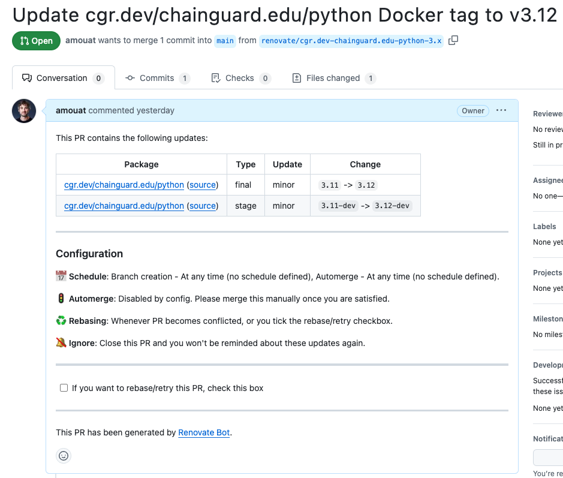
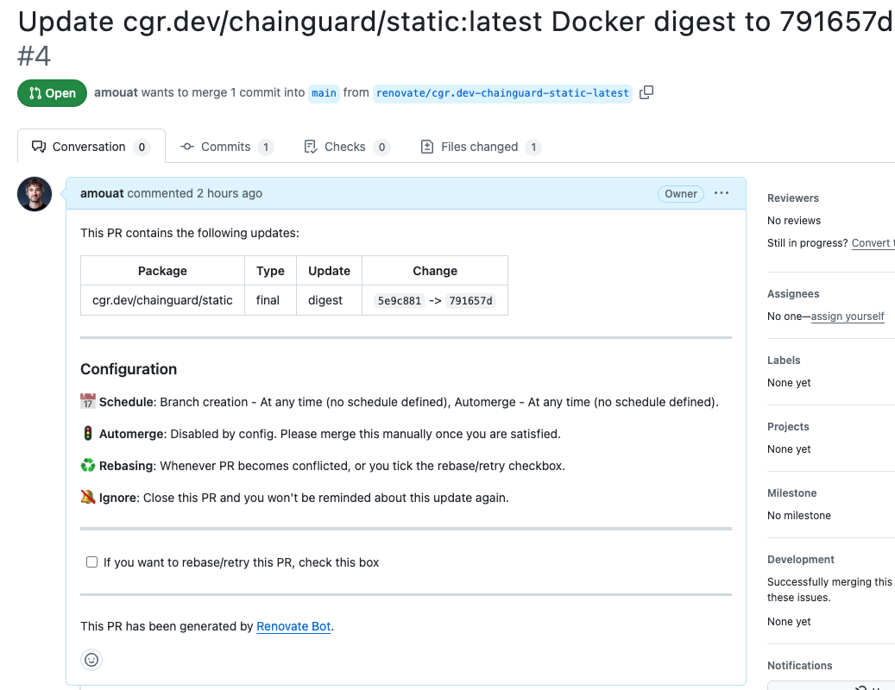

[Renovate](https://github.com/renovatebot/renovate) can be used to alert on updates to Chainguard Images. This can be an effective way to keep your images up-to-date and CVE free. This article will explain how to configure Renovate to support Chainguard Images.

> **NOTE*: This article describes using Renovate to alert on new versions of Chainguard Images. It is not about alerts for Wolfi packages (which is unsupported at the time of writing).


## Prerequisites

This guide assumes you have successfully installed and configured Renovate. If you haven't already set this up, please refer to the [installation instructions](https://docs.renovatebot.com/getting-started/installing-onboarding/).


## Setting up Credentials for Renovate

In order to support versioned images from a private repository, you will need to provide Renovate with credentials to access the Chainguard registry at `cgr.dev`. You can do this by creating a token with `chainctl`, as in this example:

```shell
chainctl auth configure-docker --pull-token
```

This will respond with output such as:

```shell
To use this pull token in another environment, run this command:

    docker login "cgr.dev" --username "<USERNAME>" --password "<PASSWORD>"
```

By default, this credential is good for 30 days.

You can now configure `hostRules` in Renovate to support our registry. Depending on how Renovate was set up, you can add this to `renovate.json` or `config.json` with a setting such as:

```
{
...
   "hostRules": [
    {
      "hostType": "docker",
      "matchHost": "cgr.dev",
      "username": "<USERNAME>",
      "password": "<PASSWORD>"
     }]
}
```

Be aware that you **SHOULD NOT** check this file into source control with the exposed secret. Instead, you can use environment variables which you pass in at runtime:

```json
{
...
   "hostRules": [
    {
      "hostType": "docker",
      "matchHost": "cgr.dev",
      "username:" process.env.CGR_USERNAME,
      "password:" process.env.CGR_PASSWORD,
     }]
}
```

But an even more secure solution would be to create a script which automatically updates the configuration with the correct values by calling `chainctl`. If you do this, you should also set the credential lifetime to a much shorter period with the `–ttl` flag:

```shell
chainctl auth configure-docker --pull-token –ttl 10m
```

This will set the lifetime to 10 minutes, which limits the risk posed if the token should leak. You can also set the lifetime to a longer period for more manual configurations.


## Updating Versioned Images

By default, Renovate will now open PRs for any out-of-date versions of images it finds. For example, you can run Renovate by pushing the following Dockerfile to a repository overseen by Renovate:

```
FROM cgr.dev/chainguard.edu/python:3.11-dev AS builder
...

FROM cgr.dev/chainguard.edu/python:3.11
...
```

At the time of writing, version 3.12 was the current version of the Python image, so the following PR was opened by Renovate:



Not all images use semantic versioning. Refer to the [Renovate documentation](https://docs.renovatebot.com/modules/manager/dockerfile/\#additional-information) for details on how to support different schemes.

Ideally, image references should also be pinned to a digest, as shown in the following section.

## Updating `:latest` Images

Renovate also supports updating image references that are pinned to digests. This allows you to keep floating tags such as `:latest` in sync with the most up-to-date version. 

As an example, for the following Dockerfile Renovate opened two similar pull requests:

```
FROM cgr.dev/chainguard/go:latest-dev@sha256:ff187ecd4bb5b45b65d680550eed302545e69ec4ed45f276f385e1b4ff0c6231 as builder

WORKDIR /work

COPY go.mod /work/
COPY cmd /work/cmd
COPY internal /work/internal

RUN CGO_ENABLED=0 go build -o hello ./cmd/server

FROM cgr.dev/chainguard/static:latest@sha256:5e9c88174a28c259c349f308dd661a6ec61ed5f8c72ecfaefb46cceb811b55a1
COPY --from=builder /work/hello /hello

ENTRYPOINT ["/hello"]
```

The following screenshot shows the PR to update the static image:



## Troubleshooting

### Connection Errors

If you have problems getting Renovate to monitor `cgr.dev`, please double check the connection details. Make sure the token is still valid (you can verify with `chainctl iam identities list`) and it has access to the repository you are referring to. You can test these credentials by running a `docker login` and `docker pull` in a clean environment.

### getRelaseList error

You may encounter errors such as the following:

```
DEBUG: getReleaseList error (repository=chainguard-images/images-private, branch=renovate/cgr.dev-chainguard.edu-python-3.x)
       "type": "github",
       "apiBaseUrl": "https://api.github.com/",
       "err": {
         "message": "`chainguard-images` forbids access via a personal access token (classic). Please use a GitHub App, OAuth App, or a personal access token with fine-grained permissions.",
         "stack": "Error: `chainguard-images` forbids access via a personal access token (classic). Please use a GitHub App, OAuth App, or a personal access token with fine-grained permissions.\n    at
…
```

These can be safely ignored. They are caused by Renovate using the `org.opencontainers.image.source` label on our images to look for a changelog. As this source is set to the private `images-private` GitHub repository, this request fails.
