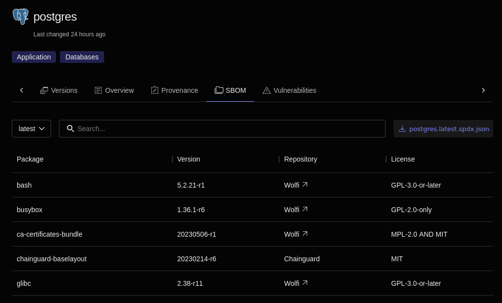

Chainguard Images contain only the minimum number of packages needed to use the software they contain. The purpose of this is to reduce the image's attack surface and minimize the risk that CVEs will impact software that depends on these container images. 

Even though they contain the minimum number of packages, there may come a time when you want to know exactly what's running inside of a certain Chainguard Image. For this reason, we include a signed SBOM with each image in the form of a [software attestation](https://slsa.dev/attestation-model).

[Cosign](/open-source/sigstore/cosign/an-introduction-to-cosign/) — a part of the Sigstore project — supports software artifact signing, verification, and storage in an [OCI (Open Container Initiative)](/open-source/oci/what-is-the-oci/) registry, as well as the retrieval of said artifacts. This tutorial outlines how you can use the `cosign` command to retrieve a Chainguard Image's SBOM. 


## Prerequisites

In order to follow this guide, you'll need the following installed on your local machine:

* **Cosign** — to retrieve SBOMs associated with Chainguard Images, check out [our guide on installing Cosign](/open-source/sigstore/cosign/how-to-install-cosign/) to configure it.
* **jq** — to process JSON, visit the [jq downloads](https://jqlang.github.io/jq/download/) page to set it up.


## Using Cosign to retrieve an Image's SBOM

Cosign includes a `download` command that allows you to retrieve a Chainguard Image's attestation over the command line. To do so, you would use this command with syntax like the following.

```shell
cosign download attestation cgr.dev/chainguard/php | jq -r .payload | base64 -d | jq .predicate
```

This example command downloads the attestation of our [php image](/chainguard/chainguard-images/reference/php/). 

Notice that this example syntax includes `download attestation` rather than `download sbom`. You can generally think of an attestation as an authenticated statement about a software artifact. There are different types of attestations [as defined by the SLSA 1.0 specification](https://slsa.dev/attestation-model), and they are typically referenced by their **predicate type**. One of the available predicate types is SPDX, an open standard for SBOM files. Because attestations must be signed, this is a way to verify the authenticity of the software producer, thereby ensuring the accuracy of the SBOM and the quality of the software.

This attestation data is encoded in base64, making it unreadable without further processing. This is why the output from the first part of the command is piped into `jq` in order to filter out the payload section of the output containing the SBOM. This filtered output is then passed into the `base64` command to be decoded before that output is piped into another `jq` command. The final `jq` command extracts the attestation predicate from the `base64` output and returns it to your terminal.

As an example, to retrieve the `argocd` image's attestation you would run a command like this.

```shell
cosign download attestation \
  --platform=linux/amd64 \
  --predicate-type=https://spdx.dev/Document \
  cgr.dev/chainguard/argocd | jq -r .payload | base64 -d | jq .predicate
```

This example includes two extra arguments not included in the example syntax outlined previously. First, it includes the `--platform` flag which allows you to download the attestation for a specific platform image. This example specifies the `linux/amd64` platform, but you could also use `linux/arm64`. Be aware, though, that in order to use the `--platform` option you'll need to have Cosign version 2.2.1 or newer installed.

The other extra argument is the `--predicate-type` flag, required to specify which type of predicate you want to download from the registry. In order to download Chainguard Images SBOM attestations, you should use the `https://spdx.dev/Document` predicate type.


## Image SBOMs in the Chainguard Console

You can also find Image SBOMs in the [Chainguard Console](https://console.enforce.dev). After signing in to the Console and clicking either the **Public images** or, if available, **Organization images** you'll be presented with a list of images. Clicking on any of these will take you to the image's landing page. There, you can click on the [**SBOM** tab](/chainguard/chainguard-images/images-directory/#sboms-tab) to find and download the SBOM for the given Image. 

The following example shows the **SBOM** tab for the `postgres` Image.



You can use the drop-down menu above the table to select which version of the image you want to view. You can also use the search box to find specific packages in the SBOM or use the button to the right of the search box to download the SBOM to your machine.

Check out our guide on [using the Chainguard Images Directory](/chainguard/chainguard-images/images-directory/) for more details.


## Learn more

We provide provenance information for every Chainguard Image in their respective [Reference docs](/chainguard/chainguard-images/reference/). After reaching the **Overview** for the image of your choice, navigate to the **Provenance** tab for information on how to retrieve the image's attestations, as well as how to verify the image's attestations and signatures.

For example, if you're looking for the provenance information of the Python image, you can navigate to the [Python overview page](/chainguard/chainguard-images/reference/python/) and then click through to [the **Provenance** tab](https://edu.chainguard.dev/chainguard/chainguard-images/reference/python/provenance_info/).