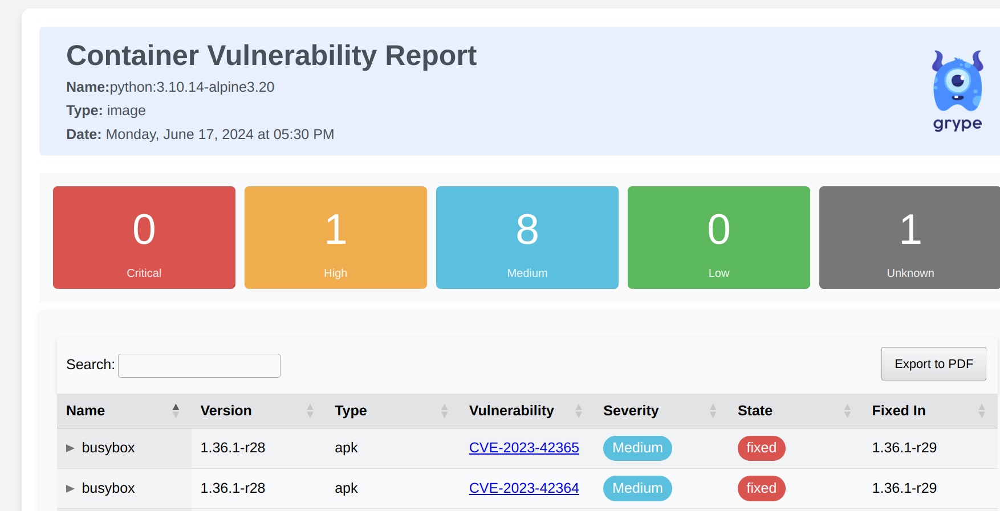

[Grype](https://github.com/anchore/grype) is a vulnerability scanner for container images and filesystems developed and maintained by [Anchore](https://anchore.com/) and written in the Go programming language. Grype can scan from Docker, OCI, Singularity, podman, image archives, and local directory. Grype is compatible with SBOMs generated by [Syft](https://github.com/anchore/syft), and Grype's [vulnerability database](https://github.com/anchore/grype-db) draws from a wide variety of sources, including [Wolfi SecDB]( https://github.com/wolfi-dev/wolfictl/blob/main/docs/cmd/wolfictl_advisory_secdb.md).

Grype is appropriate for one-off detection for manual CVE mitigation and in automated use in CI pipelines. Chainguard maintains a [low-to-no CVE Chainguard Image for Grype](/chainguard/chainguard-images/reference/grype/) based on our lightweight Wolfi distribution.

## Installation

### Container Images

Grype is readily available as a container image. To pull the low-to-no-CVE Chainguard Image for Grype and perform a scan on the official Docker nginx image, run the following:

```bash
docker run -it cgr.dev/chainguard/grype nginx
```

Alternatively, you can scan using the official Grype Docker image:

```bash
docker run -it anchore/grype:latest nginx
```

### Binary Installation

Grype provides an installation script. To use it, change the path following the `-b` flag to a preferred installation location on your system path, such as `/usr/bin`.

```bash
curl -sSfL https://raw.githubusercontent.com/anchore/grype/main/install.sh | sh -s -- -b /usr/local/bin
```

Alternatively, find and download the appropriate package file or binary from the [official releases page](https://github.com/anchore/grype/releases). Place the binary on your system path or install the package using the conventions for your OS and distribution.

Note that Grype can also be [built from source](https://github.com/anchore/grype/blob/main/DEVELOPING.md#native-development).

### Install via Package Manager

Grype can be installed using the following commands specific to your OS and distribution: 

#### Homebrew

```bash
brew tap anchore/grype
brew install grype
```

#### Chocolatey

```cmd
choco install grype -y
```

## Basic Usage

Throughout this tutorial, we'll use the `grype` command to run Grype. If you're running Grype as a container image, replace this command with the appropriate `docker run` command, such as `docker run -it cgr.dev/chainguard/grype`.

### Scan an Image in a Registry

To run Grype on an image on Docker Hub, pass the image name as an argument:

```bash
grype nginx
```

For images on other registries:

```bash
grype cgr.dev/chainguard/nginx
```

### Scan a .tar File

To scan an image stored to `.tar`, pass the path to the archive file as an argument:

```bash
docker pull cgr.dev/chainguard/nginx
docker save cgr.dev/chainguard/nginx > nginx_chainguard_image.tar.gz
grype nginx_chainguard_image.tar.gz
```

### Scan a Local Directory

Grype can scan local directories, such as Python virtual environments (venv) or `node_modules` folders.

To try it out, start by creating a Python virtual environment:

```bash
python -m venv venv
```

Add a few out-of-date packages that will show vulnerabilities:

```bash
./venv/bin/pip install WTForms==2.3.3 Werkzeug==2.0.1
```

Scan the virtual environment folder by passing the folder path to Grype as an argument:

```bash
grype venv
```

We can do the same with node modules in a mode_modules folder. First, create an empty project folder and change the working directory to that folder:

```bash
mkdir node_project && cd node_project
```

Next, initialize npm with a default configuration:

```bash
npm init -y
```

Install a package with known vulnerabilities. The 6.5.2 version of the `qs` query string parser has a known vulnerability [allowing for prototype poisoning](https://security.snyk.io/package/npm/qs/6.5.2).

```bash
npm install qs@6.5.2
```

Finally, use Grype to scan the current working directory:

```bash
grype .
```

### Scan from an SBOM

Grype can read vulnerabilities from SBOMs generated by [Syft](https://github.com/anchore/syft). SBOMs can be piped into Grype using stdin:

```bash
syft -o syft-json python > sbom.json
cat sbom.json | grype               
```

You should see Grype results based on the packages itemized in the SBOM.

## Comprehending Grype Output

By default, Grype output is divided into two sections: a summary of information on the scanned artifact and an itemized list of CVEs.

 In this section, we'll use an Alpine version of the official Python image as an example. Since we're specifying an older version, you may encounter more CVEs when following the examples than are shown here, as CVEs will accumulate on an image over time.

Scan the image with the following command:

```bash
grype python:3.10.14-alpine3.20
```

You will receive output similar to the following:

```
 ✔ Vulnerability DB                [no update av
 ✔ Parsed image                    sha256:f48490
 ✔ Cataloged contents              09feb83998b9d
   ├── ✔ Packages                        [47 pac
   │     └── ⠹ Linux kernel cataloger          
   ├── ✔ File digests                    [659 fi
   ├── ✔ File metadata                   [659 lo
   └── ✔ Executables                     [144 ex
 ✔ Scanned for vulnerabilities     [10 vulnerabi
   ├── by severity: 0 critical, 1 high, 8 medium
   └── by status:   7 fixed, 3 not-fixed, 0 igno
NAME           INSTALLED   FIXED-IN    TYPE    VULNERABILITY        SEVERITY 
busybox        1.36.1-r28  1.36.1-r29  apk     CVE-2023-42365       Medium    
busybox        1.36.1-r28  1.36.1-r29  apk     CVE-2023-42364       Medium    
busybox-binsh  1.36.1-r28  1.36.1-r29  apk     CVE-2023-42365       Medium    
busybox-binsh  1.36.1-r28  1.36.1-r29  apk     CVE-2023-42364       Medium    
pip            23.0.1      23.3        python  GHSA-mq26-g339-26xf  Medium    
python         3.10.14                 binary  CVE-2023-36632       High      
python         3.10.14                 binary  CVE-2023-27043       Medium    
python         3.10.14                 binary  CVE-2024-4030        Unknown   
ssl_client     1.36.1-r28  1.36.1-r29  apk     CVE-2023-42365       Medium    
ssl_client     1.36.1-r28  1.36.1-r29  apk     CVE-2023-42364       Medium
```

### Interpreting the Summary

In the initial portion of its results output, Grype summarizes information on the scanned artifact and gives an overview of known vulnerabilities. In the case of a scanned image, the output includes the image digest, a unique hash of the image that can be used as an identifier. 

Overview output includes the number of packages, files, and executables found in the artifact. Generally speaking, CVEs are detected against packages, but the number of executables detected can also give you an idea of the attack surface of the scanned image or filesystem.

Finally, this portion gives a count of the number of CVEs detected by severity and fixed status. Severity categorization sorts CVEs into four categories based on the Common Vulnerability Scoring System (CVSS).





In our output, we can see that we have 0 critical, 1 high, and 8 medium CVEs:

```
   ├── by severity: 0 critical, 1 high, 8 medium, 0 low, 0 negligible 
```
Grype also counts the number of CVEs by fixed status. If a CVE is marked as fixed, it can be resolved by updating to a newer version of the package. Our output suggests that 7 packages have been fixed and can be remediated with updates:

```
   └── by status:   7 fixed, 3 not-fixed, 0 ignored 
```
### Itemized CVEs

In addition to the summary, Grype provides an itemized list of CVEs. By default, these are in table format, and list the package name, current version, severity, and package type (such as `apt`, `apk`, `binary`). If the package is fixed, Grype will also indicate the package version where the fix was introduced.

Grype writes itemized CVEs to stdout, so you can redirect the report of itemized CVEs to a file:

```bash
grype python:3.10.14-alpine3.20 > report.txt
```
Alternatively, you can use the `--file` flag to write to a file:


```bash
grype --file report.txt python:3.10.14-alpine3.20
```

Redirecting output can also be useful to suppress a long list of CVEs, making the summary more immediately accessible.

## Output Formats

### Standard Formats

You can use Grype to write itemized CVEs to a number of formats, including the XML- or JSON-based [cyclonedx](https://cyclonedx.org/) SBOM standard and the [SARIF](https://sarifweb.azurewebsites.net/) static analysis format. To maximize the information provided by Grype, use the JSON output type:

```bash
 grype -o json python:3.10.14-alpine3.20 > report.json
```

When using these more detailed formats, Grype provides additional useful fields, such as the data source of the CVE, URLs to information on the CVE, advisories, related vulnerabilities, and details on how the vulnerability was detected.

### Output Templates

Additional output formats are available as Hugo templates. These include output templates for HTML and CSV, and a [full list](https://github.com/anchore/grype/tree/main/templates) can be found at the Grype GitHub repository.

To generate a HTML file of the itemized CVEs, first clone the Grype repository from GitHub. Then provide the path to the template file in your `grype` command:

```bash
git clone git@github.com:anchore/grype.git ~/.grype
grype -o template -t ~/.grype/templates/html.tmpl python:3.10.14-alpine3.20 > report.html
```



To generate a CSV:

```bash
git clone git@github.com:anchore/grype.git ~/.grype
grype -o template -t ~/.grype/templates/csv.tmpl python:3.10.14-alpine3.20 > report.csv
```

## `grype explain`

Grype provides an explain subcommand that gives information on the nature of a specific CVE, how it was matched, and the locations of files associated with the vulnerability. The output of this command suggests a useful starting point for remediation.

To use `grype explain`, generate JSON output from Grype and pipe it into the `grype explain` subcommand. Indicate the CVE you'd like information on using the `--id` flag. The `-q` flag in the following example suppresses the summary output.

```bash
 grype -q python:3.10.14-alpine3.20 -o json | grype explain --id CVE-2023-36632
 ```

Grype uses information from the JSON output to generate a human-readable report on the specific CVE that includes match information, file locations, and links to information on the vulnerability.

## Additional Resources

The following resources may also be useful while working with Grype:

### Tools

- [Syft](https://github.com/anchore/syft) - A Grype-compatible tool for generating SBOMs from images and filesystems.
- [Grype-DB](https://github.com/anchore/grype-db) - A tool to build Grype databases from specific upstream vulnerability database providers
- [vunnel](https://github.com/anchore/vunnel) - Atool for collating vulnerability provider data
- [Grype Chainguard Image](https://edu.chainguard.dev/chainguard/chainguard-images/reference/grype/) — A low-to-no CVE container image maintained by Chainguard

### More on Grype

- [Grype on the Anchore blog](https://anchore.com/search/?search=grype) - Blog posts from Anchore related to Grype
- [Why Chainguard uses Grype](https://www.chainguard.dev/unchained/why-chainguard-uses-grype-as-its-first-line-of-defense-for-cves) - Why Chainguard contributes to and recommends Grype for vulnerability scanning in container images
