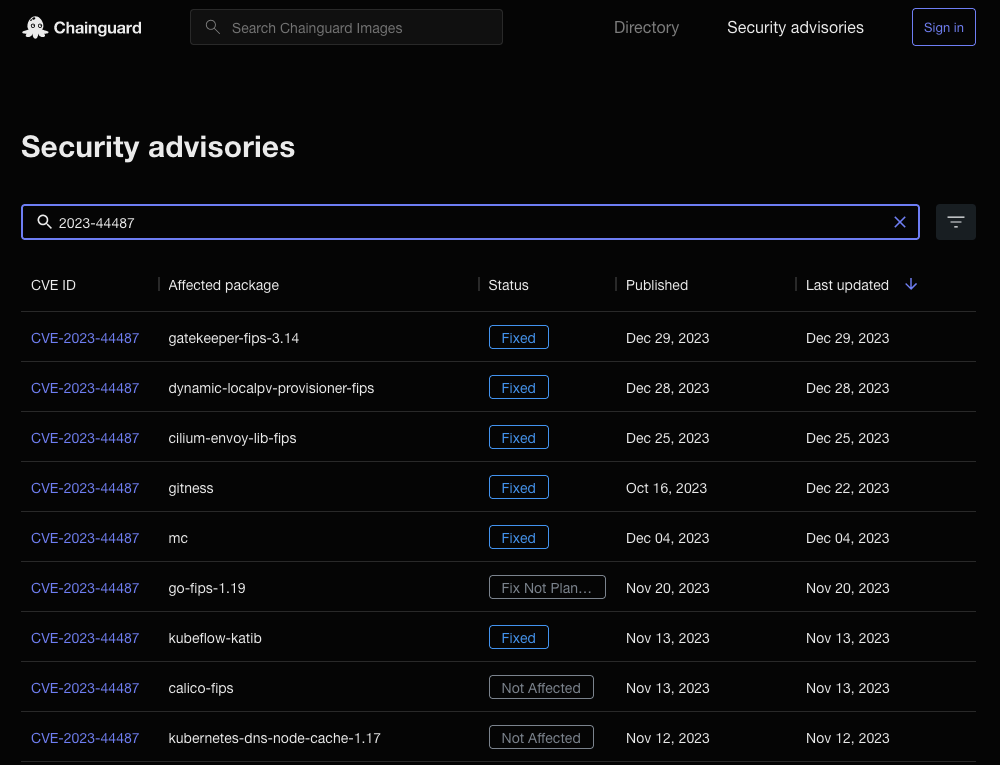
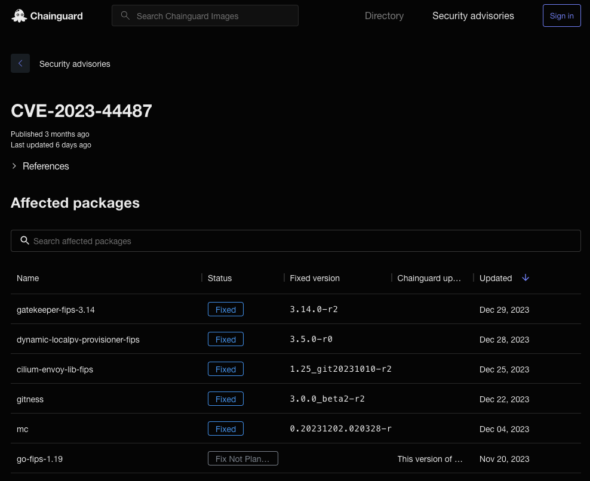
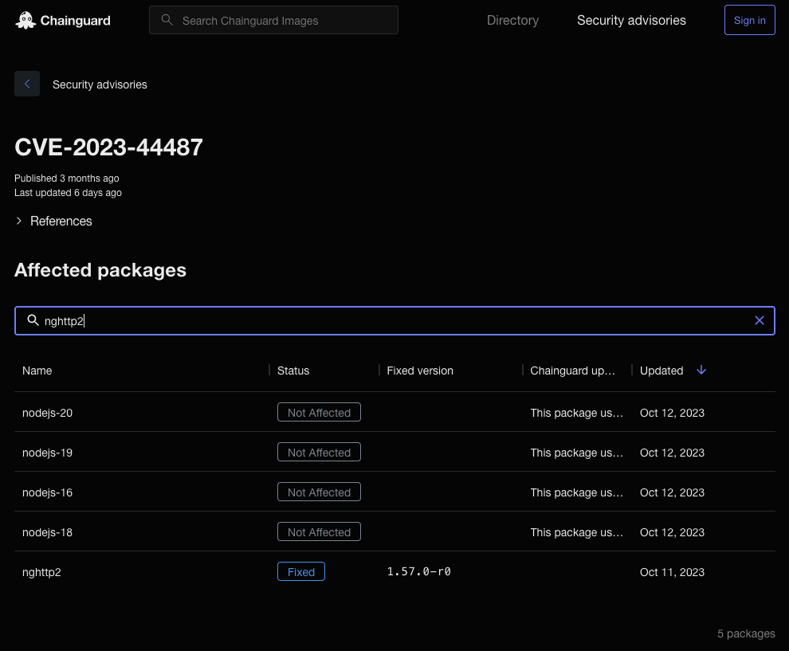

When using scanners such as [Grype](https://github.com/anchore/grype) or [Docker Scout](https://docs.docker.com/scout/) to scan for vulnerabilities in Chainguard Images, you'll often find that there are few or no CVEs present. However, CVEs can sometimes be found in Chainguard Images, and you may also encounter CVEs if you're using older tags. In these cases, you will likely wish to check Chainguard's security advisories for information on which CVEs will cause security issues in your deployment.

To help demystify the nature of CVEs within Chainguard Images, we've created a self-service [Security Advisories page](https://images.chainguard.dev/security?utm_source=cg-academy&utm_medium=website&utm_campaign=dev-enablement&utm_content=edu-content-chainguard-chainguard-images-working-with-images-security-advisories-how-to-use) that lists every security advisory published for Chainguard Images. Having this information available allows you to view whether Chainguard is aware of a specific vulnerability reported to exist within a Chainguard Image and whether we've mitigated or are planning to mitigate the CVE.

This guide outlines how you can use Chainguard's Security Advisories to learn more about the status of a CVE within a given package. It will walk through a practical example of discovering a vulnerability in a Chainguard Image, searching for Security Advisories associated with this vulnerability, and then comparing the original Image with a later version.

## Prerequisites

You don't need any special access or software to explore Chainguard's Security Advisories. However, this guide includes a few examples that use specific software tools in order to outline a practical example of how one might navigate and use these Security Advisories.

To follow along with these examples, you'll need the following tools installed.

* A security scanner like [Trivy](https://aquasecurity.github.io/trivy/v0.18.3/installation/), [Grype](https://github.com/anchore/grype#installation), or [Docker Scout](https://docs.docker.com/get-docker/) — This guide's examples use Grype to scan container images and identify vulnerabilities. However, you should be able to follow along with any container vulnerability scanning tool.
* [`chainctl`](/chainguard/chainctl/) — Chainguard's command-line interface tool. To install `chainctl`, follow our [installation guide](/chainguard/administration/how-to-install-chainctl/). 
* [`jq`](https://jqlang.github.io/jq/) — `jq` is a command-line JSON processor that allows you to filter and manipulate streaming JSON data. Although it isn’t strictly necessary for the purposes of this guide, this tutorial includes commands that use `jq` to filter command output that would otherwise be difficult to read. You can install `jq` by following the instructions on [the project’s Download jq page](https://jqlang.github.io/jq/download/).

Lastly, note that this guide includes examples involving a sample organization with a private Chainguard Registry named `example.com`. If you would like to follow along with your own private Chainguard Images, be sure to change this where relevant to reflect your own setup. If you don't have access to a private Chainguard Registry, you can also follow along using Chainguard's public Developer Images, but be aware that these are limited to only the `latest` or `latest-dev` tags. You can download public Developer Images from the `cgr.dev/chainguard` registry, as in `cgr.dev/chainguard/go:latest`.


## So you've encountered a CVE in a Chainguard Image

Say you use a vulnerability scanner like Grype or Docker Scout to inspect a certain Chainguard Image. This example uses Grype to scan a Chainguard Production Image, specifically one tagged with `1.21.2`.

As of this writing, the `go:1.21.2` image points to the image digest `sha256:04ab6905552b54a6977bed40a4105e9c95f78033e1cde67806259efc4beb959d`. Be aware that this tag will be withdrawn in the future, but the digest will remain available.

```sh
grype cgr.dev/example.com/go:1.21.2
```

Because this is the digest for an older version of Chainguard's Go Image, this command's output will show a number of vulnerabilities that have been found to exist within this specific version of the Image. 

```
. . .

   ├── by severity: 28 critical, 230 high, 185 medium, 4 low, 0
...
```

This output shows that this particular image has many critical and high vulnerabilities. The Grype output also lists each of the packages affected by CVEs as well as the specific vulnerabilities it found for each.

> Note: All of these vulnerabilities have been addressed in newer versions of the Chainguard Go Image.

Within this output,, we find that the package `nghttp2` is referenced. 

```sh
grype cgr.dev/example.com/go:1.21.2| grep nghttp2
```

```
...
libnghttp2-14        1.56.0-r0  1.57.0-r0        apk        CVE-2023-44487       High      
libnghttp2-14        1.56.0-r0  1.61.0-r0        apk        CVE-2024-28182       Medium    
libnghttp2-14        1.56.0-r0  1.57.0-r0        apk        GHSA-qppj-fm5r-hxr3  Unknown   
```

We'll use the `HIGH` severity vulnerability listed here as an example when we explore Chainguard's Security Advisories in the next section.

Copy or note down the CVE identifier (`2023-44487` in this case). Additionally, note down the name of the affected package (`nghttp2`). You'll use these details to retrieve more information about the CVE shortly. 


## Searching the Security Advisories

After finding a vulnerability in a Chainguard Image, you can navigate to [Chainguard's **Security Advisories** page](https://images.chainguard.dev/security?utm_source=cg-academy&utm_medium=website&utm_campaign=dev-enablement&utm_content=edu-content-chainguard-chainguard-images-working-with-images-security-advisories-how-to-use). This is a helpful resource you can use to determine the status for any CVE found within a Chainguard Image.

The Security Advisories page is self-service, allowing you to check whether Chainguard is aware of a specific vulnerability and whether it has been mitigated in a certain package version. You can search the Security Advisories page by entering any CVE identifier to find what packages are affected by that CVE. You can also enter the names of individual packages to find what CVEs have been reported within them.

Enter the CVE identifier you copied previously (`2023-44487`) into the search box at the top of the page. This will immediately filter the list of security advisories to only show packages where that CVE has been reported. It will also show the **Status** of each.



If you click on any row in the filtered list, it will take you to the CVE's specific page. There, you'll find a list of every package where this CVE has been reported.



As with the Security Advisories landing page, you can filter by package name here on the CVE's landing page as well. Enter the name of the package we highlighted previously (`nghttp2`) and the index will immediately filter out any packages that do not mention that string in their metadata.



As the previous screenshot highlights, for CVE-2023-44487, the `nghttp2` package's **Status** is marked as **Fixed** in version `1.57.0-r0` as of October 11, 2023.


## Comparing Images

Chainguard's Security Advisories have told us that the CVE-2023-44487 was fixed and removed from `nghttp2` with a more recent version than the one available in Chainguard's `go:1.21.2` Image. However, we don't have to take that report at face value; we can inspect a later version of the same Image and compare it with version `1.21.2` to determine whether the vulnerability is still present in the later version.

If you inspect a later version of the Image with Grype, you'll find that this time it does not report the high CVE we noted earlier. This example inspects version `1.21.5` of the Image.

```shell
grype cgr.dev/example.com/go:1.21.5 | grep nghttp2
```

You should find that the high CVE fixed in this specific version no longer appears in the output. (You may still see other CVEs fixed in later versions.)

You can go a step further by comparing these two images directly with the `chainctl images diff` command, as in this example.

```sh
chainctl images diff \
cgr.dev/example.com/go:1.21.2 \
cgr.dev/example.com/go:1.21.5 | jq .
```

This example will return a lot of output, as there are significant differences from version `1.21.2` to `1.21.5` of the Go Image. If you scroll down to the `vulnerabilities` section of this output, you'll find a list of vulnerabilities that are present in version `1.21.2` but have been removed by version `1.21.5`.

```
  "vulnerabilities": {

. . .
  	
{
    	"id": "CVE-2023-44487",
    	"reference": "chainguard:distro:chainguard:rolling",
    	"severity": "High"
  	},

	. . .
```

As this output indicates, `CVE0223-44487` is no longer present in later versions of the Go Chainguard Image. If you were using version `1.21.2`, you should seriously consider upgrading to a later version.

## Learn More

The Security Advisories page serves as a helpful resource for anyone who wants to learn more about CVEs reported within Chainguard Images. You can search the database of advisories to learn more about any CVEs you encounter as you work with Chainguard Images.

Additionally, we encourage you to explore the [Chainguard Images Directory](https://images.chainguard.dev/?utm_source=cg-academy&utm_medium=website&utm_campaign=dev-enablement&utm_content=edu-content-chainguard-chainguard-images-working-with-images-security-advisories-how-to-use), the parent site of the Security Advisories page. The Directory allows users to explore the complete inventory of Chainguard Images. You may also be interested in our guide on [How To Compare Chainguard Images with `chainctl`](/chainguard/chainguard-images/comparing-images/) to learn more about how you can use the Diff API to compare Chainguard Images. Finally, we encourage you to learn more about [noisy scan results](/chainguard/chainguard-images/scanners/false-results/) when scanning Chainguard Images. 
