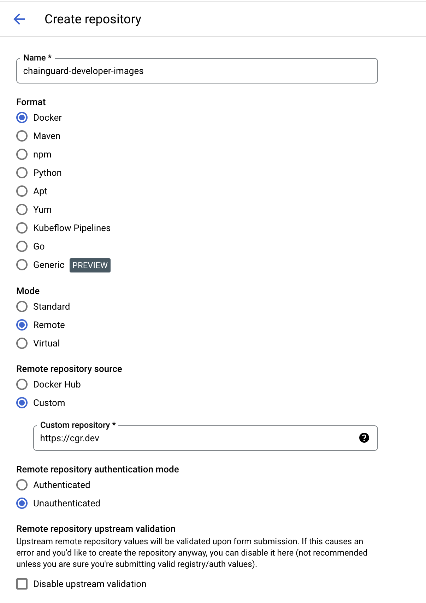
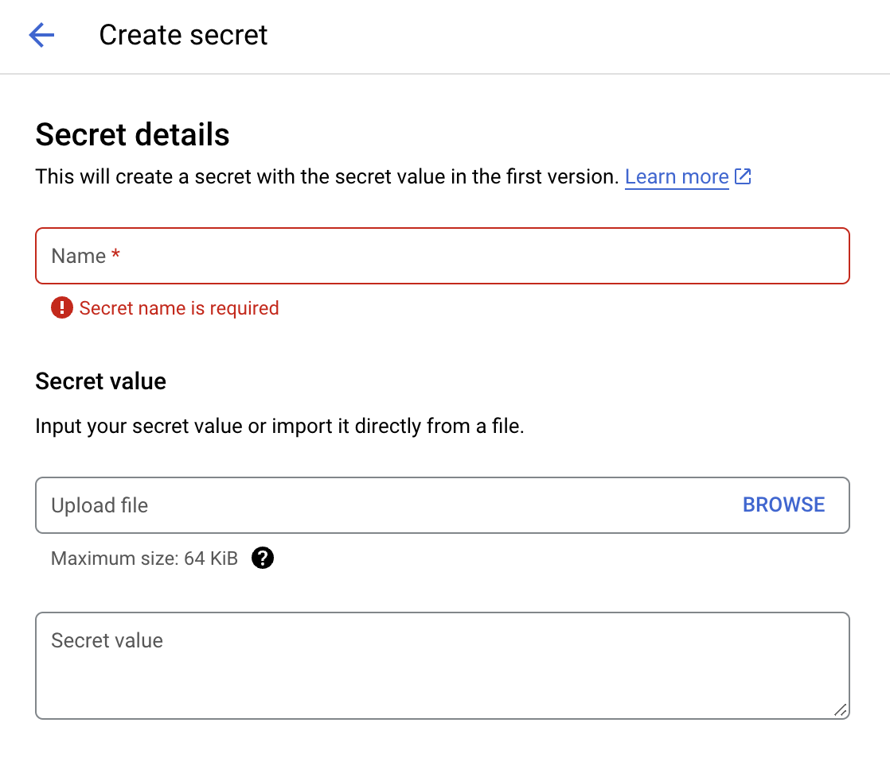
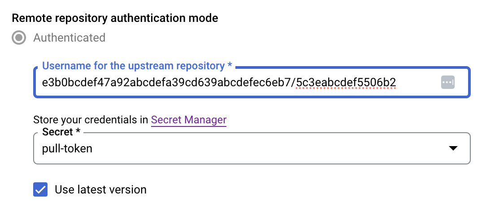

Organizations can use Chainguard Images along with third-party software repositories in order to integrate with current workflows as the single source of truth for software artifacts. In this situation, you can set up a proxy repository to function as a mirror of the [Chainguard Registry](/chainguard/chainguard-registry/overview/). This mirror can then serve as a pull through cache for your Chainguard Images.

This tutorial outlines how to set up a remote repository with [Google Artifact Registry](https://cloud.google.com/artifact-registry/docs/repositories/remote-overview). Specifically, it will walk you through how to set up one repository you can use as a pull through cache for Chainguard's public Developer Images or for Production Images originating from a private Chainguard repository.

## Prerequisites

In order to complete this tutorial, you will need the following:

* Administrative privileges over a Google Cloud Platform project.
* Privileges to create a pull token on a Chainguard Registry. (For private Chainguard repository access)

## Setting up Google Artifact Registry as a pull through for Developer Images

Chainguard's Developer Images are free to use, publicly available, and always represent versions tagged as `:latest`.

To set up a remote repository in Google Artifact Registry from which you can pull Chainguard Developer Images, log in to the [Google Cloud Console](https://console.cloud.google.com) and choose your project. Once there, browse to the ]Artifact Registry section](https://console.cloud.google.com/artifacts), click on **Repositories** in the left-hand navigation menu, and click on **Create Repository** near the top of the page.

Following that, you can enter the following details for your new remote repository:

* **Name** — This is used to refer to your repository. You can choose whatever name you like here, but this guide's examples will use the name `chainguard-developer-iamges`.
* **Format** - This must be set to `Docker`.
* **Mode** — This must be set to `Remote`.
* **Remote repository source** — Choose `Custom` then enter `https://cgr.dev/` in the **Custom repository** field.



Following that, choose the Location, Encryption and Cleanup policy options for your repository. Finally, click **Create** to create the repository. This guide's examples will use the location `us-central1`, but you can choose the location that best suits your needs.

### Testing pull through of a Chainguard Developer Image

By default, the Artifact Registry repository requires authentication, so log in with a valid Google Artifact Registry:

```sh
gcloud auth configure-docker us-central1-docker.pkg.dev
```

After running this command, you may be prompted to log in to your Google Cloud account.

After running the command, you will be able to pull a Chainguard Developer Image through Google Artifact Registry. The following example pulls the `wolfi-base` Image.

```sh
docker pull us-central1-docker.pkg.dev/<your-project-id>/chainguard-developer-images/chainguard/wolfi-base:latest
```

Be sure the `docker pull` command contains the correct Google Artifact Registry URL for your repository, including the location and project ID.

## Setting up Google Artifact Registry as a pull through for Production Images

Production Chainguard Images are enterprise-ready images that come with patch SLAs and features such as Federal Information Processing Standard (FIPS) readiness. The process for setting up an Google Artifact Registry repository that you can use as a pull through cache for Chainguard Production Images is similar to the one outlined previously for Developer Images, but with a few extra steps.

To get started, you will need to create [a pull token](/chainguard/chainguard-registry/authenticating/#authenticating-with-a-pull-token) for your organization's Chainguard Registry. Pull tokens are longer-lived tokens that can be used to pull Images from other environments that don't support OIDC, such as some CI environments, Kubernetes clusters, or with registry mirroring tools like Google Artifact Registry.

Follow the instructions in the link above to create a pull token and take note of the values for `username` and `password` as you'll need this to configure a repository for pulling through Production Images.

You can edit the existing repository and all your users will have access to the private images. Alternatively, you could create a new `chainguard-private` repository exactly as before but with restricted access, though restricting access to repositories in Google Artifact Registry is beyond the scope of this guide.

First, you will need to store the pull token password in a Google Secret Manager secret. This is because Google Artifact Registry does not support storing passwords directly in the repository configuration. To do this, first run the following command:

```sh
gcloud secrets create chainguard-pull-token
```

This command creates an empty secret. Next, you can update the secret with the pull token password:

```sh
echo -n $PASSWORD | gcloud secrets versions add chainguard-pull-token --data-file=-
```

Alternatively, you can also provide the secret using the Google Cloud Console, in the [Secret Manager](https://console.cloud.google.com/security/secret-manager) section. To do this, select **Create Secret**, provide a name for the secret, and enter the pull token password in the **Secret value** field. You can also choose a replication policy, rotation policy, expiration policy, notification policy and more for the secret, or you can choose the defaults.



Back in the Google Artifact Registry, click on the repository you want to configure for pulling through Production Images. Click on the **Edit** button to edit the repository configuration. In the **Remote repository source** section of the configuration screen choose **Authenticated**.

Enter the `username` from the pull token in the **Username** field. In the **Password** field, select the secret you created in Google Secret Manager.

Finally, click the **Save** button to apply the changes.



Click the **Save** button to apply the changes.

### Testing pull through of a Chainguard Production image:

Make sure you've logged in with a valid Google Cloud account and set up `docker` credentials as described above.

If your organization has access to it, the following example will pull the `argo-cli-fips` Image.

```sh
docker pull us-central1-docker.pkg.dev/<your-project-id>/chainguard-developer-images/<your-chainguard-org-name>/argo-cli-fips:latest
```

Be sure the `docker pull` command you run includes the name of your Chainguard organization's registry.

## Debugging pull through from Chainguard’s registry to Google Artifact Registry

If you run into issues when trying to pull Images from Chainguard's Registry to Google Artifact Registry, please ensure the following requirements are met:

* Ensure that all Images [network requirements](https://edu.chainguard.dev/chainguard/administration/network-requirements/) are met.
* When configuring a remote Google Artifact Registry repository, ensure that the **URL** field is set to `https://cgr.dev/`. This field **must not** contain additional components.
* You can troubleshoot by running `docker login` from another node (using the Google Artifact Registry pull token credentials) and try pulling an Image from `cgr.dev/chainguard/<image name>` or `cgr.dev/<company domain>/<image name>`.
* It could be that your Google Artifact Registry repository was misconfigured. In this case, create and configure a new Google Artifact Registry repository to test with.

## Learn more

If you haven't already done so, you may find it useful to review our [Registry Overview](/chainguard/chainguard-registry/overview/) to learn more about the Chainguard Registry. You can also learn more about Chainguard Images by checking out our [Images documentation](/chainguard/chainguard-images/overview/). If you'd like to learn more about Sonatype Google Artifact Registry, we encourage you to refer to the [official Google Artifact Registry documentation](https://cloud.google.com/artifact-registry/docs/overview).
