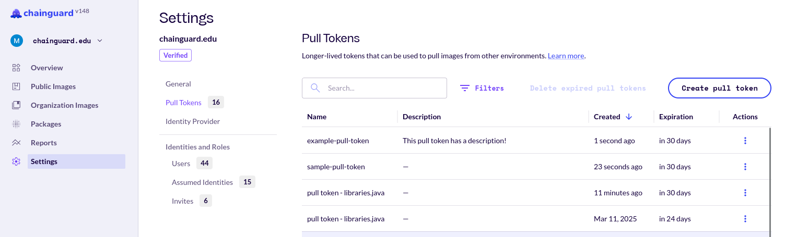

## Public Images

Chainguard offers a collection of images that are publicly available and don't require authentication, being free to use by anyone. However, logging in with a Chainguard account and authenticating when pulling from the Registry provides a mechanism for Chainguard to contact you if there are any issues with images you are pulling. This may enable Chainguard to notify you of upcoming deprecations, changes in behavior, critical vulnerabilities and remediations for images you have recently pulled.

## Signing Up

You can register a Chainguard account through our [sign up form](https://console.chainguard.dev/auth/login?utm_source=docs). This will create your account and a [Chainguard IAM organization](/chainguard/administration/iam-organizations/overview-of-chainguard-iam-model/). If you already have an account, you can log in through the [login page](https://console.chainguard.dev/auth/login?utm_source=docs).

For more details on signing in, you can review our [sign in guidance](/chainguard/administration/iam-organizations/how-to-manage-iam-organizations-in-chainguard/#logging-in). If your organization is interested in (or already using) custom identity providers like Okta, you can read [how to authenticate to Chainguard with custom identity providers](/chainguard/administration/custom-idps/custom-idps/).

## Authenticating with the `chainctl` Credential Helper

You can configure authentication by using the credential helper included with `chainctl`. This is the workflow recommended by Chainguard.

First [install `chainctl`](/chainguard/administration/how-to-install-chainctl) and configure the credential helper:

```sh
chainctl auth configure-docker
```

This will update your Docker config file to call `chainctl` when an auth token is needed. A browser window will open when the token needs to be refreshed.

Pulls authenticated in this way are associated with your user.

## Authenticating with a Pull Token

You can also create a "pull token" using `chainctl`. This generates a longer-lived token that can be used to pull images from other environments that don't support OIDC, such as some CI environments, Kubernetes clusters, or with registry mirroring tools like Artifactory.

First [install `chainctl`](/chainguard/administration/how-to-install-chainctl/), then log in and configure a pull token:

```sh
chainctl auth configure-docker --pull-token
```

With the latest release of `chainctl`, this will print a `docker login` command that can be run in the CI environment to log in with a pull token.

You can also pass the `--save` flag, which will update your Docker config file with the pull token directly.

This token expires in 30 days by default, which can be shortened using the `--ttl` flag (for example, `--ttl=24h`).

Pulls authenticated in this way are associated with a Chainguard identity, which is associated with the organization selected when the pull token was created.

### Note on Multiple Pull Tokens

Running the `chainctl auth configure-docker --pull-token` command multiple times will result in multiple pull tokens being created. However, the tokens stored in your Docker config when using `--save` will overwrite old tokens.

Tokens cannot be retrieved once they have been overwritten so they must be extracted from the local Docker config and saved elsewhere if multiple are required.

### Revoking a Pull Token

Pull tokens are associated with Chainguard identities so they can be viewed with:

```sh
chainctl iam identities list
```

To revoke a token, delete the associated identity.

```sh
chainctl iam identity delete <identity UUID>
```

### Managing Pull Tokens in the Chainguard Console

You can also create and view pull tokens in the [Chainguard Console](https://console.chainguard.dev/).

After navigating to the Console, click on **Settings** in the left-hand navigation menu. From the **Settings** pane, click on **Pull tokens**. There, you'll be presented with a table listing of all the active pull tokens for your selected organization.



This table shows the name of each pull token, their descriptions, the date they were created, and the number of days until they expire.

You can create a new pull token by clicking the **Create pull token** button at the top of the page. A new pane will appear where you can enter a name for the new pull token, add an optional description, and select when the pull token will expire. The **Expiration** drop-down menu has options for 30, 60, and 90 days, as well as a **Custom** expiration option. This will cause a **Custom Expiration** window to appear, allowing you to select the date when you'd like the token to expire.


After entering these details, click the **Create token** button and your new pull token will appear in the list with the rest of your organization's tokens.


## Authenticating with GitHub Actions

You can configure authentication with OIDC-aware CI platforms like GitHub Actions.

First create an identity using `chainctl`, which can be limited to only allow OIDC federation from certain GitHub workflow runs:

```sh
chainctl iam identity create github [GITHUB-IDENTITY] \
  --github-repo=${GITHUB_ORG}/${GITHUB_REPO} \
  --github-ref=refs/heads/main \
  --role=registry.pull
```

**Note**: The value passed to `--github-repo` should be equal to the repository name you expect to be returned in the `subject` field of the token from GitHub. If you need to further scope or change the subject you can find a number of useful examples in the ["Example subject claims"](https://docs.github.com/en/actions/deployment/security-hardening-your-deployments/about-security-hardening-with-openid-connect#example-subject-claims) section of GitHub's OIDC documentation and then you may update the identity with [`chainctl iam identities update`](/chainguard/chainctl/chainctl-docs/chainctl_iam_identities_update/).

This creates a Chainguard identity that can be assumed by a GitHub Actions workflow only for the specified GitHub repository, triggered on pushes to the specified branch (such as `refs/heads/main`), with permissions only to pull from the Chainguard Registry.

When this identity is created, its ID will be displayed. Using this ID, you can configure your GitHub Actions workflow to install `chainctl` and assume this identity when the workflow runs:

```yaml
name: Chainguard Registry Example

on:
  push:
	branches: ['main']

permissions:
  contents: read
  id-token: write  # This is needed for OIDC federation.

jobs:
  example:
	runs-on: ubuntu-latest
	steps:
  	- uses: chainguard-dev/setup-chainctl@main
    	with:
      	identity: [[ The Chainguard Identity ID you created above ]]
  	- run: docker pull cgr.dev/chainguard/node
```

Pulls authenticated in this way are associated with the Chainguard identity you created, which is associated with the organization selected when the identity was created.

If the identity is configured to only work with GitHub Actions workflow runs from a given repo and branch, that identity will not be able to pull from other repos or branches, including pull requests targeting the specified branch.

## Authenticating with Kubernetes

You can also configure a Kubernetes cluster to use a pull token, as described above.

When you create a pull token with `--save`, your Docker config file is updated to include that token and configure it to be used when pulling images from `cgr.dev`.

After that, you can create a Kubernetes secret based on those credentials, following [these instructions](https://kubernetes.io/docs/tasks/configure-pod-container/pull-image-private-registry/#registry-secret-existing-credentials):

```sh
kubectl create secret generic regcred \
	--from-file=.dockerconfigjson=<path/to/.docker/config.json> \
	--type=kubernetes.io/dockerconfigjson
```

**Important Note:** this will also make any other credentials you have configured in your Docker config available in the secret! Ensure only the necessary credentials are included.

Then you can create a Pod that uses that secret, following [these instructions](https://kubernetes.io/docs/tasks/configure-pod-container/pull-image-private-registry/#create-a-pod-that-uses-your-secret):

```yaml
apiVersion: v1
kind: Pod
metadata:
  name: cgr-example
spec:
  containers:
  - name: nginx
	image: cgr.dev/chainguard/nginx:latest
  imagePullSecrets:
  - name: regcred
```

For this example, save the file as `cgr-example.yaml`. Then you can create and get the Pod:

```sh
kubectl apply -f cgr-example.yaml
kubectl get pod cgr-example
```
