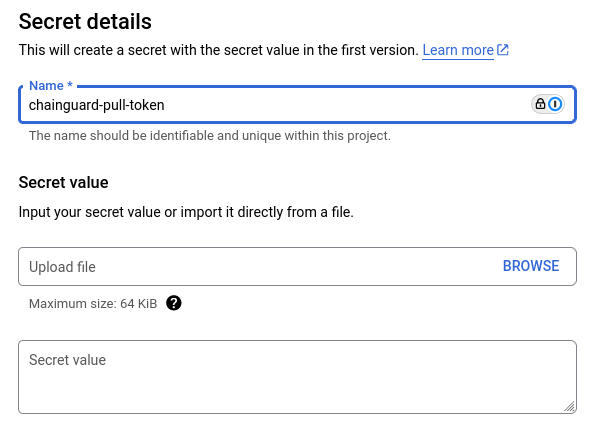

Organizations can use Chainguard Images along with third-party software repositories in order to integrate with current workflows as the single source of truth for software artifacts. In this situation, you can set up a proxy repository to function as a mirror of the [Chainguard Registry](/chainguard/chainguard-registry/overview/). This mirror can then serve as a pull through cache for your Chainguard Images.

This tutorial outlines how to set up a remote repository with [Google Artifact Registry](https://cloud.google.com/artifact-registry/docs/repositories/remote-overview). It will walk you through how to set up an Artifact Registry Repository you can use as a pull through cache for Chainguard's public Developer Images or for Production Images originating from a private Chainguard repository.

## Prerequisites

In order to complete this tutorial, you will need the following:

* Docker installed on your local machine. Follow the [official installation instructions](https://docs.docker.com/engine/install/) to set this up.
* Administrative privileges over a Google Cloud Platform project. This project will also need to have the [Artifact Registry API](https://cloud.google.com/artifact-registry/docs/reference/rest) enabled. 
* If you plan to set up an Artifact Registry repository to serve as a pull through cache for Production Images, then you will also need to have privileges to create a pull token on a Chainguard Registry.
    * Additionally, you'll need `chainctl` installed to create the pull token. If you haven't already installed this, follow the [installation guide](/chainguard/administration/how-to-install-chainctl/).


## Setting up Google Artifact Registry as a Pull Through for Developer Images

Chainguard's Developer Images are free to use, publicly available, and always represent versions tagged as `:latest`.

To set up a remote repository in Google Artifact Registry from which you can pull Chainguard Developer Images, log in to the [Google Cloud Console](https://console.cloud.google.com) and choose your project. Once there, navigate to the [Artifact Registry section](https://console.cloud.google.com/artifacts), click on **Repositories** in the left-hand navigation menu, and click on the **Create Repository** button near the top of the page.

On the **Create Repository** page, enter the following details for your new remote repository:

* **Name** — This is used to refer to your repository. You can choose whatever name you like here, but this guide's examples will use the name `chainguard-pull-through`.
* **Format** — For the purposes of this guide, this must be set to **Docker**.
* **Mode** — Set this to **Remote**.
* **Remote repository source** — Choose **Custom** then enter `https://cgr.dev/` in the **Custom repository** field.


Following that, choose the Location, Encryption and Cleanup policy options for your repository. This guide's examples will use the location `us-central1`, but you can choose the location that best suits your needs. Finally, click the **Create** button to create the repository. 

### Testing pull through of a Chainguard Developer Image

By default, the Artifact Registry repository requires authentication. Log in with a valid Google Artifact Registry:

```sh
gcloud auth configure-docker us-central1-docker.pkg.dev
```

Be sure to change `us-central1` to reflect the location of your Artifact Registry repository. 
Also, after running this command you may be prompted to log in to your Google Cloud account.

After running the command, you will be able to pull a Chainguard Developer Image through Google Artifact Registry. The following example pulls the `go` Image:

```sh
docker pull us-central1-docker.pkg.dev/<your-project-id>/chainguard-pull-through/chainguard/go:latest
```

This command first specifies the location of the Artifact Registry repository we just created (`us-central1-docker.pkg.dev/<your-project-id>/chainguard-pull-through/`). It then follows that with the name of the Chainguard Developer Image and the remote repository we want to pull it from (`chainguard/go:latest`). 

If you run into issues with this command, be sure that it contains the correct Google Artifact Registry URL for your repository, including the location and project ID.


## Setting up Google Artifact Registry as a Pull Through for Production Images

Production Chainguard Images are enterprise-ready images that come with patch SLAs and features such as [Federal Information Processing Standard](/chainguard/chainguard-images/working-with-images/fips-images/) (FIPS) readiness. The process for setting up a Google Artifact Registry repository that you can use as a pull through cache for Chainguard Production Images is similar to the one outlined previously for Developer Images, but with a few extra steps.

To get started, you will need to create [a pull token](/chainguard/chainguard-registry/authenticating/#authenticating-with-a-pull-token) for your organization's Chainguard Registry. Pull tokens are longer-lived tokens that can be used to pull Images from other environments that don't support OIDC, such as some CI environments, Kubernetes clusters, or with registry mirroring tools like Google Artifact Registry.

First log in with `chainctl`:

```sh
chainctl auth login
```

Then configure a pull token:

```sh
chainctl auth configure-docker --pull-token
```

This command will prompt you to select an organization. Be sure to select the organization whose Production images you want to pull through the Artifact Registry repository.

This will create a pull token and print a `docker login` command that can be run in a CI environment to log in with the token. This command includes both `--username` and `--password` arguments.

Note down the `username` value, as you will need it shortly. Then run the following command to create an environment variable named `$PASSWORD` set to the pull token password generated by the previous command:

```sh
export PASSWORD=<password value copied from previous output>
```

Now that you've set up a pull token, you can configure a repository for pulling through Production Images.

You can edit the existing repository and all your users will have access to the private images. Alternatively, you could create a new `chainguard-private` repository exactly as before but with restricted access, though restricting access to repositories in Google Artifact Registry is beyond the scope of this guide.

First, you will need to store the pull token password as a Google Secret Manager secret. This is because Google Artifact Registry does not support storing passwords directly in the repository configuration. To do this, first run the following command:

```sh
gcloud secrets create chainguard-pull-token
```

This command creates an empty secret. Next, you can update the secret with the pull token password using the environment variable you set previously:

```sh
echo -n $PASSWORD | gcloud secrets versions add chainguard-pull-token --data-file=-
```

If you haven't already done so, this command will ask if you want to enable the [Secret Manager API](https://cloud.google.com/secret-manager/docs/configuring-secret-manager?hl=en). Press `y` and then `ENTER` to enable the API and allow the command to finish.

Alternatively, you can also provide the secret using the Google Cloud Console in the [Secret Manager](https://console.cloud.google.com/security/secret-manager) section. To do this, select **Create Secret**, provide a name for the secret, and enter the pull token password in the **Secret value** field. You also have the option to choose a replication policy, rotation policy, expiration policy, notification policy and more for the secret.



Back in the Google Artifact Registry, click on the repository you want to configure for pulling through Production Images and then click on the **Edit** button to edit the repository configuration. In the **Remote repository source** section of the configuration screen, choose **Authenticated**.

Enter the pull token `username` value in the **Username** field. In the **Password** field, select the secret you created in Google Secret Manager.


Click the **Save** button to apply the changes.

### Testing pull through of a Chainguard Production image:

As with testing pull through of a Developer image, you'll first need to authenticate to the Artifact Registry:

```sh
gcloud auth configure-docker us-central1-docker.pkg.dev
```

Be sure to change `us-central1` to reflect the location of your Artifact Registry repository.


After running the command, you will be able to pull any Production Images that your organization has access to through Google Artifact Registry. For example, the following command will pull the `chainguard-base` Image if your organization has access to it:

```sh
docker pull us-central1-docker.pkg.dev/<your-project-id>/chainguard-pull-through/<example.com>/chainguard-base:latest
```

Be sure the `docker pull` command you run includes the name of your Chainguard organization's registry.


## Debugging Pull Through from the Chainguard Registry to Google Artifact Registry

If you run into issues when trying to pull Images from Chainguard's Registry to Google Artifact Registry, please ensure the following requirements are met:

* Ensure that all Images [network requirements](https://edu.chainguard.dev/chainguard/administration/network-requirements/) are met.
* When configuring a remote Google Artifact Registry repository, ensure that the **URL** field is set to `https://cgr.dev/`. This field **must not** contain additional components.
* You can troubleshoot by running `docker login` from another node (using the Google Artifact Registry pull token credentials) and try pulling an Image from `cgr.dev/chainguard/<image name>` or `cgr.dev/<company domain>/<image name>`.
* It could be that your Google Artifact Registry repository was misconfigured. In this case, create and configure a new Google Artifact Registry repository to test with.

## Learn More

If you haven't already done so, you may find it useful to review our [Registry Overview](/chainguard/chainguard-registry/overview/) to learn more about the Chainguard Registry. You can also learn more about Chainguard Images by checking out our [Images documentation](/chainguard/chainguard-images/overview/). If you'd like to learn more about Google Artifact Registry, we encourage you to refer to the [official Google Artifact Registry documentation](https://cloud.google.com/artifact-registry/docs/overview).