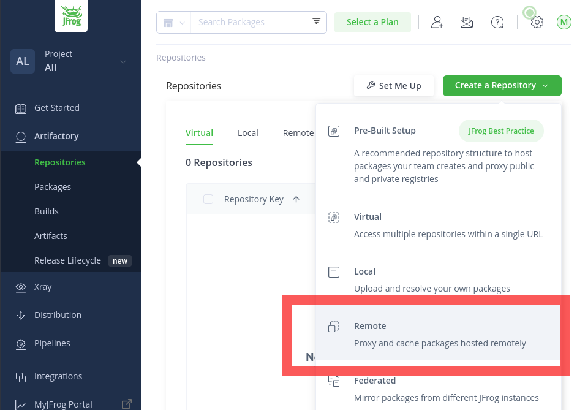
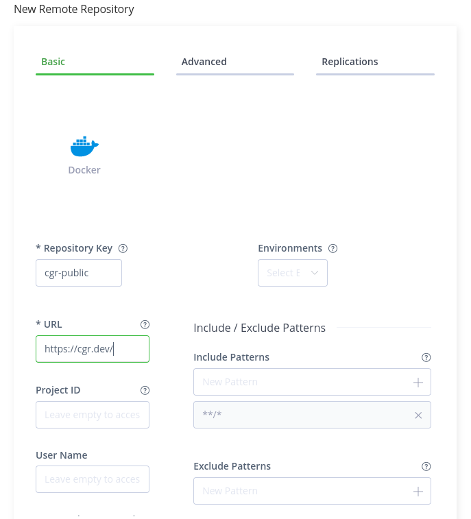
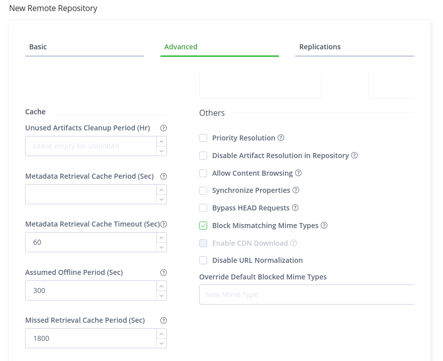

Organizations can use Chainguard Images along with third-party software repositories in order to integrate with current workflows as the single source of truth for software artifacts. In this situation, you can set up a remote repository to function as a mirror of a [Chainguard Registry](/chainguard/chainguard-registry/overview/) — either the public registry or a private one belonging to your organization. This mirror can then serve as a pull through cache for your Chainguard Images.

This tutorial outlines how to set up remote repositories with [JFrog Artifactory](https://jfrog.com/artifactory/). Specifically, it will walk you through how to set up one repository you can use as a pull through cache for Chainguard's public Developer Images and another you can use with Production Images originating from a private Chainguard repository.


## Prerequisites

In order to complete this tutorial, you will need the following:

* Administrative privileges over an Artifactory instance. If you're interested in testing out this configuration, you can set up a trial instance on the [JFrog Artifactory landing page](https://jfrog.com/artifactory/). 
* Administrative privileges over a Chainguard Registry. 
* `chainctl`, Chainguard's command line interface tool, installed on your local machine. To set this up, follow our [installation guide for `chainctl`](/chainguard/administration/how-to-install-chainctl/).

Lastly, part of this guide assumes you have access to a private Chainguard Registry containing one or more Production Images. If you don't already have access to these, you can [contact our sales team](https://www.chainguard.dev/contact?utm_source=docs). 


## Setting up Artifactory as a pull through for Developer Images

Chainguard's Developer Images are free to use, publicly available, and always represent versions tagged as `:latest`.

To set up a remote repository in Artifactory from which you can pull Chainguard Developer Images, log in to the JFrog platform. Once there, click on the **Artifactory** tab in the left-hand menu and select **Repositories** from the drop-down. On the Repositories page, click the **Create a Repository** button and select the **Remote** option.



Next, you'll need to select the type of repository to set up. For the purposes of this guide, select **Docker**.

Following that, you can enter the following details for your new remote repository in the **Basic** configuration tab:

* **Repository Key** — This is used to refer to your repository. You can choose whatever name you like here, but this guide's examples will use the name `cgr-public`.
* **URL** — This must be set to `https://cgr.dev/`.
* **Include Patterns** — Ensure that you use the default value (`**/*`) in this field.



Lastly, in the **Advanced** configuration tab, ensure that the **Block Mismatching Mime Types** option is checked, as it should be by default.



Following that, click the **Create Remote Repository** button. If everything worked as expected, a modal window will appear letting you know that the repository was created successfully. You can click the **Set Up Docker Client** button at the bottom of this window to retrieve the commands you'll use to test that you can pull Images through this repository.

### Testing pull through of a Chainguard Developer Image

After clicking the **Set Up Docker Client** button, a modal window will appear from the right side of the page. Click the **Generate Token & Create Instructions** button, which will generate two code blocks whose contents you can copy.

The first will be a `docker login` command similar to the following example. Copy this command and run it in your terminal.

```sh
docker login -u<inky@chainguard.dev> <myproject>.jfrog.io
```

After running this command, you'll be prompted to enter a password. Copy the token from the second code block and paste it into your terminal.

After running the `docker login` command, you will be able to pull a Chainguard Developer Image through Artifactory. The following example pulls the `wolfi-base` Image.

```sh
docker pull <myproject>.jfrog.io/cgr-public/chainguard/wolfi-base
```

Be sure the `docker pull` command you run includes the name of your project as well as your own repository key in place of `cgr-public`.


## Setting up Artifactory as a pull through for Production Images

Production Chainguard Images are enterprise-ready images that come with patch SLAs and features such as Federal Information Processing Standard (FIPS) readiness. The process for setting up an Artifactory repository that you can use as a pull through cache for Chainguard Production Images is similar to the one outlined previously for Developer Images, but with a few extra steps.

To get started, you will need to create [a pull token](/chainguard/chainguard-registry/authenticating/#authenticating-with-a-pull-token) for your organization's Chainguard Registry. Pull tokens are longer-lived tokens that can be used to pull Images from other environments that don't support OIDC, such as some CI environments, Kubernetes clusters, or with registry mirroring tools like Artifactory.

To create a pull token with `chainctl`, run the following command. 

```sh
chainctl auth configure-docker --pull-token --parent <organization>
```

Be sure to replace `<organization>` with your organization's name or ID.

> **Note**: You can find your organization's name or ID by running `chainctl iam groups list -o table`.

This command will return a `docker login` command like the following.

```
. . .

	docker login "cgr.dev" --username "<pull_token_ID>" --password "<password>"
```

Take note of the values for `<pull_token_ID>` and  `<password>` as you'll need these credentials when you configure a new remote Artifactory repository for pulling through Production Images.

After noting your credentials, you can begin setting up an Artifactory repository from which you can pull Chainguard Production Images. This process is similar to the one outlined previously for setting up an Artifactory repository. 

Create another repository and again select the **Remote** option. Also, be sure to once again choose **Docker** as the type of remote repository you want to set up. Enter the following details for your new remote repository in the **Basic** configuration tab:

* **Repository Key** — Again, you can choose whatever name you like here, but this guide's examples will use the name `cgr-private`.
* **URL** — This must be set to `https://cgr.dev/`.
* **User Name** — Enter the `<pull_token_ID>` value you noted down from the `docker login` command  
* **Password / Access Token** — Enter the `<password>` value you noted down from the `docker login` command
* **Include Patterns** — Ensure that you use the default value (`**/*`) in this field.


Lastly, in the **Advanced** configuration tab, ensure that the **Block Mismatching Mime Types** option is checked. Again, this should be the default.


Following that, click the **Create Remote Repository** button. If everything worked as expected, a modal window will appear letting you know that the repository was created successfully. You can click the **Set Up Docker Client** button at the bottom of this window to retrieve the commands you'll use to test that you can pull Images through this repository.

### Testing pull through of a Chainguard Production image: 

After clicking the **Set Up Docker Client** button, a modal window will appear from the right side of the page. Click the **Generate Token & Create Instructions** button, which will generate two code blocks.

The first will be a `docker login` command similar to the following example. Copy this command and run it in your terminal.

```sh
docker login -u<inky@chainguard.dev> <myproject>.jfrog.io
```

Be sure to include your own username and Artifactory instance.

After running this command, you'll be prompted to enter a password. Copy the token from the second code block, paste it into your terminal, and press `ENTER`.

After running the `docker login` command, you will be able to pull a Chainguard Production Image through Artifactory. The following example pulls the `wolfi-base` Image.

```sh
docker pull <myproject>.jfrog.io/cgr-private/<organization-name>/wolfi-base
```

Be sure the `docker pull` command you run includes the name of your artifactory project and the proper name of your organization's registry. Additionally, if you entered a different repository key in the setup section, use it in place of `cgr-private`.


## Debugging pull through from Chainguard’s registry to Artifactory

If you run into issues when trying to pull Images from Chainguard's Registry to Artifactory, please ensure the following requirements are met:

* Ensure that all Images [network requirements](https://edu.chainguard.dev/chainguard/administration/network-requirements/) are met.
* Regarding networking, if you attempt to pull a non-existing image via pull-through, Artifactory will also make calls to `chainguard.dev` and `www.chainguard.dev`.  Calls to these domains should not occur when pulling a valid image.
* When configuring a remote Artifactory repository, ensure that the **URL** field is set to `https://cgr.dev/`. This field **must not** contain additional components. 
* You can troubleshoot by running `docker login` from another node (using the Artifactory pull token credentials) and try pulling an Image from `cgr.dev/chainguard/<image name>` or `cgr.dev/<company domain>/<image name>`.
* It may help to [clear the Artifactory cache](https://jfrog.com/help/r/artifactory-cleanup-best-practices/clearing-an-oversized-cache).
* It could be that your Artifactory repository was misconfigured. In this case, create and configure a new Remote Artifactory repository to test with.


## Learn more

If you haven't already done so, you may find it useful to review our [Registry Overview](/chainguard/chainguard-registry/overview/) to learn more about the Chainguard Registry. You can also learn more about Chainguard Images by referring to our [Images documentation](/chainguard/chainguard-images/overview/). If you'd like to learn more about JFrog Artifactory, we encourage you to refer to the [official Artifactory documentation](https://jfrog.com/help/r/jfrog-artifactory-documentation).
