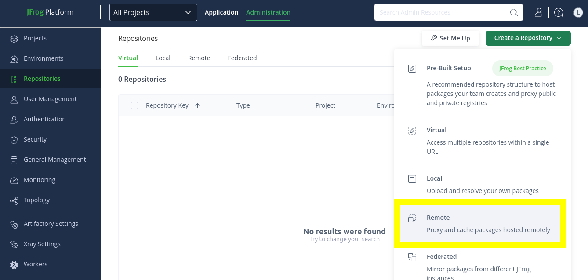
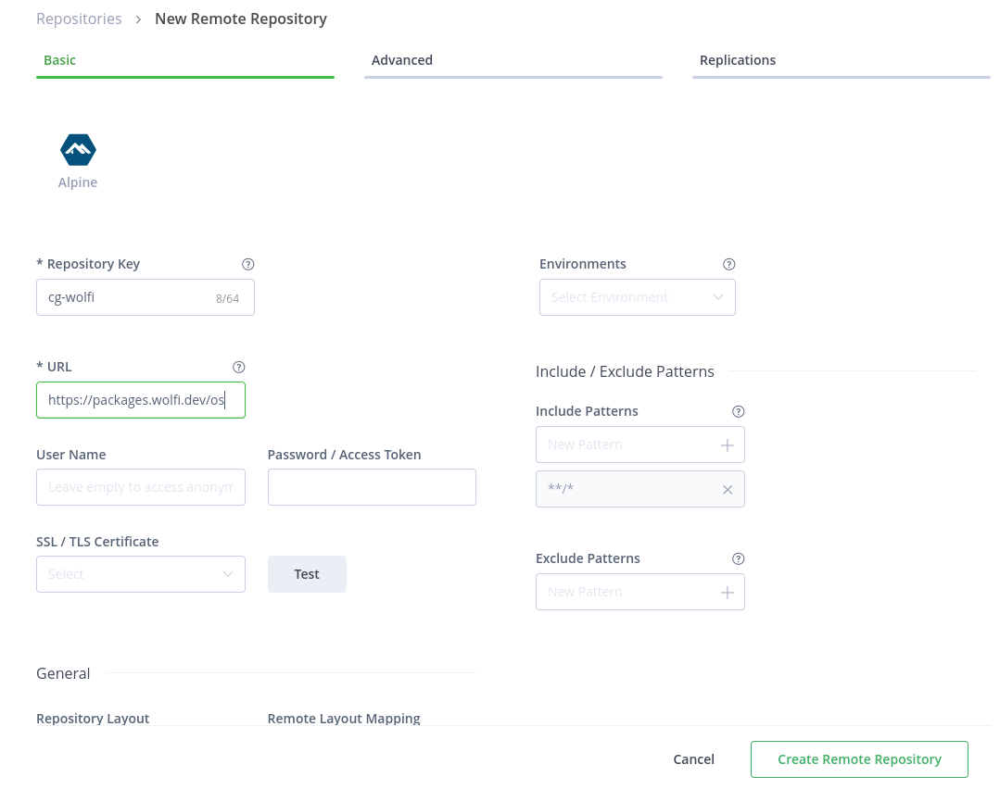
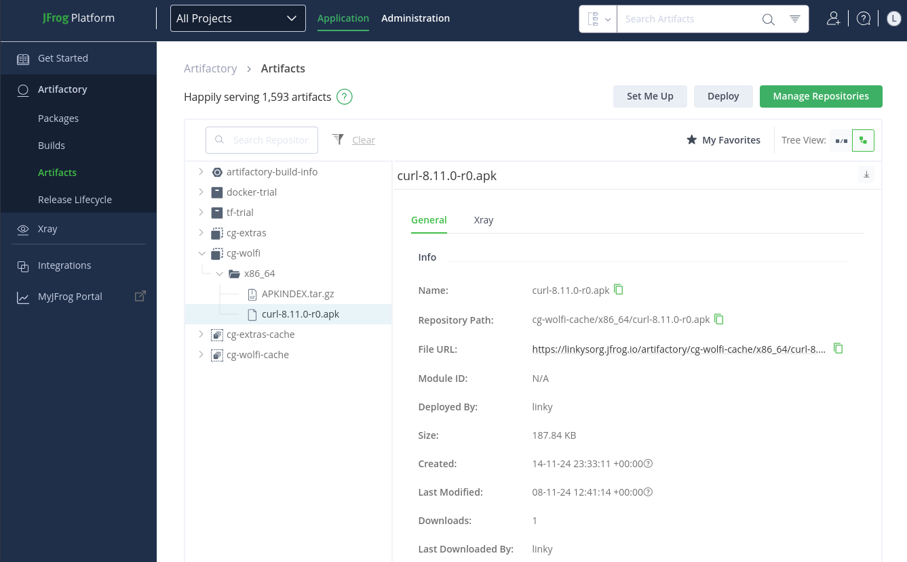
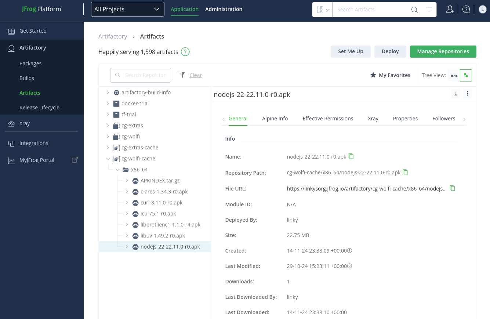
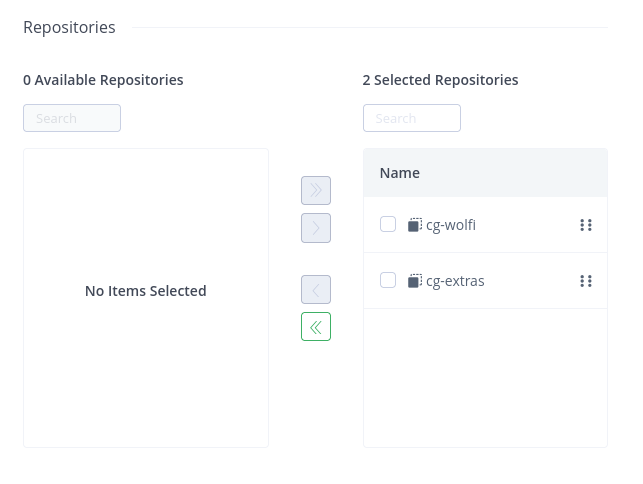

This tutorial outlines how to set up remote Alpine package repositories with [JFrog Artifactory](https://jfrog.com/artifactory/). Specifically, it will walk you through how to set up two repositories you can use as a pull through cache for Chainguard's public package repositories. This guide will then outline how you can configure an image to pull APK packages from these repositories. It will also go over how you can use one of Artifactory's virtual repositories as a pull through cache.


## Prerequisites

In order to complete this tutorial, you will need administrative privileges over an Artifactory instance. If you're interested in testing out this configuration, you can set up a trial instance on the [JFrog Artifactory landing page](https://jfrog.com/artifactory/). 

> **Note**: As you follow this guide, you may run into issues if your Artifactory username is an email address; specifically, the `@` sign can lead to errors. Be sure that you're using a user profile with a name that only contains letters and numbers. 

## Setting Up Remote Artifactory Repositories to Mirror Public Chainguard Package Repositories

To set up a remote repository in Artifactory from which you can pull public Chainguard packages, log in to the JFrog platform. Once there, select on the **Administration** tab near the top of the screen and select **Repositories** from the left-hand navigation menu. On the Repositories page, click the **Create a Repository** button and select the **Remote** option.

<center></center>
<br />

Next, you'll need to select the type of repository to set up. Because all packages offered by Chainguard are APKs, select **Alpine**.

First, we'll set up a remote repository to mirror the Wolfi APK packages repository. On the new page, you can enter the following details in the **Basic** configuration tab:

* **Repository Key** — This is used to refer to your remote repository. You can choose whatever name you like here, but this guide's examples will use the name `cg-wolfi`.
* **URL** — This must be set to `https://packages.wolfi.dev/os`.

<center></center>
<br />

Keep all the remaining fields set to their default values and click the **Create Remote Repository** button. A modal window will appear letting you know that the repository was created successfully. For now, hold off on clicking the **Set Up Alpine Client** button, as you will take care of configuring this repository shortly.

Before getting to that, repeat the process to create another remote repository. This one will serve as a pull through for Chainguard's Extra Packages repository. This repository provides the latest packages for software products with non-open-source licenses.

Once again, from the Repositories page, click the **Create a Repository** button, select the **Remote** option, and then select **Alpine** to create an Alpine repository.

Enter the following details for your new remote repository in the **Basic** configuration tab:

* **Repository Key** — Again, you can choose whatever name you like here, but this guide's examples will use the name `cg-extras`.
* **URL** — This must be set to `https://packages.cgr.dev/extras`.

Following that, click the **Create Remote Repository** button to create the new remote repository. 

### Generate tokens for remote repositories

Before testing whether you're able to pull packages through the remote repositories, you will need to retrieve a token generated by Artifactory for both of them. To generate these tokens, you can either click the **Set Up Alpine Client** button after creating the remote repository or you can retrieve them from the **Repositories** page. 

On the Repositories page, find the ellipsis (**⋯**) all the way to the right of the repository's row. Click on it, and then select **Set me up**. 

This will open a modal window from the right side of the page. Click the **Generate Token & Create Instructions** button, which will generate two code blocks whose contents you can copy. The first code block will contain a token you can use to access the remote Artifact repository. The second block will contain an `echo` command you can use to add a URL to an `/etc/apk/repositories` file. 

Take note of the token generated for each repository. Then, run the following `export` commands to create a few environment variables, replacing `my-wolfi-token` and `my-extras-token` with the respective token you noted down. You will use these environment variables in the next sections as you test out these remote repositories:

```shell
export WOLFI_TOKEN=my-wolfi-token
export EXTRAS_TOKEN=my-extras-token
```

Additionally, create two more environment variables to hold your Artifactory user profile and hostname:

```shell
export ARTIFACTORY_USER_PROFILE=my-user-profile
export ARTIFACTORY_HOSTNAME=my-artifactory-hostname
```

If you aren't sure of these values, you can find them in the command from the **Set Up An Alpine Client** window where you found the token:

```
sudo sh -c "echo 'https://linky:<TOKEN>@linkysorg.jfrog.io/artifactory/cg-wolfi/<BRANCH>/<REPOSITORY>'" >> /etc/apk/repositories
```

In this example, the Artifactory user profile is `linky` and the hostname is `linkysorg`.

### Testing pull through from remote package repositories interactively

In order to test that you're able to pull packages from the remote Artifactory repositories you just created, this section outlines how to build a container image (using a Chainguard image as a base) and configure it to pull packages from these repositories.

Open a terminal and create a Dockerfile:

```shell
cat > Dockerfile <<EOF
FROM cgr.dev/chainguard/python:latest-dev
USER root
RUN mv /etc/apk/repositories /etc/apk/repositories.disabled
RUN echo 'https://$ARTIFACTORY_USER_PROFILE:$WOLFI_TOKEN@$ARTIFACTORY_HOSTNAME.jfrog.io/artifactory/cg-wolfi/' >> /etc/apk/repositories
RUN echo 'https://$ARTIFACTORY_USER_PROFILE:$EXTRAS_TOKEN@$ARTIFACTORY_HOSTNAME.jfrog.io/artifactory/cg-extras/' >> /etc/apk/repositories
EOF
```

This Dockerfile uses the `python:latest-dev` image, but you can use any image which you have access to. However, after the image is built we will open up an interactive shell to test whether we can actually install packages from these repos with `apk`, so whatever image you use should be one that has a shell available. 

Note that this Dockerfile renames the default `/etc/apk/repositories` field. This isn't necessary, but doing so will allow you to ensure that you're actually downloading packages from the remote Artifactory repositories instead of the default ones. 

After creating the Dockerfile,  use it to build a new image. Here, we tag the image `ar-interactive`:

```shell
docker build -t ar-interactive .
```

Once the image is built, run it. Be sure to include the `-it` and `--entrypoint` options to run it with an interactive shell:

```shell
docker run -it --entrypoint /bin/sh ar-interactive
```

Now that the container is running, you can check whether it was configured correctly and that you can pull packages from the remote Artifactory repositories.

First check that the `/etc/apk/repositories` file contains the correct lines:

```shell
cat /etc/apk/repositories
```
```Output
https://<ARTIFACTORY-USER-PROFILE>:<WOLFI-TOKEN>@<ARTIFACTORY-HOSTNAME>.jfrog.io/artifactory/cg-wolfi/
https://<ARTIFACTORY-USER-PROFILE>:<EXTRAS-TOKEN>@<ARTIFACTORY-HOSTNAME>.jfrog.io/artifactory/cg-extras/
```

Then test that you can install a package from these repositories with `apk`. This example installs the `curl` package:

```shell
apk add curl
```
```Output
fetch https://<ARTIFACTORY-USER-PROFILE>:*@<ARTIFACTORY-HOSTNAME>.jfrog.io/artifactory/cg-wolfi/
fetch https://<ARTIFACTORY-USER-PROFILE>:*@<ARTIFACTORY-HOSTNAME>.jfrog.io/artifactory/cg-extras/
(1/1) Installing curl (8.11.0-r0)
Executing glibc-2.40-r3.trigger
Executing busybox-1.37.0-r0.trigger
OK: 576 MiB in 77 packages
```

This output shows that `curl` was indeed correctly installed from the remote Artifactory repository.

You can confirm this from the Artifactory dashboard. Navigate to the **Application** tab, then select **Artifactory** in the left-hand navigation menu and select **Artifacts**. From there, expand the menu option for the `cg-wolfi` Artifactory repository. There, you will find the `curl` package listed.

<center></center>
<br />

This shows that the pull through and caching occurred as expected.

### Testing pull through within a build

You can also use the remote Artifactory repositories to install packages directly within a Dockerfile. 

To try this out, create another Dockerfile:

```shell
cat > Dockerfile.build <<EOF
FROM cgr.dev/chainguard/python:latest-dev
USER root
RUN mv /etc/apk/repositories /etc/apk/repositories.disabled
RUN echo 'https://$ARTIFACTORY_USER_PROFILE:$WOLFI_TOKEN@$ARTIFACTORY_HOSTNAME.jfrog.io/artifactory/cg-wolfi/' >> /etc/apk/repositories
RUN echo 'https://$ARTIFACTORY_USER_PROFILE:$EXTRAS_TOKEN@$ARTIFACTORY_HOSTNAME.jfrog.io/artifactory/cg-extras/' >> /etc/apk/repositories
RUN apk add nodejs-22
USER nonroot
EOF
```

This example will install the `nodejs-22` package into the built image.

After creating the Dockerfile, build the image. Note that this command includes the `-f` option to specify that it should build the image with the Dockerfile you just created:

```shell
docker build -t ar-build -f Dockerfile.build .
```

Once again, you can confirm that the pull through and caching worked as expected by checking the **Artifacts** page in the Artifactory dashboard.

<center></center>
<br />


## Setting Up a Virtual Repository to Mirror Packages

Artifactory allows you to create what it refers to as [*virtual repositories*](https://jfrog.com/help/r/jfrog-artifactory-documentation/virtual-repositories). A virtual repository is a collection of one or more repositories (such as local, remote, or other virtual repositories) that have the same package type. The benefit of this is that you can access resources from multiple locations using a single logical URL.

You can also use a virtual repository as a pull through cache. To illustrate, create a new virtual repository.

From the **Repositories** tab, click the **Create a Repository** button. This time, select the **Virtual** option, but instead of selecting the Alpine package type, select **Generic**. You can use the Alpine package type, but [virtual Alpine repositories](https://jfrog.com/help/r/jfrog-artifactory-documentation/virtual-alpine-repositories) will only allow you to pull packages that have already been cached by an associated remote repository. A **Generic** artifact repository will provide more flexibility.

On the **New Virtual Repository** page, enter a key of your choosing into the **Repository Key** field. You can enter whatever you'd like here, but for this guide we will refer to this repository as `cg-apk-virt`.

Next, you must select existing repositories to include within this virtual repository. To keep things simple, we will use the `cg-wolfi` and `cg-extras` repositories created previously. Select your repositories by clicking their respective checkboxes. Then be sure to click the right-pointing chevron to move them to the **Selected Repositories** column.

<center></center>
<br />

Finally, click the **Create Virtual Repository** button. As before, a modal window will appear letting you know that the repository was created successfully. Click the **Set Up Generic Client** button at the bottom of this window to retrieve the token you'll need to test whether you can pull Images through this repository. 

With this token in hand, create another environment variable:

```shell
export VIRTUAL_TOKEN=my-virtual-repo-token
```

You'll use this token to create one more Dockerfile in the next section.

### Testing pull through with a virtual package repository

As outlined previously, create a Dockerfile that configures an image to use the virtual repository you just created. You can test this out however you like, but we will stick to one example here showing how to install a package into the built image:

```shell
cat > Dockerfile.virtual <<EOF
FROM cgr.dev/chainguard/python:latest-dev
USER root
RUN mv /etc/apk/repositories /etc/apk/repositories.disabled
RUN echo 'https://$ARTIFACTORY_USER_PROFILE:$VIRTUAL_TOKEN@$ARTIFACTORY_HOSTNAME.jfrog.io/artifactory/cg-apk-virt/' >> /etc/apk/repositories
RUN apk add nodejs-18
USER nonroot
EOF
```

This example will install the `nodejs-18` package.

After creating the Dockerfile, build the image with the Dockerfile you just created:

```shell
docker build -t ar-virtual -f Dockerfile.virtual .
```

This command will install the `nodejs-18` package from the virtual repository as it builds the image.


## Debugging pull through from Chainguard’s registry to Artifactory

If you run into issues when trying to pull from Chainguard's package repositories through Artifactory, you can try checking for these common pitfalls:

* You may run into issues if your Artifactory username is an email address; specifically, the `@` sign can lead to errors. Be sure that you're using a user profile with a name that only contains letters and numbers. 
* Ensure that all Images [network requirements](https://edu.chainguard.dev/chainguard/administration/network-requirements/) are met.
* When configuring a remote Artifactory repository, ensure that the **URL** field is set correctly. 
* It may help to [clear the Artifactory cache](https://jfrog.com/help/r/artifactory-cleanup-best-practices/clearing-an-oversized-cache).
* It could be that your Artifactory repository was misconfigured. In this case, create and configure a new Remote Artifactory repository to test with.


## Learn more

If you haven't already done so, you may find it useful to review our [Registry Overview](/chainguard/chainguard-registry/overview/) to learn more about the Chainguard Registry. You can also learn more about Chainguard Images by referring to our [Images documentation](/chainguard/chainguard-images/overview/), and learn more about working with the Chainguard platform by reviewing our [Administration documentation](/chainguard/administration/). If you'd like to learn more about JFrog Artifactory, we encourage you to refer to the [official Artifactory documentation](https://jfrog.com/help/r/jfrog-artifactory-documentation).