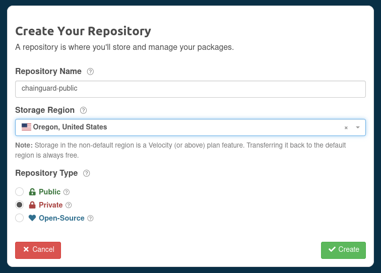
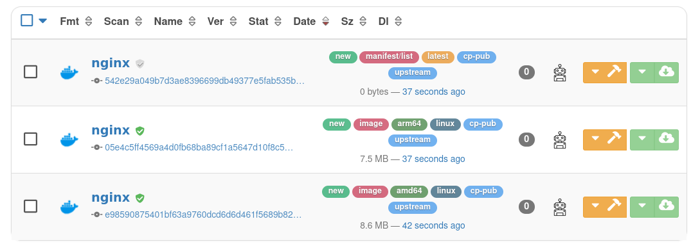
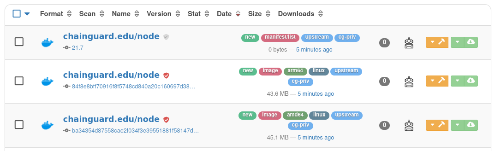

Organizations can use Chainguard Images along with third-party software repositories in order to integrate with current workflows as the single source of truth for software artifacts. In this situation, you can set up a proxy repository to function as a mirror of the [Chainguard Registry](/chainguard/chainguard-registry/overview/). This mirror can then serve as a pull through cache for your Chainguard Images.

This tutorial outlines how to set up a remote repository with [Cloudsmith](https://cloudsmith.com/). It will walk you through how to set up a Cloudsmith repository you can use as a pull through cache for Chainguard's public Developer Images or for Production Images originating from a private Chainguard repository.

## Prerequisites

In order to complete this tutorial, you will need the following:

* Docker installed on your local machine. Follow the [official installation instructions](https://docs.docker.com/engine/install/) to set this up.
* Administrative privileges over a Cloudsmith project. You can set up an account by visiting the [Cloudsmith website](https://cloudsmith.com/). 
* If you plan to set up a Cloudsmith repository to serve as a pull through cache for Production Images, then you will also need to have privileges to create a pull token on a Chainguard Registry.
    * Additionally, you'll need `chainctl` installed to create the pull token. If you haven't already installed this, follow the [installation guide](/chainguard/administration/how-to-install-chainctl/).


## Setting up Cloudsmith as a Pull Through for Developer Images

Chainguard's Developer Images are free to use, publicly available, and always represent versions tagged as `:latest`.

To set up a remote repository in Cloudsmith through which you can pull Chainguard Developer Images, log in to the [Cloudsmith App](https://cloudsmith.io/user/login/). Once there, navigate to the **Repositories** tab and and click the **+ Create Repository** button. 

A modal window will appear where you can enter the following details for your new remote repository:

* **Name** — This is used to refer to your repository. You can choose whatever name you like here, but this guide's examples will use the name `chainguard-public`.
* **Storage Region** — Here, select the region closest to your location.
* **Repository Type** — This setting determines how the repository can be accessed. You can select **Public**, **Private**, or **Open-Source**. 



Following that, you will need to set an [upstream proxy](https://help.cloudsmith.io/docs/upstream-proxying-caching) for this repository. This is what will let Cloudsmith know where to pull images from. 

In the lower left-hand navigation menu, select **Upstream Proxying**. From there, click the **➕ Create Upstream** button and select **Docker** as the upstream source. This will open a modal window where you can enter the details for the upstream source:


This window has a few fields for which you need to enter values. The **Name** field can include any name you'd like for the upstream source, but it can be helpful to choose something descriptive. In our example the name is "Chainguard Public Upstream." Likewise, you can choose whatever **Priority** value you prefer. This dictates the order in which requests are resolved, with `1` being resolved first, `2` second, and so on.

The most important field in this window is the **Upstream URL** value. In order to use Cloudsmith as a pull through cache for Chainguard Developer Images, this **must** be set to `https://cgr.dev/chainguard`. 

Lastly, be sure that the **Mode** is set to **Cache and Proxy** and the **Verify SSL Certificates** option is selected. Then, click the **Create Docker Upstream** button.

If you entered all the details correctly, then the upstream proxy will be created successfully and you can test pulling a Chainguard Developer Image through Cloudsmith.


### Testing pull through of a Chainguard Developer Image

Before testing whether you can pull a Developer Image through Cloudsmith, you'll need to log in to the Cloudsmith registry with `docker`:

```sh
docker login docker.cloudsmith.io
```

This command will prompt you to enter your Cloudsmith username and password. Your username appears in the top-right corner of the Cloudsmith web app. If you click on this, a drop-down menu will appear. Select **API Settings**; on the resulting page you'll find a field named **API Key** containing a 40-character string. You can use this API key to access Cloudsmith programmatically or, as in the case of this example, use it as a password in a `docker login` command.

After running the command, you will be able to pull a Chainguard Developer Image through your new Cloudsmith repository. The following example pulls the `nginx` Image:

```sh
docker pull docker.cloudsmith.io/<cloudsmith-organization>/<cloudsmith-repository>/nginx:latest
```

Be sure to replace `<cloudsmith-organization>` and `<cloudsmith-repository>` with the names of your Cloudsmith organization and repository, respectively.

If everything worked correctly, the image will appear in your repository:



If you run into issues pulling images like this, ensure that your `docker pull` command specifies the correct Cloudsmith organization and repository.


## Setting up Cloudsmith as a Pull Through for Production Images

Production Chainguard Images are enterprise-ready images that come with patch SLAs and features such as Federal Information Processing Standard (FIPS) readiness. The process for setting up a Cloudsmith repository that you can use as a pull through cache for Chainguard Production Images is similar to the one outlined previously for Developer Images, but with a few extra steps.

You can create a new Cloudsmith repository or use the same repository you used as a pull through cache for Developer Images.

Next, you'll need to create [a pull token](/chainguard/chainguard-registry/authenticating/#authenticating-with-a-pull-token) for your organization's Chainguard Registry. Pull tokens are longer-lived tokens that can be used to pull Images from other environments that don't support OIDC, such as some CI environments, Kubernetes clusters, or with registry mirroring tools like Cloudsmith.

Log in with `chainctl`:

```sh
chainctl auth login
```

Then configure a pull token:

```sh
chainctl auth configure-docker --pull-token
```

This command will prompt you to select an organization. Be sure to select the organization whose Production images you want to pull through your Cloudsmith repository.

This will create a pull token and print a `docker login` command that can be run in a CI environment to log in with the token. This command includes both `--username` and `--password` arguments. You don't need to run this `docker login` command, but you will need the username and password values in a moment so note them down.

Following that, you'll need to create another upstream source. Return to the Cloudsmith web app and navigate to the **Upstream Proxying** page. Click the **➕ Create Upstream** button and select **Docker** as the upstream source. Again, set a **Name** and **Priority** level for this source and ensure that the **Mode** is set to **Cache and Proxy**. 

When pulling from a private Chainguard Registry, the **Upstream URL** must be set to `https://cgr.dev`; any other URL here will cause an error.

Lastly, you need to add the username and password you received when you generated the pull token to the upstream source. To do this, expand the **Authentication** section and under **Method** select **Username and Password**. Then enter the username and password you noted down earlier in their respective fields. 


Finally, click the **Create Docker Upstream** button. With that, you're ready to test a Chainguard Production Image through Cloudsmith.


### Testing pull through of a Chainguard Production image:

As with testing pull through of a Developer image, you'll first need to authenticate to Cloudsmith:

```sh
docker login docker.cloudsmith.io
```

After running the command, you will be able to pull any Production Images that your organization has access to through Cloudsmith. To do so, you would run a command with syntax like the following:

```sh
docker pull docker.cloudsmith.io/<cloudsmith-organization>/<cloudsmith-repository>/<chainguard-registry>/IMAGE
```

As with the `docker pull` command used in the previous section, you will need to change the `<cloudsmith-organization>` and `<cloudsmith-repository>` values to reflect your own Cloudsmith setup. Additionally, be sure to change `<chainguard-registry>` to the name of your organization's Chainguard registry.

As an example, the following command will pull the `python:3.9-dev` image from a Chainguard registry named `chainguard.edu` and through a Cloudsmith repository named `chainguard-private` owned by a Cloudsmith organization named `chainguard-example`:

```sh
docker pull docker.cloudsmith.io/chainguard-example/chainguard-private/chainguard.edu/python:3.9-dev
```

Once this command is completed you will find the Production Image you pulled in your Cloudsmith repository.



If you run into issues pulling images like this, be sure that your `docker pull` command specifies the correct Cloudsmith organization and repository as well as the correct Chainguard registry. 


## Debugging Pull Through from the Chainguard Registry to Cloudsmith

If you run into issues when trying to pull Images from Chainguard's Registry to Cloudsmith, please make sure the following requirements are met:

* Ensure that all Images [network requirements](https://edu.chainguard.dev/chainguard/administration/network-requirements/) are met.
* When configuring a remote Cloudsmith repository, ensure that the **URL** field is set correctly. For Developer Images, this should be `https://cgr.dev/chainguard`; for Production Images this should be `https://cgr.dev/`. This field **must not** contain any additional components.
* You can troubleshoot by running `docker login` from another node (using the Cloudsmith pull token credentials) and try pulling an Image from `cgr.dev/chainguard/<image name>` or `cgr.dev/<company domain>/<image name>`.
* It could be that your Cloudsmith repository was misconfigured. In this case, create and configure a new Cloudsmith repository to test with.

## Learn More

If you haven't already done so, you may find it useful to review our [Registry Overview](/chainguard/chainguard-registry/overview/) to learn more about the Chainguard Registry. You can also learn more about Chainguard Images by checking out our [Images documentation](/chainguard/chainguard-images/overview/). If you'd like to learn more about Cloudsmith, we encourage you to refer to the [official documentation](https://help.cloudsmith.io/docs/welcome-to-cloudsmith-docs).