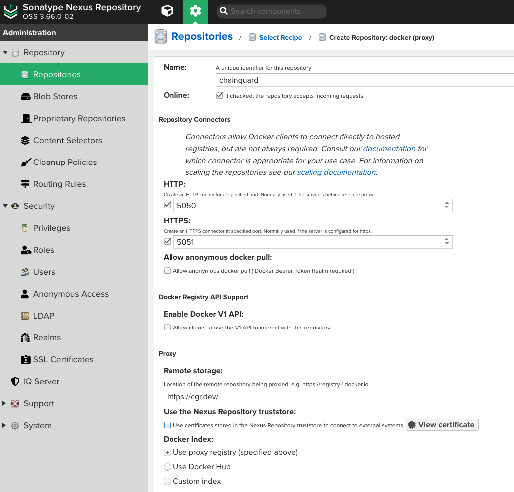
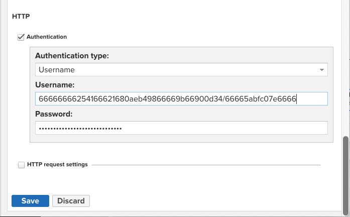

Organizations can use Chainguard Images along with third-party software repositories in order to integrate with current workflows as the single source of truth for software artifacts. In this situation, you can set up a proxy repository to function as a mirror of the [Chainguard Registry](/chainguard/chainguard-registry/overview/). This mirror can then serve as a pull through cache for your Chainguard Images.

This tutorial outlines how to set up a repository with [Sonatype Nexus](https://www.sonatype.com/products/sonatype-nexus-repository). Specifically, it will walk you through how to set up one repository you can use as a pull through cache for Chainguard's public Developer Images or for Production Images originating from a private Chainguard repository.


## Prerequisites

In order to complete this tutorial, you will need the following:

* Administrative privileges over a Nexus instance. If you're interested in testing out this configuration, you can either download a trial from [Sonatype's website](https://www.sonatype.com/products/sonatype-nexus-oss-download) or run it as a [Docker container](https://github.com/sonatype/docker-nexus3).

> Note: If you use the Docker solution, you will need to add an extra port for the repository to the `docker run` command. For example, if you run the repository on port `5051`, you would a command like `docker run -d -p 8081:8081 -p 5051:5051 --name nexus sonatype/nexus3` instead of the example given in the linked GitHub overview.

* Privileges to create a pull token on a Chainguard Registry. (For private Chainguard repository access)
* A spare port on the Nexus server to serve the repository (Nexus limits you to 20 ports). Or an alternative solution — such as a reverse proxy — which is beyond the scope of this guide.


## Setting up Nexus as a pull through for Developer Images

Chainguard's Developer Images are free to use, publicly available, and always represent versions tagged as `:latest`.

To set up a remote repository in Nexus from which you can pull Chainguard Developer Images, log in to Nexus with an **admin** account. Once there, click on the Administration mode cog in the top bar, click **Repository** in the left-hand navigation menu, and then select **Repositories**. On the Repositories page, click the **Create Repository** button and select the **docker (proxy)** Recipe.

Following that, you can enter the following details for your new remote repository:

* **Name** — This is used to refer to your repository. You can choose whatever name you like here, but this guide's examples will use the name `chainguard`.
* **Remote storage** — This must be set to `https://cgr.dev/`.
* **HTTP[S] port** — Choose an HTTP or HTTPS port as appropriate for your setup.



Following that, click the **Create repository** button at the bottom of the page. If everything worked as expected, you'll be taken back to the repository list and should now see an extra repository with your chosen name, with type "proxy".

Your Nexus URL is the hostname of the Nexus server AND the port number you chose; for example, `myrepo.local:5051`. If your Nexus server is running from a Docker container, your Nexus URL would be something like `localhost:5051`.  

### Testing pull through of a Chainguard Developer Image

If your setup requires authentication, log in with a valid Nexus username and password:

```sh
docker login -u<user> <Nexus URL>
```

After running this command, you'll be prompted to enter a password.

After running the `docker login` command, you will be able to pull a Chainguard Developer Image through Nexus. The following example pulls the `wolfi-base` Image.

```sh
docker pull <Nexus URL>/chainguard/wolfi-base
```

Be sure the `docker pull` command contains the correct Nexus URL for your repository. 

## Setting up Nexus as a pull through for Production Images

Production Chainguard Images are enterprise-ready images that come with patch SLAs and features such as Federal Information Processing Standard (FIPS) readiness. The process for setting up an Nexus repository that you can use as a pull through cache for Chainguard Production Images is similar to the one outlined previously for Developer Images, but with a few extra steps.

To get started, you will need to create [a pull token](/chainguard/chainguard-registry/authenticating/#authenticating-with-a-pull-token) for your organization's Chainguard Registry. Pull tokens are longer-lived tokens that can be used to pull Images from other environments that don't support OIDC, such as some CI environments, Kubernetes clusters, or with registry mirroring tools like Nexus.

Follow the instructions in the link above to create a pull token and take note of the values for `username` and `password` as you'll need this to configure a repository for pulling through Production Images.

You can edit the existing repository and all your users will have access to the private images. Alternatively, you could create a new `chainguard-private` repository exactly as before but with restricted access, though restricting access to repositories in Nexus is beyond the scope of this guide.

At the bottom of the configuration screen there will be an HTTP section. Check the **Authentication** box and use the "Username" Authentication type.

Enter the `username` and `password` from the pull token in the respective fields. 



Click the **Save** button to apply the changes.


### Testing pull through of a Chainguard Production image: 

If your setup requires authentication, log in with a valid Nexus username and password:

```sh
docker login -u<user> <Nexus URL>
```

After running this command, you'll be prompted to enter a password.

After running the `docker login` command, you will be able to pull a Chainguard Production Image through Nexus. If your organization has access to it, the following example will pull the `argo-cli-fips` Image.

```sh
docker pull <Nexus URL>/<company domain>/argo-cli-fips
```

Be sure the `docker pull` command you run includes the name of your organization's registry.


## Debugging pull through from Chainguard’s registry to Nexus

If you run into issues when trying to pull Images from Chainguard's Registry to Nexus, please ensure the following requirements are met:

* Ensure that all Images [network requirements](https://edu.chainguard.dev/chainguard/administration/network-requirements/) are met.
* When configuring a remote Nexus repository, ensure that the **URL** field is set to `https://cgr.dev/`. This field **must not** contain additional components. 
* You can troubleshoot by running `docker login` from another node (using the Nexus pull token credentials) and try pulling an Image from `cgr.dev/chainguard/<image name>` or `cgr.dev/<company domain>/<image name>`.
* It could be that your Nexus repository was misconfigured. In this case, create and configure a new Nexus repository to test with.


## Learn more

If you haven't already done so, you may find it useful to review our [Registry Overview](/chainguard/chainguard-registry/overview/) to learn more about the Chainguard Registry. You can also learn more about Chainguard Images by checking out our [Images documentation](/chainguard/chainguard-images/overview/). If you'd like to learn more about Sonatype Nexus, we encourage you to refer to the [official Nexus documentation](https://help.sonatype.com/en/sonatype-nexus-repository.html).