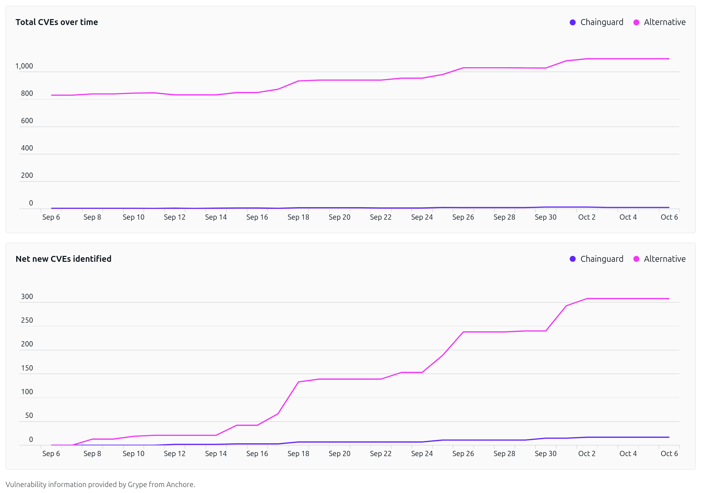

Chainguard provides CVE Visualizations for all of its container images. This feature creates reports with CVE comparisons between Chainguard Containers and popular alternatives, as well as historical CVE remediation metrics. CVE Visualizations provide insight into image health and can help teams measure the engineering, security, and economic benefits gained from using Chainguard Containers.

This guide outlines how you can access a container image's CVE Visualization in both the Chainguard Console and in the Containers Directory.

## Accessing CVE visualizations in the Console

You can find CVE visualizations in two places in the [Chainguard Console](https://console.chainguard.dev): the **Reports** page in the left-hand navigation menu, and the **Comparison** tab of an individual image.

### Reports section

Select [**Reports**](https://console.chainguard.dev/reports) in the left-hand navigation menu.

The Reports page has two tabs: **Compare images** and **Organization comparison**.

#### Compare images

The **Compare images** tab compares one Chainguard Container with a popular alternative. It has three controls at the top:

* A search box for choosing the Chainguard Container to compare. Its list shows your organization's images first, followed by the Chainguard catalog. The tab opens with the first image already selected.
* An **Alternative** drop-down that lists the alternative images available for comparison. When more than one is available, choose the one you want.
* A **Period** drop-down that sets the time range: **Last month**, **Last 3 months**, **Last 6 months**, **Last 12 months**, or **Custom**.

Below the controls are these sections:

* An overview of each image's **Latest CVE count**, **Daily average** CVE count, and **Compressed size**.
* **CVEs by severity**, with bar graphs of each image's daily CVE count, broken down by severity. Its **Export** button downloads this data as a JSON file.
* **Total CVEs over time**, a line graph of each image's total CVE count per day. It shows the difference in CVE count between the images.
* **Net new CVEs identified**, a line graph of the CVEs newly identified in each image during the time range. It shows how quickly each image accumulates CVEs.

 

#### Organization comparison

The **Organization comparison** tab totals CVE data across your organization's images and compares it with their alternatives. It covers only images in your organization, not the rest of the Chainguard catalog.


If you're a member of more than one organization, you can switch organizations with the drop-down menu in the top left corner of the Console.


There are several controls at the top of the tab:

* An image selector, with all of your organization's images selected by default. Remove images to narrow the comparison. The copy button next to the image count copies a link to your selection.
* A **Compare** drop-down that switches between **All organization images** and **Images with known alternatives**.
* **Export to PDF** and **Export to JSON** buttons.

Below the controls, a summary states how many vulnerabilities the selected images eliminate compared to their alternatives. Next is a severity section titled with your image count, such as **CVEs by severity for your 287 images**. It has side-by-side bar graphs of the daily CVE counts for **Chainguard** and **Alternatives** over the last 30 days, color-coded by severity. Select **What's being compared?** to list each image with the alternative it's compared against.

### Comparison tab

You can find the same comparison data for a single image under **Images**, on either the **Organization** or **Chainguard catalog** tab.

Select or search for a container image, which opens on its **Tags** tab by default. Select the **Comparison** tab, which shows the same sections as the **Compare images** tab on the Reports page, with **Alternative** and **Period** drop-downs at the top. An **Export** button appears only for images you open from the **Organization** tab.

## Accessing CVE visualizations in the Containers Directory

Similar to the CVE reports found under **Images** in the Chainguard Console, you can find CVE reports for every one of Chainguard's container images in the [Containers Directory](https://images.chainguard.dev/).

In the directory, select or search for any container image. The image opens on its **Tags** tab. Select the **Comparison** tab to view the CVE comparison data.

## Limitations

Some container images don't have a comparable alternative. For these images, the **Comparison** tab shows data only for the Chainguard Container.

The **Comparison** tab isn't available for customized images.

## Learn more

The CVE data used in these reports is from the [Grype vulnerability scanner](/chainguard/containers/security-and-compliance/working-with-scanners/grype-tutorial/). Vulnerability data is constantly evolving, so we scan container images each day and store the results. The results shown are the vulnerabilities found on the day in question; scanning the container images again with a newer database can produce different results.

For more information on CVEs refer to [What are software vulnerabilities and CVEs](https://www.chainguard.dev/supply-chain-security-101/what-is-a-cve). You may also find our guide on [Using the Chainguard Directory and Console](/platform/console/images-directory/) to be of interest.
