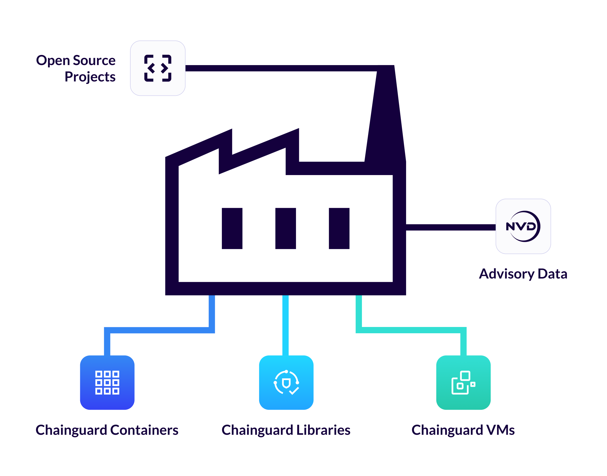
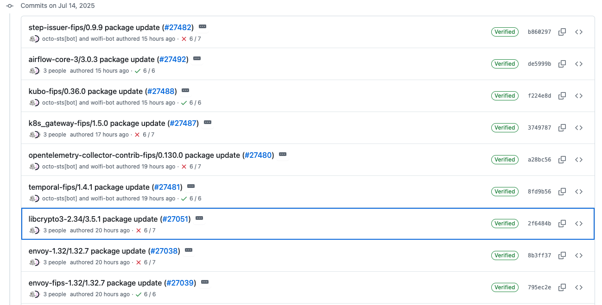

Chainguard Factory is the automated build infrastructure that continuously monitors, builds, and updates thousands of open source projects to deliver containers, libraries, and VMs with a strong security posture and the latest patches. This massive automation system tackles one of the industry's biggest challenges: keeping software dependencies current at scale while maintaining security and compatibility across the entire open source ecosystem. 

It is hard to overstate the sheer scale of Chainguard’s task of being the
secure source for open source. There are **thousands** of projects that we
constantly monitor, build, test, and update. Some of these are
foundational projects like [LLVM](https://llvm.org/) and
[glibc](https://www.gnu.org/software/libc/). Others are applications central to
modern infrastructure like PostgreSQL and nginx. Still more are the small utilities
and libraries that we use all the time and almost forget about, such as sed and jq.
These projects are then built into our 1,500
containers, plus our VMs and libraries, each of which are updated daily.

If you look inside the factory, you will find a complex build system running
parallel builds at high speed, constantly being updated and refined by
engineers supported by AI.

## The Pace of Updates

Open source projects are constantly evolving and updating. The factory keeps up
through vigilant and automated monitoring that leverages the [GitHub
API](https://docs.github.com/en/rest), the [Release Monitoring
project](https://release-monitoring.org/), [PyPI](https://pypi.org/), [Maven
Central](https://mvnrepository.com/repos/central) and the [npm
registry](https://docs.npmjs.com/about-the-public-npm-registry). To give you an
idea of how many updates happen in a short window of time, here is a screenshot
of 5 hours of our automation finding updates to projects.  

Automation opens a Pull Request (PR) when a new release is detected which updates the builds
to the latest version. After building the new version, a suite of tests will
then run to ensure it works as expected.  If a test fails, AI analyzes the logs
and suggests updates. Human engineers then step in to approve the update or fix
any issues. Once approved, the package is built and is added to one of our package
repositories. The process combines fast, automated updates from AI, with
reviews and guidance from engineers to ensure all changes meet our high
standards of quality and security.

As every software engineer knows, not all updates are equal. Some are simple
updates to applications which build cleanly and are not used in other packages.
Some updates are a lot more complicated however, with other packages being
dependent on them, either at buildtime or runtime. Consider a bump to the Go
compiler. Not only do we need to update the Go package and release a new Go
compiler image, we also need to rebuild all the packages that are dependent on
Go and their dependencies. Some of these builds will fail due to changes caused
by the update, and will require extra attention from engineers. Updates to core
packages like the Go compiler, OpenSSL, or glibc are major events that require
considerable engineering effort to successfully conclude. They are also
happening all the time. 

Once an update passes through the package stage, we still need to update all
container images that are dependent on it. For applications like PostgreSQL,
this affects a handful of images, but an update to OpenSSL or glibc requires
practically all our images to be rebuilt. After new versions of images are
built, they are tested, often as part of a Helm chart deployed to a Kubernetes
cluster (sometimes even a specially provisioned EKS cluster for images such as
[eks-distro-kube-proxy!](https://images.chainguard.dev/directory/image/eks-distro-kube-proxy/overview?utm_source=cg-academy&utm_medium=referral&utm_campaign=dev-enablement)).

On top of this, software is constantly going End-of-Life (EOL). When software
is no longer supported upstream, we will cease updating it in Wolfi (see [Wolfi
Packages in Chainguard
Containers](/chainguard/chainguard-images/about/versions/#wolfi-packages-in-chainguard-containers).
Customers benefit from an extended [EOL Grace
Period](/chainguard/chainguard-images/features/eol-gp-overview/)
with Chainguard OS where we continue to build old versions).

The result is a relentless, orchestrated flow of updates — ensuring our
software remains secure, current, and reliable.  

## Handling CVEs

Projects like [NVD](https://nvd.nist.gov/) and
[GHSA](https://github.com/advisories) are constantly issuing security
advisories, for example in 2024 an [average of 108 CVEs were issued every
day](https://jerrygamblin.com/2025/01/05/2024-cve-data-review/). These
advisories are ingested by [scanners](https://www.chainguard.dev/scanners?utm_source=cg-academy&utm_medium=referral&utm_campaign=dev-enablement) such
as grype and snyk. We use these scanners internally to alert whenever a CVE is
identified as affecting one of our packages. Automation adds the CVE to an
internal queue for further investigation and an advisory is issued with
the status of `Under Investigation`. 

After an engineer investigates the issue, the most likely outcomes are: 
- We determine the advisory to be a false positive and change the status to
    `Not Affected`. 
- We determine it to be a real issue and take further action to resolve it.
    This could mean pulling in a patch or bumping a dependency in the project,
before rebuilding and updating the status to `Fixed`. 

See [How Chainguard Issues Security
Advisories](/chainguard/chainguard-images/staying-secure/security-advisories/how-chainguard-issues/)
for full information on the lifecycle of advisories.

## Identifying Malware and Malicious Updates

It is essential that the factory is secure and we do not inadvertently publish
malware. There have been multiple cases of supply chain attacks where reputable
open source projects have been subverted or taken over and used for the
distribution of malware, the XZ utils attack being a case-in-point.
Avoiding the propagation of such malware is a key goal of the factory and there
are several steps that we take to ensure security. One of the most important is
analyzing code for known malware, but we also automatically identify any
unexpected changes in the functionality of software from an update. For
example: an update would be flagged as suspicious if it makes new network
connections but there are no references to this in the project's changelog.

## Infrastructure and Build Security

We use GitHub for source code management, but our builds themselves run on Kubernetes
clusters to provide the scaling and observability we require. As you can
imagine, there is a considerable cost associated with building at the pace
described.

We take security in our build environment seriously and adhere to the
[SLSA](https://slsa.dev/) guidelines for ensuring build integrity and
provenance. The builds themselves follow [OpenSSF guidance for security
hardening via compiler flag
settings](https://www.chainguard.dev/unchained/enhanced-compiler-flags-for-building-chainguards-guarded-images?utm_source=cg-academy&utm_medium=referral&utm_campaign=dev-enablement).  

## On Automation, AI and Human Engineers

To keep the factory running at the pace it does, we leverage automation and AI
to streamline operations. But the vast number of changes results in constant
exceptions and unexpected events that require domain specific knowledge to
resolve. For this reason, we rely on a large and experienced engineering team
with backgrounds in a wide range of technologies, from low-level kernel and VM
engineers to those who know their way around higher level ecosystems like Node,
Java and PHP.

## Conclusion

The Chainguard Factory operates at an enormous scale. The number of builds and
workflows that are happening every second is staggering. The factory is a
critical component in Chainguard and effectively what our customers are paying
for — the ability to turn open source projects into easily consumable
containers, VMs, and libraries quickly and securely.  
