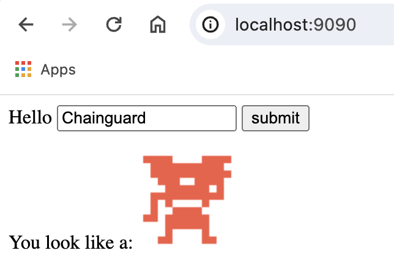

### Porting Key Points

* Chainguard's distroless Images have no shell or package manager by default. This is great for security, but sometimes you need these things, especially in builder images. For those cases we have `-dev` images (such as `cgr.dev/chainguard/python:latest-dev`) which do include a shell and package manager.
* Chainguard Images typically don't run as root, so a `USER root` statement may be required before installing software.
* The `-dev` images and `wolfi-base` / `chainguard-base` use BusyBox by default, so any `groupadd` or `useradd` commands will need to be ported to `addgroup` and `adduser`.
* The free Developer tier of Images provides `:latest` and `:latest-dev` versions. Our paid Production Images offer tags for major and minor versions.
* We use apk tooling, so `apt install` commands will become `apk add`.
* Chainguard Images are based on `glibc` and our packages cannot be mixed with Alpine packages.
* In some cases, the entrypoint in Chainguard Images can be different from equivalent images based on other distros, which can lead to unexpected behavior. You should always check the image's specific documentation to understand how the entrypoint works.
* When needed, Chainguard recommends using a base image like `chainguard-base` or a `-dev` image to install an application's OS-level dependencies.
* Although `-dev` images are still more secure than most popular container images based on other distros, for increased security on production environments we recommend combining them with a distroless variant in a multi-stage build.
---

## The Sample Application

The application in question is [identidock](https://github.com/using-docker/identidock). This application was written for the book [Using Docker](https://learning.oreilly.com/library/view/using-docker/9781491915752/) about ten years ago, which shows that we can still migrate software of this age to a new container while realizing the benefits of a no-to-low CVE count. The application itself will create [identicons](https://en.wikipedia.org/wiki/Identicon) for a user name, similar to what [GitHub generates for users with no avatar](https://github.blog/2013-08-14-identicons/). It was designed at the time to demonstrate a "microservices" approach, and as such it's made up of 3 services:

* The main identidock service, which takes the requests and talks to the
  [dnmonster](https://github.com/amouat/dnmonster) service and the redis cache
* A NodeJS application which creates the identicons
* Redis which is used as a simple cache

The services are put together as shown in the below diagram. The user only talks to the identidock service. The identidock service will first check the cache to see if it has already created an identicon for the input and, if not, requests a new identicon from the dnmonster service. The identicon is then returned to the user and saved to the cache if required.


The book walked through using various orchestrators to deploy the application, some of which have since fallen out of usage (anyone remember [fleet](https://github.com/coreos/fleet)?). For the sake of this tutorial, we'll use Docker Compose, which is arguably the simplest surviving orchestrator covered in the book.

The first task was to get the 10-year-old application building and running again. As it was a simple example application, this was thankfully straightforward and mainly required bumping versions of dependencies and a couple of cases of replacing unmaintained libraries. For a larger project, this may well have been a major effort. The original code can be found on the [using-docker GitHub repository](https://github.com/using-docker/identidock) and the updated working version (prior to moving to Chainguard Images) can be found on the [v1 branch](https://github.com/chainguard-dev/identidock-cg/tree/v1) of the [repository for this tutorial](https://github.com/chainguard-dev/identidock-cg/).

In order to follow along with the tutorial, please clone the code and switch to the `v1` branch:


```bash
git clone https://github.com/chainguard-dev/identidock-cg.git
cd identidock-cg
git switch v1
```

## Updating the Node.js Microservice

To begin, we'll update the heart of the application – the dnmonster service. dnmonster is based on [monsterid.js](https://github.com/KevinGaudin/monsterid.js/) by Kevin Gaudin. The dnmonster container hosts an API which returns an [identicon](https://en.wikipedia.org/wiki/Identicon) based on the input it's given.

```bash
docker run -d -p 8080:8080 amouat/dnmonster
curl --output ./monster.png 'localhost:8080/monster/wolfi?size=100'
```

In this example, we give dnmonster the input "wolfi", for which it will produce the following image:


The version of the code on the v1 branch already contains a few updates from the original code, as well as bumping versions, the codebase was moved from the old and sporadically maintained [restify](https://github.com/restify/node-restify) module to the more modern [express](https://expressjs.com/) module.

The Dockerfile for this version of the dnmonster service can be found in the dnmonster folder:


```Dockerfile
FROM node

RUN apt-get update && apt-get install -yy --no-install-recommends \
    libcairo2-dev libjpeg62-turbo-dev libpango1.0-dev libgif-dev \
    librsvg2-dev build-essential g++

#Create non-root user
RUN groupadd -r dnmonster && useradd -r -g dnmonster dnmonster
RUN install -d -o dnmonster -g dnmonster /home/dnmonster

RUN mkdir -p /usr/src/app
WORKDIR /usr/src/app

COPY package.json /usr/src/app/
RUN npm install
COPY ./src /usr/src/app

RUN chown -R dnmonster:dnmonster /usr/src/app
USER dnmonster

EXPOSE 8080

CMD [ "npm", "start" ]
```

The image can be built with:

```bash
cd dnmonster
docker build --pull -t dnmonster .
```

Looking at this image:

```bash
docker images dnmonster
REPOSITORY   TAG       IMAGE ID       CREATED         SIZE
dnmonster    latest    3337171ebb44   4 minutes ago   1.79GB
```

We can also run the [Grype scanning tool](https://github.com/anchore/grype) to investigate if there are any known vulnerabilities present in the image:

```
grype docker:dnmonster
 ✔ Loaded image                                                                                                dnmonster:latest
 ✔ Parsed image                                         sha256:17ad85081f0b4151b30556e2750ceab3222495cfc32caec2bf6e7be3647de78e
 ✔ Cataloged contents                                          5c969fe3503a9f5e6c83117d0efa79af70380eac2abe66a756eae00351972352
   ├── ✔ Packages                        [788 packages]
   ├── ✔ File digests                    [20,143 files]
   ├── ✔ File metadata                   [20,143 locations]
   └── ✔ Executables                     [1,343 executables]
 ✔ Scanned for vulnerabilities     [600 vulnerability matches]
   ├── by severity: 7 critical, 103 high, 290 medium, 49 low, 500 negligible (195 unknown)
   └── by status:   7 fixed, 1137 not-fixed, 544 ignored
...
```

This tells us that (at the time of writing) the image is 1.79 GB in size and has **hundreds of known vulnerabilities**.

The first step in moving to Chainguard Images is to try switching the image name in to check if anything breaks. In this case, we’ll begin with the developer variant of the Node image. Change the first line of the Dockerfile from:


```Dockerfile
FROM node
```

To:

```Dockerfile
FROM cgr.dev/chainguard/node:latest-dev
```

Unlike the `cgr.dev/chainguard/node:latest` image, the `:latest-dev` version includes a shell and package manager, which we will need for some of the build steps. In general, it's better to use the more minimal `:latest` version where possible in order to keep the size down and reduce the tooling available to attackers. Often the `:latest-dev` image can be used as a build step in a multi-stage, with a more minimal image such as `:latest` used in the final production image.

If you try building this image, you'll find that it breaks in several places. The image needs to install various libraries so that it can compile the [`node-canvas`](https://github.com/Automattic/node-canvas) dependency, and this looks a bit different in Debian than it does in [Wolfi](https://github.com/wolfi-dev/) (the OS powering Chainguard Images). In Wolfi, we first need to switch to the root user to install software and we use `apk add` instead of `apt-get`. We then need to figure out the Wolfi equivalents of the various Debian packages, which may not always have a one-to-one correspondence. There are tools to help here – you can consult our [migration guides](/chainguard/migration/debian-compatibility/) and use apk tools (like `apk search libjpeg`), but searching the [Wolfi GitHub](https://github.com/wolfi-dev/os) repository for package names will often provide you with what you’re looking for.

Make these changes by replacing the `RUN apt-get …` line with the following `RUN apk update` and adding a `USER root` line. The start of the Dockerfile should look like this:


```Dockerfile
FROM cgr.dev/chainguard/node:latest-dev

USER root
RUN apk update && apk add \
    cairo-dev libjpeg-turbo-dev pango-dev giflib-dev python3 make gcc\
    librsvg-dev glib-dev harfbuzz-dev fribidi-dev expat-dev libxft-dev\
    libfontconfig1
```

The next change we need to make is to the `RUN groupadd …` line. Chainguard images use BusyBox by default, which means `groupadd` needs to become `addgroup`. Rewrite the line so that it looks like this:

```Dockerfile
RUN addgroup dnmonster && adduser -D -G dnmonster dnmonster
```

Finally, the default entrypoint for the Chainguard image is `/usr/bin/node`. If we leave the `CMD` as it is, it will be interpreted as an argument to node, which isn't what we want. The Docker official image uses an entrypoint script to interpret commands, but this isn't available in the `cgr.dev/chainguard/node:latest-dev` image. The easiest fix is to change the `CMD` command to `ENTRYPOINT` which will override the `/usr/bin/node` command:

```Dockerfile
ENTRYPOINT [ "npm", "start" ]
```

Once you've made all these changes, you should have a Dockerfile that looks like:

```Dockerfile
FROM cgr.dev/chainguard/node:latest-dev

USER root
RUN apk update && apk add \
    cairo-dev libjpeg-turbo-dev pango-dev giflib-dev python3 make gcc\
    librsvg-dev glib-dev harfbuzz-dev fribidi-dev expat-dev libxft-dev\
    libfontconfig1

#Create non-root user
RUN addgroup dnmonster && adduser -D -G dnmonster dnmonster
RUN install -d -o dnmonster -g dnmonster /home/dnmonster

RUN mkdir -p /usr/src/app
WORKDIR /usr/src/app

COPY package.json /usr/src/app/
RUN npm install
COPY ./src /usr/src/app

RUN chown -R dnmonster:dnmonster /usr/src/app
USER dnmonster

EXPOSE 8080

ENTRYPOINT [ "npm", "start" ]
```

At this point, we have a version of dnmonster that works and is equivalent to the previous version. We can build this image:

```bash
docker build --pull -t dnmonster-cg .
...
```

And investigate it again:

```bash
docker images dnmonster-cg
REPOSITORY     TAG       IMAGE ID       CREATED              SIZE
dnmonster-cg   latest    5b785d38a022   About a minute ago   1.55GB

grype docker:dnmonster-cg
 ✔ Vulnerability DB                [updated]
 ✔ Loaded image                                                                                             dnmonster-cg:latest
 ✔ Parsed image                                         sha256:4795459b2f4a28bb721b19b798b4f78d6affb6b2a43096f8752576e6ce3fcd2c
 ✔ Cataloged contents                                          aa53bb57b8e994e65de7f3e19da6b1945a86005fe76961383166248aad56f6fe
   ├── ✔ Packages                        [599 packages]
   ├── ✔ File digests                    [14,204 files]
   ├── ✔ File metadata                   [14,204 locations]
   └── ✔ Executables                     [733 executables]
 ✔ Scanned for vulnerabilities     [2 vulnerability matches]
   ├── by severity: 0 critical, 0 high, 0 medium, 0 low, 0 negligible (2 unknown)
   └── by status:   0 fixed, 2 not-fixed, 0 ignored
NAME         INSTALLED  FIXED-IN  TYPE  VULNERABILITY   SEVERITY
git          2.48.1-r0            apk   CVE-2024-52005  Unknown
python-3.13  3.13.1-r5            apk   CVE-2025-0938   Unknown
```

So the image is a bit smaller at 1.55GB, but more importantly, we've vastly reduced the number of
vulnerabilities. There are now only 2 known vulnerabilities.

But we can still do more. In particular, although 1.55GB is smaller than the previous version, it's still a large image. To get the size down, we can use a multi-stage build where the built assets are copied into a minimal production image, which doesn't include build tooling or dependencies required during development.

Ideally, we would use the `cgr.dev/chainguard/node:latest` image for this, but we also need to install the dependencies for `node-canvas`, which means we need an image with apk tools. Normally it’s recommended to use a `:latest-dev` image for this, but in node's case, the `:latest-dev` image is relatively large due to the inclusion of build tooling, such as C compilers, that can be required by Node modules. Instead, we're going to use the `wolfi-base` image and install `nodejs` as a package.

To do this, replace the Dockerfile with the following:

```Dockerfile
FROM cgr.dev/chainguard/node:latest-dev as build

USER root
RUN apk update && apk add \
    cairo-dev libjpeg-turbo-dev pango-dev giflib-dev python3 make gcc \
    librsvg-dev glib-dev harfbuzz-dev fribidi-dev expat-dev libxft-dev \
    libfontconfig1

#Create non-root user
RUN addgroup dnmonster && adduser -D -G dnmonster dnmonster
RUN install -d -o dnmonster -g dnmonster /home/dnmonster

RUN mkdir -p /usr/src/app
WORKDIR /usr/src/app

COPY package.json /usr/src/app/
RUN npm install
COPY ./src /usr/src/app

RUN chown -R dnmonster:dnmonster /usr/src/app
USER dnmonster

EXPOSE 8080

ENTRYPOINT [ "npm", "start" ]

FROM cgr.dev/chainguard/wolfi-base

RUN apk update && apk add nodejs \
    cairo-dev libjpeg-turbo-dev pango-dev giflib-dev \
    librsvg-dev glib-dev harfbuzz-dev fribidi-dev expat-dev libxft-dev

WORKDIR /app
COPY --from=build /usr/src/app /app

EXPOSE 8080
ENTRYPOINT [ "node", "server.js" ]
```

We've added an `as build` statement to the first `FROM` line and added a second build that starts on the line `FROM cgr.dev/chainguard/wolfi-base`. The second build installs the required dependencies (including Node.js) before copying the build artifacts from the first image. We also changed the entrypoint to execute Node directly, as the image no longer contains npm.

Build and investigate the image:


```bash
docker build --pull -t dnmonster-multi .
…
docker images dnmonster-multi
REPOSITORY        TAG       IMAGE ID       CREATED         SIZE
dnmonster-multi   latest    a2efea945fb9   2 minutes ago   620MB

grype dnmonster-multi
 ✔ Loaded image                                                                                          dnmonster-multi:latest
 ✔ Parsed image                                         sha256:08c8f2b6f0bc8b55a5962abfb9daaee9030fc37c19875592ea53f896f29a4c60
 ✔ Cataloged contents                                          37c6abd0a832ad48e4a604a392d6ebbea1a7483ddedf94b7762186de9e991cff
   ├── ✔ Packages                        [343 packages]
   ├── ✔ File digests                    [8,887 files]
   ├── ✔ File metadata                   [8,887 locations]
   └── ✔ Executables                     [601 executables]
 ✔ Scanned for vulnerabilities     [0 vulnerability matches]
   ├── by severity: 0 critical, 0 high, 0 medium, 0 low, 0 negligible
   └── by status:   0 fixed, 0 not-fixed, 0 ignored
No vulnerabilities found
```

This results in an image that is now 620MB in size and has 0 CVEs.

We're most of the way now, but there are still a couple of finishing touches to make. The first one is to remove the dnmonster user. The wolfi-base image already defines a `nonroot` user, so we can make the build a little less complicated by using that user directly. The second one is to add in a process manager. We have node running as the root process (PID 1) in the container, which isn't ideal as it doesn't handle some of the responsibilities that come with running as PID 1, such as forwarding signals to subprocesses. You can see this most clearly when you try to stop the image – it takes several seconds as the process doesn't respond to the SIGTERM signal sent by Docker and has to be hard killed with SIGKILL. To fix this, we can add [`tini`](https://github.com/krallin/tini), a small init for containers.

The `tini` binary will run as PID 1, launch npm as a subprocess and take care of PID 1 responsibilities. Now, the final Dockerfile looks like this:

```Dockerfile
FROM cgr.dev/chainguard/node:latest-dev as build

USER root

RUN apk update && apk add \
    cairo-dev libjpeg-turbo-dev pango-dev giflib-dev python3 make gcc \
    librsvg-dev glib-dev harfbuzz-dev fribidi-dev expat-dev libxft-dev \
    libfontconfig1

RUN mkdir -p /usr/src/app
WORKDIR /usr/src/app

ENV NODE_ENV production
COPY package.json /usr/src/app/
RUN npm install
COPY ./src /usr/src/app

FROM cgr.dev/chainguard/wolfi-base

RUN apk update && apk add tini nodejs \
    cairo-dev libjpeg-turbo-dev pango-dev giflib-dev \
    librsvg-dev glib-dev harfbuzz-dev fribidi-dev expat-dev libxft-dev

WORKDIR /app
COPY --from=build /usr/src/app /app

EXPOSE 8080
ENTRYPOINT ["tini", "--" ]
CMD [ "node", "server.js" ]
```

This version is also available in the [main branch of the repository](https://github.com/chainguard-dev/identidock-cg/blob/main/dnmonster/Dockerfile).

Build it:

```bash
docker build --pull -t dnmonster-final .
…
```

And run it to prove it still works:

```bash
docker run -d -p 8080:8080 dnmonster-final
...
curl --output ./monster.png 'localhost:8080/monster/wolfi?size=100'
```
> **Note:** If you receive a "port is already allocated" error, be sure to clean up the previous container. Check what containers are running with `docker container ls` and remove it with `docker rm -f <container-name>`. There are still more tweaks that could be made. Bret Fisher has some [excellent resources on building Node.js containers in this GitHub repo](https://github.com/BretFisher/nodejs-rocks-in-docker). But for the purposes of this example app, we've made excellent progress.

## Updating the Python Microservice

The next service we will look at updating is Identidock, the main entrypoint for the application. Identidock is responsible for looking up requests in the cache and falling-back to calling the dnmonster service if they're not present.

Again, the version of the code on the v1 branch already contains a few updates from the original code, but in this case all that was needed was to bump various libraries to newer versions. The Dockerfile for the v1 version can be found in the identidock folder and looks like:

```Dockerfile
FROM python

RUN groupadd -r uwsgi && useradd -r -g uwsgi uwsgi
RUN pip install Flask==3.1.0 uWSGI requests==2.32.3 redis==5.2.1
WORKDIR /app
USER uwsgi
COPY app /app
COPY cmd.sh /

EXPOSE 9090 9191

CMD ["/cmd.sh"]
```

The image can be built with the following, assuming the current directory is the root of repo:

```bash
cd identidock
docker build --pull -t identidock .
…
```

Take a look at the image:

```bash
docker images identidock
REPOSITORY   TAG       IMAGE ID       CREATED          SIZE
identidock   latest    a718358590ff   11 seconds ago   1.51GB
```

Scan for vulnerabilities:

```bash
grype docker:identidock
 ✔ Loaded image                                                                                               identidock:latest
 ✔ Parsed image                                         sha256:0b4ac715984206f1e9134aa48a8efeba88e7badc3969d6f8c79cca98b47df676
 ✔ Cataloged contents                                          5ebeaac39f8f941d41629fdb1e13c39bc73558caadfe7699963b4b3a6c55a222
   ├── ✔ Packages                        [452 packages]
   ├── ✔ File digests                    [20,129 files]
   ├── ✔ File metadata                   [20,129 locations]
   └── ✔ Executables                     [1,428 executables]
 ✔ Scanned for vulnerabilities     [621 vulnerability matches]
   ├── by severity: 7 critical, 100 high, 296 medium, 47 low, 515 negligible (200 unknown)
   └── by status:   2 fixed, 1163 not-fixed, 544 ignored
```

At the time of writing, this image is 1.51GB with hundreds of vulnerabilities (7 critical) according to Grype.

Again as a first step, we will try to switch out directly to the Chainguard Image. To do this, edit the Dockerfile so the first line reads:

```Dockerfile
FROM cgr.dev/chainguard/python:latest-dev
```

Before building the image we need to also update `groupadd` syntax to use the `addgroup` format. As Chainguard Images don't run as root by default for security reasons, we also need to change to the root user for this command to work. Replace the `RUN groupadd` line with the lines:


```Dockerfile
USER root
RUN addgroup uwsgi && adduser -D -G uwsgi uwsgi
```

The image now builds, but there are issues due to differences in the image entrypoint. If you run the image, you will get a confusing error message such as:

```bash
`File "/cmd.sh", line 4`
  if [ "$ENV" = 'DEV' ]; then
         ^^^^^^
SyntaxError: cannot assign to literal here. Maybe you meant '==' instead of '='?
```

This is caused by the Chainguard Image using `/usr/bin/python` as the entrypoint, which means the `cmd.sh` entrypoint script is interpreted by Python instead of the shell. Fixing this can be as easy as changing the entrypoint, but let's take a look at the script first.

This is the file `cmd.sh` in the identidock directory:

```bash
#!/bin/bash
set -e

if [ "$ENV" = 'DEV' ]; then
   echo "Running Development Server"
   exec python "/app/identidock.py"
elif [ "$ENV" = 'UNIT' ]; then
    echo "Running Unit Tests"
    exec python "tests.py"
else
    echo "Running Production Server"
    exec uwsgi --http 0.0.0.0:9090 --wsgi-file /app/identidock.py \
               --callable app --stats 0.0.0.0:9191
fi
```

This script decides how to run the application depending on how the `ENV` environment variable is set. The idea here is to allow us to use the same image in development, testing, and production. This approach is no longer recommended as it leads to development tooling being present in the production environment. Even though the development tooling isn't run in production, it is still bloating the image and is potentially exploitable by attackers. Therefore, we will use a different approach and break the Dockerfile into separate development and production images.

Let’s skip to the final Dockerfile for our image and walk through the changes made. These changes address multiple issues, beyond just having multiple images, and are based on the [Chainguard Academy guide to Python images](/chainguard/chainguard-images/getting-started/python/).

Replace the Dockerfile with this one (this is also available on the ["main" branch](https://github.com/chainguard-dev/identidock-cg/blob/main/identidock/Dockerfile)):

```Dockerfile
FROM cgr.dev/chainguard/python:latest-dev as dev

ENV LANG=C.UTF-8
ENV PYTHONDONTWRITEBYTECODE=1
ENV PYTHONUNBUFFERED=1
ENV PATH="/app/venv/bin:$PATH"

WORKDIR /app
RUN python -m venv /app/venv
COPY requirements.txt ./
RUN pip install --no-cache-dir -r requirements.txt
COPY app /app

EXPOSE 5000

ENTRYPOINT ["python"]
CMD ["identidock.py"]

FROM cgr.dev/chainguard/python

WORKDIR /app
ENV PYTHONUNBUFFERED=1
ENV PATH="/app/venv/bin:$PATH"

COPY app/identidock.py ./
COPY --from=dev /app/venv /app/venv

EXPOSE 9090
ENTRYPOINT [ "gunicorn", "-b", "0.0.0.0:9090", "identidock:app" ]
```

And add the file `requirements.txt` to the current directory (`identidock`) with the following contents:

```
Flask==3.1.0
requests==2.32.3
redis==5.2.1
gunicorn==23.0.0
```

The first thing to notice is that we have a multistage build now. If you want the development image rather than the production one, you can specify it during docker build:

```bash
docker build --pull --target dev -t identidock:dev .
```

Otherwise, you will get the production image only.

There are several more environment variables defined. These prevent the creation of Python bytecode and buffering of output. For more detail on why this is useful, see the blog [PYTHONDONTWRITEBYTECODE and PYTHONUNBUFFERED Explained](https://blog.mimixtech.com/pythondontwritebytecode-and-pythonunbuffered-explained).

The installation of pip modules has moved to the `requirements.txt` file. The main thinking here is that we don't need to update the Dockerfile each time a dependency is updated or changed.

The development server runs on port 5000, while the production server runs on port 9090. We could edit this so they both run on the same port, but this approach reduces the chance of accidentally running the development server in production. The development server is started directly from the entrypoint, so we are no longer dependent on an entrypoint script, simplifying our architecture.

To get a minimal, clean production install, we are using a Python virtual environment([venv](https://docs.python.org/3/library/venv.html)) in the development image to isolate all dependencies, which are then copied over to the production image. Finally, the production image has been changed to use [gunicorn](https://gunicorn.org/) as [uwsgi has entered "maintenance mode"](https://github.com/unbit/uwsgi).

Build the final image:

```bash
docker build --pull -t identidock-cg .
```

And take a look at it:

```bash
docker images identidock-cg
REPOSITORY      TAG       IMAGE ID       CREATED          SIZE
identidock-cg   latest    1b5689af14a1   14 seconds ago   122MB
```

Run a scan with grype:


```bash
grype docker:identidock-cg
 ✔ Loaded image                                                                                            identidock-cg:latest
 ✔ Parsed image                                         sha256:c79295258a2b67f2a0eda49c41a2d791888df6cc7b3bdea694d810ec5d2916d8
 ✔ Cataloged contents                                          6c8262ac152209ef3e36cad9c49c0d3e3f16d7cbfeafad9abb569c7690c68c2e
   ├── ✔ Packages                        [45 packages]
   ├── ✔ File digests                    [1,667 files]
   ├── ✔ File metadata                   [1,667 locations]
   └── ✔ Executables                     [135 executables]
 ✔ Scanned for vulnerabilities     [1 vulnerability matches]
   ├── by severity: 0 critical, 0 high, 0 medium, 0 low, 0 negligible (1 unknown)
   └── by status:   0 fixed, 1 not-fixed, 0 ignored
NAME         INSTALLED  FIXED-IN  TYPE  VULNERABILITY  SEVERITY
python-3.13  3.13.1-r5            apk   CVE-2025-0938  Unknown
```

The result of all these changes is that the production image is only 122 MB (down from 1.51GB, so an enormous saving of over a GB) and has 1 CVE (down from hundreds). This is a huge improvement!

Further information on using Chainguard Images with Python can be found in our [Getting Started guide](https://edu.chainguard.dev/chainguard/chainguard-images/getting-started/python/).


## Replacing the Redis Image and Updating the Docker Compose File

Updating Redis is straightforward. We're not making any changes to the application image, so all we need to do is directly update the reference to `redis:7` in the Docker Compose file to `cgr.dev/chainguard/redis`. The new image requires no extra configuration, but we go from a 195 MB image with 129 vulnerabilities to a 33 MB image with 0 CVEs (again according to Grype).

To update Compose, in the top level directory of the repo, replace the content of the `docker-compose.yml` file with the following:


```yaml
name: identidock

services:
  frontend:
    build: identidock
    ports:
      - "9090:9090"

  dnmonster:
    build: dnmonster

  redis:
    image: cgr.dev/chainguard/redis
```

If you now run `docker compose up -–build`, you should have a working application that can be reached on port 9090:



There are some differences between this version and the original. The environment variable used for switching between image variants has been removed and the ports have changed to reflect the default port used in gunicorn.

This Compose file doesn't contain support for a development workflow currently – ideally we would be able to quickly iterate on our code without building a new image. The original file used volumes to achieve this, but this isn't something we want to do with the production image. One solution is to have a separate development Compose file, which will build the development image and use a volume to mount code at runtime for immediate feedback. New versions of Docker also support [Compose Watch](https://docs.docker.com/compose/file-watch/) which can be a more efficient and granular solution than volume mounts. See [What is Docker Compose Watch and what problem does it solve?](https://collabnix.com/what-is-docker-compose-watch-and-what-problem-does-it-solve/) for an introductory tutorial on using Compose Watch.

## Conclusion

Porting our application to Chainguard Images was relatively straightforward. There were some gotchas around differences to other images, such as different entrypoint settings and names for packages. The largest part of the puzzle was moving from single image builds to multistage builds that take advantage of the minimal Chainguard runtime images for Python and NodeJS. Once all this was done, we ended up with a much smaller set of images and with a drastically reduced number of CVEs.

### Cleaning Up

To clean up the resources used in this guide, first stop any containers started by Compose:

```bash
docker-compose down
```

Then check `docker ps` to see if any containers are still running and stop them with `docker stop
<id>`.

You can then remove any images you've built:

```bash
docker rmi -f dnmonster dnmonster-cg dnmonster-multi identidock identidock:dev identidock-cg
```
