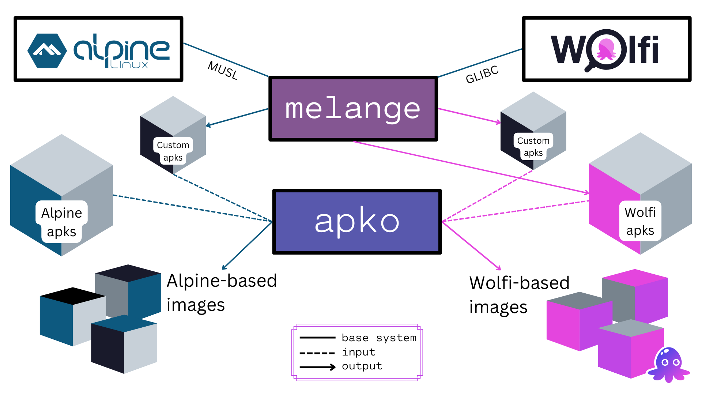

[apko](http://github.com/chainguard-dev/apko) is a command-line tool that allows users to build container images using a declarative language based on YAML.

apko is so named as it uses the [APK](https://wiki.alpinelinux.org/wiki/Package_management) package format and is inspired by the [ko](https://github.com/google/ko) build tool.

The following image contains an overview of the apko ecosystem and how it interacts with melange for building apk-based images, using either Alpine or Wolfi as base system.

apko and [melange](/open-source/melange) are part of the open source toolkit developed by Chainguard to build [Wolfi](/open-source/wolfi) and [Chainguard Images](/chainguard/chainguard-images).

### apko Features

- **Fully reproducible by default.** Run apko twice and you will get exactly the same binary.
- **Fast.** apko aims to build images in ms.
- **Small.** apko generated images only contain what's needed by the application, in the style of distroless.
- **SBOM Support.** apko produces a Software Bill of Materials (SBOM) for images, detailing all the packages inside.
- **Services.** apko supports using the s6 supervision suite to run multiple processes in a container without reaping or signalling issues.

