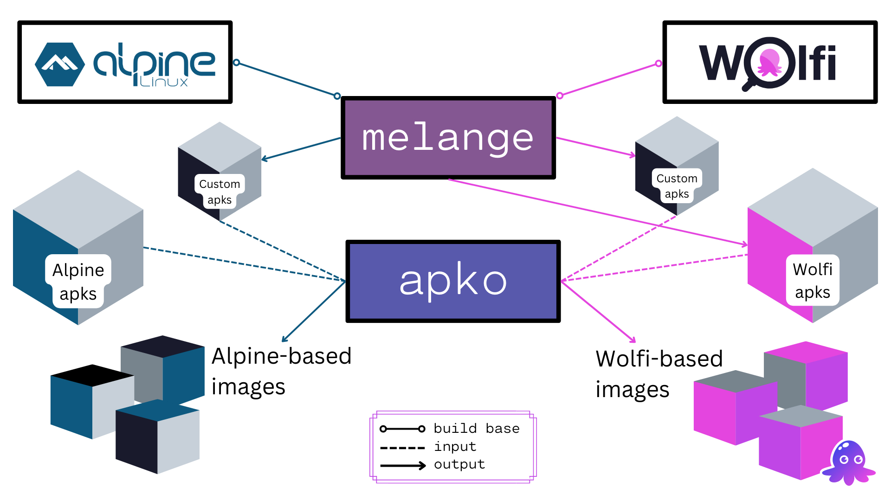

[apko](http://github.com/chainguard-dev/apko) is a command-line tool designed to create single-layer container images based on the [apk](https://wiki.alpinelinux.org/wiki/Package_management) package format. It was so named as it uses the apk package format and is inspired by the [ko](https://github.com/google/ko) build tool.

apko is part of the open source toolkit developed by Chainguard to build [Chainguard Images](/chainguard/chainguard-images/overview/). The following diagram contains an overview of the apko ecosystem and how it interacts with [melange](/open-source/build-tools/melange/overview/) for building apk-based images, using either [Wolfi](/open-source/wolfi/overview/) or Alpine as base system.

For more information and up-to-date examples on how to use apko, please refer to the [apko repository on GitHub](http://github.com/chainguard-dev/apko).
