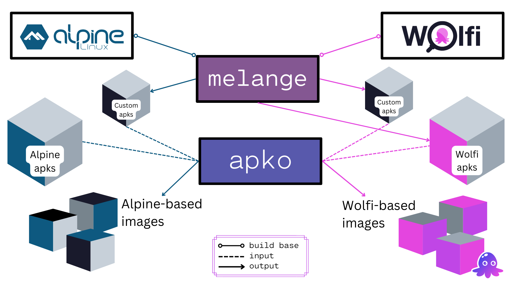

[melange](https://github.com/chainguard-dev/melange) is an [apk](https://wiki.alpinelinux.org/wiki/Package_management) builder tool that uses declarative pipelines to create apk packages. It is part of the open source tooling used for [Wolfi](/open-source/wolfi), which is the operating system used to power [Chainguard Images](/chainguard/chainguard-images).

From a single YAML file, users are able to generate multi-architecture apks that can be injected directly into [apko](https://github.com/chainguard-dev/apko) builds.

The following diagram contains an overview of the apko and melange ecosystem and how they work together to compose apk-based images, using either Wolfi or Alpine as base system.

For more information and up-to-date examples on how to use melange, please refer to the [melange repository on GitHub](http://github.com/chainguard-dev/melange).
