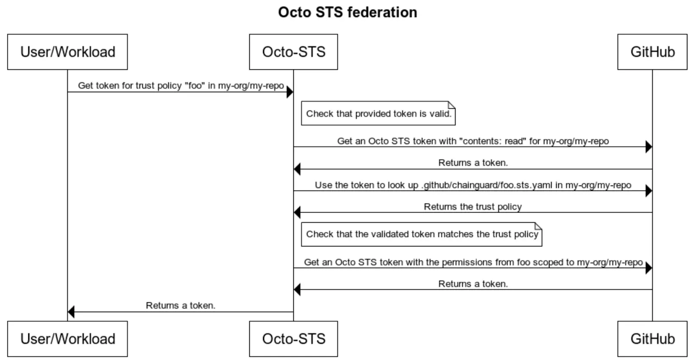

Octo STS is a GitHub App that exchanges OIDC tokens from your workloads for short-lived GitHub tokens, so your automation doesn't need personal access tokens (PATs). This page shows you how to install Octo STS, write trust policies, exchange tokens, and fix failed exchanges. For background on why Octo STS exists, read [Octo STS: Short-lived GitHub tokens without PATs](https://www.chainguard.dev/supply-chain-security-101/octo-sts-overview) in Supply Chain Security 101.

## How the token exchange works

Octo STS issues tokens according to trust policies that you keep in your repositories:

1. You install the Octo STS GitHub App on your organization or repositories.
1. You write trust policies that say which identities can get a token and what permissions the token carries.
1. Your workload presents an OIDC token to Octo STS.
1. If the OIDC token matches a trust policy, Octo STS returns a short-lived GitHub token with the permissions that policy grants.



Tokens expire after one hour and can't be refreshed. When a token expires, exchange a new OIDC token for a new GitHub token.

## Install Octo STS

1. Go to the [Octo STS app page](https://github.com/apps/octo-sts) and click **Install**.
1. Select the organization or user account.
1. Choose the repositories that Octo STS can access. Octo STS works with both public and private repositories.
1. Approve the permissions.

Octo STS requests a broad set of permissions so that it can support many use cases, but the tokens it issues carry only the permissions that your trust policies grant. The app itself needs `contents: read` so that it can read your trust policies. Until you create a trust policy, Octo STS can't issue any tokens.

The hosted service at `octo-sts.dev` is free to use. Octo STS is open source, so you can also host it yourself; the [Octo STS repository](https://github.com/octo-sts/app) has deployment instructions.

When Octo STS needs to add or remove GitHub permissions, the maintainers open an issue in the Octo STS repository that explains the change, and GitHub asks you to approve the updated permissions for your installation. These updates happen quarterly, except for critical changes.

## Write a trust policy

Trust policies are YAML files at `.github/chainguard/{name}.sts.yaml` in your repository. Octo STS typically reads them from the default branch. A repository can have several policies, each with its own identity requirements and permissions:

- `.github/chainguard/renovate.sts.yaml`
- `.github/chainguard/deploy.sts.yaml`
- `.github/chainguard/ci.sts.yaml`

When your workload exchanges a token, it names the policy to use with the `identity` parameter.

To change a policy's permissions, edit the file, then commit and push the change. New permissions apply to every exchange after that. Tokens that Octo STS already issued keep their original permissions until they expire.

### Match subjects exactly

Prefer exact subject matching:

```yaml
subject: repo:org@<owner-id>/repo@<repo-id>:ref:refs/heads/main
```

Use a pattern only when you need the flexibility:

```yaml
subject_pattern: "repo:org@<owner-id>/repo@<repo-id>:ref:refs/heads/.*"
```

An exact match makes it harder to grant broader access than you intended.


These subjects use GitHub's immutable format, which embeds the numeric owner ID and repository ID in the `sub` claim (for example, `repo:org@123456/repo@654321:ref:refs/heads/main`). This format is the default for repositories created after July 15, 2026, and an opt-in for older repositories. Match the exact subject your repository's token carries. For how to find the IDs, refer to [Finding your repository's numeric identifiers](/platform/administration/assumable-ids/identity-examples/github-identity/#finding-your-repositorys-numeric-identifiers).


### Grant access to several repositories

To issue one token that works across several repositories, use an organization trust policy with a `repositories` field:

```yaml
issuer: https://token.actions.githubusercontent.com
subject: repo:org@<owner-id>/automation-repo@<repo-id>:ref:refs/heads/main

permissions:
  contents: read

repositories:
  - org/repo-one
  - org/repo-two
  - org/repo-three
```

The resulting token can access every listed repository.

Whatever a policy grants, GitHub still enforces branch protection. A token with `contents: write` must still meet requirements such as pull request reviews and status checks.

## Exchange tokens outside GitHub Actions

Octo STS works with any system that can obtain an OIDC token, such as Jenkins, GitLab CI, or CircleCI, and make an HTTP request to exchange it. The system needs an OIDC identity provider that Octo STS can validate.

For example, Terraform can exchange a token through its `external` data source:

```hcl
data "external" "github_token" {
  program = ["bash", "-c", <<-EOT
    OIDC_TOKEN=$(get_oidc_token)
    RESPONSE=$(curl -s -H "Authorization: Bearer $OIDC_TOKEN" \
      "https://octo-sts.dev/sts/exchange?scope=org/repo&identity=terraform")
    echo $RESPONSE | jq '{token: .access_token}'
  EOT
  ]
}

provider "github" {
  token = data.external.github_token.result.token
}
```

## Migrate from personal access tokens

You can use PATs and Octo STS side by side during a migration, which lets you move one workload at a time and roll back if you need to.

1. Find where your automation uses PATs.
1. Check whether each of those systems can provide OIDC tokens.
1. Write a trust policy for each use case.
1. Update the automation to exchange OIDC tokens instead of using PATs.
1. Test the changes in a non-production environment.
1. Revoke the PATs once Octo STS is working.

## Troubleshoot a failed token exchange

If a token exchange fails, check these common causes:

- **The trust policy doesn't exist.** Verify that the file exists at `.github/chainguard/{identity}.sts.yaml`.
- **The OIDC token doesn't match the policy.** Check that the token's issuer and subject match the policy.
- **The app isn't installed.** Make sure Octo STS is installed and has access to the repository.
- **The policy is on the wrong branch.** Octo STS typically reads trust policies from the default branch.
- **The permissions are invalid.** The policy requests permissions that don't exist or that the app can't grant.

## Get help

- To report a bug, open an issue in the [Octo STS repository](https://github.com/octo-sts/app/issues).
- To ask a question, use GitHub Discussions in the [Octo STS repository](https://github.com/octo-sts/app/).
- To contribute, follow the contribution guidelines in the [repository](https://github.com/octo-sts/app).

For a worked example, watch [Updating container images with Renovate (and no PATs!)](/open-source/octo-sts/updating-container-images-with-renovate/).
