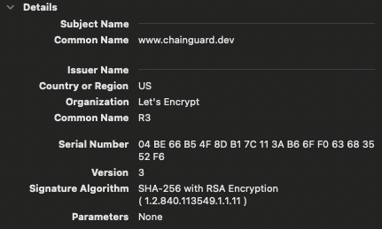
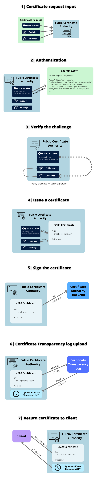

_An earlier version of this material was published in the [Fulcio chapter](https://learning.edx.org/course/course-v1:LinuxFoundationX+LFS182x+2T2022/block-v1:LinuxFoundationX+LFS182x+2T2022+type@sequential+block@2fbe6328019c4b1fbf934bd3bfb7e308/block-v1:LinuxFoundationX+LFS182x+2T2022+type@vertical+block@1f71fcbe8219471fb82e25731b18be11) of the Linux Foundation [Sigstore course](https://learning.edx.org/course/course-v1:LinuxFoundationX+LFS182x+2T2022/home)._

Fulcio is a certificate authority that binds public keys to identities such as email addresses (such as a Google account) using OpenID Connect, essentially notarizing a short-lived key pair against a particular login. A certificate authority issues digital certificates that certify that a particular public key is owned by a particular entity. The certificate authority therefore serves as a trusted third party, helping parties that need to attest and verify identities.

By connecting their identity to a verified email or other unique identifier, Fulcio enables software developers to confirm certain credentials associated with themselves. Developers can attest that they truly did create their signed artifacts and later software consumers can then verify that the software artifacts they use really did come from the expected software developers.

## Certificates

A certificate is a signed document that associates a public key with an identity such as an email address. The term “document” refers to a file or any electronic representation of a paper document. That the document must be signed implies that some party uses a digital signature to certify the document. You could think of a certificate as the digital equivalent of a passport: a document from a trusted authority that links information to an identity.

Fulcio issues [X.509 certificates](https://sectigo.com/resource-library/what-is-x509-certificate). X.509 certificates are an [International Telecommunication Union (ITU)](https://www.itu.int/en/about/Pages/default.aspx) standard that defines the format of public keys, and they are commonly used in many internet protocols, such as those that enable HTTPS. These certificates are what bind a given identity to a public key by using a digital signature.

Below is an example of an X.509 certificate used to authenticate a secure website connection.

## Certificate Authority

You rely on certificate authorities every time you open a browser and make a connection to a website. These certificate authorities, such as Let’s Encrypt, sign certificates that link a particular domain with a particular public key, allowing users to use HTTPS securely, knowing that a malicious third party is not pretending to be the real website. When a user visits a website, the user’s browser checks that a certificate authority trusted by the browser vouches for that certificate.

As a certificate authority, Fulcio operates analogously to the certificate authorities that are responsible for web encryption. Fulcio does not, however, tie website domains to public keys. Instead, Fulcio creates and signs certificates that bind together email addresses and public keys. Binding an email address and public key is critical to how Sigstore works. Software developers want to attest that they were indeed responsible for publishing a particular software artifact. Fulcio lets these developers issue claims associated with their public identity. As a result, software consumers can later check the end-to-end integrity of the software artifacts they consume and know that this artifact was indeed created by the party that claims to have produced that artifact.

To return to the digital passport metaphor, each national government, the entities that issue passports, is equivalent to a certificate authority.

## OpenID Connect (OIDC) Tokens

[OpenID Connect](https://auth0.com/docs/authenticate/protocols/openid-connect-protocol) (or OIDC) is a protocol that enables authentication without the service provider having to store and manage passwords. Authentication refers to establishing that the person operating an application or using a browser is who they claim to be. Allowing the service, like Sigstore, to rely on OIDC means that the service transfers responsibility of authenticating the subject to other OIDC providers like GitHub, Google, and Microsoft, solving the key management issues that many online service providers prefer to avoid.

The use of the OIDC protocol by Sigstore means that a user can rely on workflows they are already familiar with, such as logging into Google, in order to prove their identity. The OIDC “provider” (Google in this example) then vouches on the user's behalf to Fulcio that the user is who they say they are.

Returning again to the digital passport metaphor, the OIDC protocol is similar to how a passport can be used at an airport to prove your identity. The airport did not issue the passport (that is, the certificate) but it trusts the proof provided via the certificate.

## How Fulcio Issues Certificates

The user initiates a login to Fulcio using an OIDC provider such as GitHub, Google, or Microsoft. The user and an OIDC provider (for instance, GitHub) then engage in the OIDC protocol where the user logs in to GitHub to prove their identity. The OIDC provider, if the login is successful, returns an “access token,” which proves to Fulcio that the user controls the email address they claim to control. Fulcio then creates a certificate and timestamps it, returning the timestamp to the user and placing the certificate in the Rekor transparency log too.

The process described above, in reality, can be decomposed into even more steps. For a full understanding with helpful diagrams, consult the [Fulcio documentation](https://github.com/sigstore/fulcio/blob/main/docs/how-certificate-issuing-works.md).

## The Purpose and Contributions of Fulcio

The main task of Fulcio is to link public keys to email addresses. The detailed explanation earlier simply elaborates on how Fulcio binds public keys to email addresses.

Why bind public keys to email addresses? Because third parties want to verify that an artifact was signed by the person who claimed they signed the artifact. Fulcio acts as a trusted party that vouches on behalf of its users that a certain user proved their identity at a certain time.

This timestamping is an essential part of the process. The timestamp proves that the signing happened at a particular time and it creates a short time window (about 20 minutes) for the user to sign the artifact that they are signing. A verifying party then needs to check that the artifact they are verifying was not only signed by the party that claims to have signed the artifact, but also that it was done within a valid time window.
