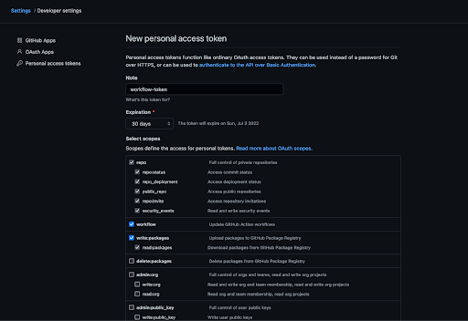
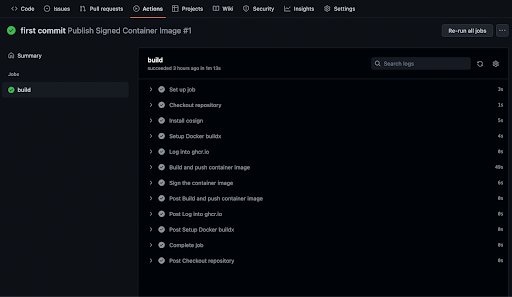

_An earlier version of this material was published in the [lab in chapter 5](https://learning.edx.org/course/course-v1:LinuxFoundationX+LFS182x+2T2022/block-v1:LinuxFoundationX+LFS182x+2T2022+type@sequential+block@5fb8482a3b764ce0903e2c424842d32f/block-v1:LinuxFoundationX+LFS182x+2T2022+type@vertical+block@2e3388391d6040f5beb5bacbf19f96f5) of the Linux Foundation [Sigstore course](https://learning.edx.org/course/course-v1:LinuxFoundationX+LFS182x+2T2022/home)._

This tutorial will bring some of the components of Sigstore together in an example project. In this demonstration, we’ll be using GitHub Actions to perform keyless signing on a sample container. In this example, we’ll use a Django container that displays a generic “Hello, World” style landing page. Django is a Python web framework.

## Prerequisites

You should have the following in place before continuing:

* The latest version of [Docker](https://docs.docker.com/get-docker/) and [Docker Compose](https://docs.docker.com/compose/install/) installed, and an account on Docker Hub. At the time of writing (June 2022), Docker Engine should be version 20.10 and Docker Compose should be version 2.6. If you are on macOS, you will need to use [Docker Desktop; refer to the official documentation](https://docs.docker.com/desktop/) for your operating system to ensure that your system meets the necessary requirements. Docker Desktop should be version 4.8 or higher.
* Cosign installed, follow [How to Install Cosign](/open-source/sigstore/cosign/how-to-install-cosign).
* The Rekor CLI installed, follow the [installation guide](/open-source/sigstore/rekor/how-to-install-rekor/)
* Familiarity with Git, GitHub, and GitHub Actions is helpful, but we'll provide some context and also walk you through setting up a GitHub account.

With these prerequisites in place, let's begin. 

## Sign up for GitHub

To create a GitHub account, navigate to https://github.com/join and fill in a valid username, email address, and password. For a username, you may want to think about whether you want a name that represents your name, or a more anonymous one. You may want to click off the email marketing box. You should also verify your account.

GitHub provides additional documentation on [signing up for an account](https://docs.github.com/en/get-started/signing-up-for-github/signing-up-for-a-new-github-account). You’ll be using a [free personal account](https://github.com/pricing) to work with GitHub.

If you are not familiar with Git and GitHub, you can review the official GitHub official docs on [About Git](https://docs.github.com/en/get-started/using-git/about-git). We will walk you through the relevant commands in this section.

[GitHub Actions](https://docs.github.com/en/actions) can perform CI/CD on your repository. You can learn more about GitHub Actions through the official GitHub docs. We will walk you through the relevant files here.

## Create a GitHub Repository

When you are logged into GitHub, create a new repository by clicking on the **+** button in the upper right-hand corner of the page (next to your user icon). The menu will drop down and you can select **New repository**. 

On the Create a new repository page, you can create a repository, you can leave the defaults, but write a meaningful name for the Repository name field, such as django-keyless-signing. Note that you’ll need to keep the repository public so that the signed image you build will be able to be uploaded to Rekor’s public transparency log. 

## Create a Local Directory for the Repository

Now, you’ll need to create a local directory for this repository. For our example, we’ll want our path to be `~/Documents/GitHub/django-keyless-signing`, but you can choose an alternate path. Create the GitHub directory if necessary, and then navigate into that folder.

```sh
cd ~/Documents/GitHub
```

Within the GitHub folder, create the new directory for your repository, and move into it. 

```sh
mkdir django-keyless-signing && cd $_
```

You’ll be making a few files in this directory that you’ll then push up to the GitHub repository.

## Create Django Container Files

First, create a `requirements.txt` file for your Django container. This is a common file in Python projects that you can run to get the necessary dependencies at the right versions. The Django Docker container will pull from this file to set up the image.

You need the Django package, and Psycopg, which is a PostgreSQL database adapter for Python.

Create your file with a text editor like nano.

```sh
nano requirements.txt
```

Once the file is open, write the following into it to set and pin your dependencies. 

```
Django>=3.0,<4.0
psycopg2>=2.8
```

Save and close the file.

Next, create your `Dockerfile`, again with a text editor like nano.

```sh
nano Dockerfile
```

Within this file you will set up the version of Python, the environments, and tell the container to install the dependencies in `requirements.txt`. 

```js
# syntax=docker/dockerfile:1
FROM python:3
ENV PYTHONDONTWRITEBYTECODE=1
ENV PYTHONUNBUFFERED=1
WORKDIR /code
COPY requirements.txt /code/
RUN pip install -r requirements.txt
COPY . /code/
```

Once you are satisfied that your `Dockerfile` reflects the content above, you can save and close the file.

Finally, you’ll create a `docker-compose.yml` file. This file allows you to document and configure all of your application’s service dependencies. If you would like to read more about [Docker Compose](https://docs.docker.com/compose/), please refer to the official Docker documentation. 

Again, use nano or similar text editor to create your file. 

```sh
nano docker-compose.yml
```

You can add the following contents to this file. This sets up the environment and Postgres database, and can build the web server on port 8000 of the present machine. 

```js
version: "3.9"
   
services:
  db:
    image: postgres
    volumes:
      - ./data/db:/var/lib/postgresql/data
    environment:
      - POSTGRES_DB=postgres
      - POSTGRES_USER=postgres
      - POSTGRES_PASSWORD=postgres
  web:
    build: .
    command: python manage.py runserver 0.0.0.0:8000
    volumes:
      - .:/code
    ports:
      - "8000:8000"
    environment:
      - POSTGRES_NAME=postgres
      - POSTGRES_USER=postgres
      - POSTGRES_PASSWORD=postgres
    depends_on:
      - db
```

At this point, your Django container is set up. You can run the `tree` command to review the file structure. Note, `tree` may not come automatically installed on your machine; use your package manager to install it if you would like to run this optional command. 

```sh
tree
```

```
.
├── Dockerfile
├── docker-compose.yml
└── requirements.txt

0 directories, 4 files
```

If your output matches the output above, you are all set to continue.

## Steps to Automate Keyless Signing

We next create a GitHub Actions YAML file. There is some boilerplate in this file common to GitHub Actions, but the high-level overview of this is that we need to enable OIDC, install Cosign, build and push the container image, and then sign the container image.

We’ll discuss each of these steps here, and then write the entire file in the next section. 

After a cron job to automate the Actions, your first step will be to enable GitHub Actions OIDC tokens. Fulcio is a free root certificate authority that issues certificates based on an OIDC email address. This is essentially enabling the certificate step of our action. 

The key piece here is `id-token: write`, which you will have under `build` and under `jobs` in your Actions workflow. 

```js
jobs:
  build:

    runs-on: ubuntu-latest
    permissions:
        contents: read
        packages: write
        id-token: write
```

The rest of this build is telling us that the container is running on the latest version of Ubuntu, that the contents are to be read, and the packages are to be written. 

The `id-token: write` line enables our job to create tokens as this workflow. This permission may only be granted to workflows on the main repository, so it cannot be granted during pull request workflows. You can learn more about GitHub Actions’s OIDC support from their document on “[Security hardening your deployments](https://docs.github.com/en/actions/deployment/security-hardening-your-deployments/about-security-hardening-with-openid-connect#updating-your-actions-for-oidc).”

The next major part of this YAML file is installing Cosign. 

```js
      - name: Install cosign
          uses: sigstore/cosign-installer@main
```

Cosign is available through the [GitHub Action Marketplace](https://github.com/marketplace/actions/cosign-installer), which is why we can add it to our GitHub Action as above. 

You can pin your workflow to a particular release of Cosign. For example, here you will use version 2.1.1.

```js
      - name: Install cosign
          uses: sigstore/cosign-installer@main
            with:
             cosign-release: 'v2.1.1'
```

After this step, there will be some actions to setup the Docker build, log into the GitHub Container Registry, and build and push the container image. The next piece that is most relevant to our work with Sigstore is signing the container image.

```js
      - name: Sign the container image
          run: cosign sign --yes ghcr.io/${{ github.repository }}@${{ steps.push-step.outputs.digest }}
```

Here you’ll run the `cosign sign` command on the container we are pushing to GitHub Container Registry with the relevant variable calling our repository and digest. 

Because we are doing a public repository, this will automatically be pushed to the public instance of the Rekor transparency log

Now that you understand the main pieces of the YAML file, let’s create it and review the contents of the entire file.

## Create GitHub Actions File

You’ll next create a hidden directory called `.github` and a subdirectory called workflows. Ensure that you are in your `django-keyless-signing` and create these two directories.

```sh
mkdir .github && cd $_
mkdir workflows && cd $_
```

Within this directory, you’ll be creating a YAML file to run a GitHub Action Workflow.

```sh
nano docker-publish.yml
```

This is how we will be building, publishing, and signing the container. We will start by naming it **Publish and Sign Container Image** and then will set up a scheduled cron job for continuous running, and also when there is a push to the main branch or pull request that is merged into the main branch. 

The rest of the file will follow what we discussed in the previous section. 

```js
name: Publish and Sign Container Image

on:
  schedule:
    - cron: '32 11 * * *'
  push:
    branches: [ main ]
    # Publish semver tags as releases.
    tags: [ 'v*.*.*' ]
  pull_request:
    branches: [ main ]

jobs:
  build:

    runs-on: ubuntu-latest
    permissions:
      contents: read
      packages: write
      id-token: write

    steps:
      - name: Checkout repository
        uses: actions/checkout@v2

      - name: Install cosign
        uses: sigstore/cosign-installer@main
        with:
          cosign-release: 'v1.4.1'

      - name: Setup Docker buildx
        uses: docker/setup-buildx-action@v2

      - name: Log into ghcr.io
        uses: docker/login-action@master
        with:
          registry: ghcr.io
          username: ${{ github.actor }}
          password: ${{ secrets.GITHUB_TOKEN }}

      - name: Build and push container image
        id: push-step
        uses: docker/build-push-action@master
        with:
          push: true
          tags: ghcr.io/${{ github.repository }}:latest

      - name: Sign the container image
        run: cosign sign ghcr.io/${{ github.repository }}@${{ steps.push-step.outputs.digest }}
```

Now, your demo Django container project is complete and ready for GitHub Actions to run on it. 

Verify that your project is configured correctly. Run the `tree` command with the `-a` flag from your project’s root directory to view invisible directories. 

```sh
cd ~/Documents/GitHub/django-keyless-signing
tree -a
```

```
.
├── .github
│   └── workflows
│       └── docker-publish.yml
├── Dockerfile
├── docker-compose.yml
└── requirements.txt

2 directories, 4 files
```

If your setup matches, we can proceed.

## Generate GitHub Personal Access Token

In order to use GitHub on the command line and run GitHub Actions, you’ll need a personal access token. 

In your web browser, navigate to https://github.com/settings/tokens in order to set those up. 

You’ll click on the **Generate new token** button and fill out the form on the next page.

Fill in the Note field about what the token is for, the 30 days expiration is adequate, and you’ll need to select the **repo**, **workflow**, and **write:packages** scopes, as indicated in the screenshot below. 



With this filled out, you can click on the green **Generate token** button at the bottom of the page and then your token will display on the page.

_Be sure to copy this token_; you won’t have access to it again. You’ll be using this token to authenticate on the command line.

## Initialize Git Repository and Push Changes

From your local repository of `django-keyless-signing` you will be initializing your repository to use with Git. 

```sh
git init
```

Next, you will add the files you created to the Git stage. 

```sh
git add .github Dockerfile docker-compose.yml requirements.txt
```

At this point, you can check that your Git stage is all set for committing and then pushing your changes to the remote GitHub repository. 

```sh
git status
```

```
On branch main

No commits yet

Changes to be committed:
  (use "git rm --cached <file>..." to unstage)
    new file:   .github/workflows/docker-publish.yml
    new file:   Dockerfile
    new file:   docker-compose.yml
    new file:   requirements.txt
```

The output indicates that changes are ready to be committed. You will now commit with a message, as in the next command.

```sh
git commit -m "first commit"
```

```
[main (root-commit) 301800b] first commit
 4 files changed, 93 insertions(+)
 create mode 100644 .github/workflows/docker-publish.yml
 create mode 100644 Dockerfile
 create mode 100644 docker-compose.yml
 create mode 100644 requirements.txt
```

Now, set up the main branch as main.

```sh
git branch -M main
```

So far we have not connected to the remote repository. You should add that repository now. This will be the URL for your repository plus `.git` at the end. Ensure that you replace `github-username` with your actual username on GitHub.

```sh
git remote add origin https://github.com/github-username/django-keyless-signing.git
```

With this set up, you’ll be able to push your changes to the remote repository that’s hosted on GitHub. 

```sh
git push -u origin main
```

With this command, you will be prompted to enter your GitHub username and the GitHub personal access token. In the first prompt, enter your GitHub username, where it reads `Username`. In the second prompt, where it reads `Password`, enter your personal access token, _not your GitHub password_. 

Username for 'https://github.com': 
Password for 'https://github-username@github.com':

Once you enter these, you’ll receive output that your changes were committed to the remote repository. 

```
Enumerating objects: 8, done.
Counting objects: 100% (8/8), done.
Delta compression using up to 10 threads
Compressing objects: 100% (5/5), done.
Writing objects: 100% (8/8), 1.62 KiB | 1.62 MiB/s, done.
Total 8 (delta 0), reused 0 (delta 0), pack-reused 0
To https://github.com/github-username/django-keyless-signing.git
 * [new branch]      main -> main
branch 'main' set up to track 'origin/main'.
```

With this complete, you can navigate to the URL of your GitHub repository.

## Confirm Keyless Signing via GitHub Actions

With your repository set up, you can move to the **Actions** tab of your GitHub repository.

Here, you’ll be able to inspect the workflows that have run. Since there is only one workflow in this repo, you can inspect the one for `first commit`. 

Here, a green checkmark and **build** will be displayed on the page under `docker-publish.yml`. This action ran when you pushed your code into the repository. You can click on **build** and inspect the steps of the action. 

Your page will appear similar to the following. Ensure that your action ran and that your output is similar.



From here, you can click into each step of the build process and dial in further. Click into **Sign the container image**.

This will dropdown and provide you with more information, like so.

```
Run cosign sign ghcr.io/github-username/django-keyless-signing@sha256:a53e24bd4ab87ac4764fb8736dd76f388fd2672c1d372446c9a2863e977f6e54
Generating ephemeral keys...
Retrieving signed certificate...
client.go:196: root pinning is not supported in Spec 1.0.19
Successfully verified SCT...
tlog entry created with index: XXXXXXX
Pushing signature to: ghcr.io/github-username/django-keyless-signing
```

This provides a bit of information, including the SHA, the Rekor log index number (as indicated by `tlog entry created with index`), and the URL of the container that the signature was pushed to.

You can also inspect the image itself under **Packages** on the main page of your repository. If you would like, you can pull down the Docker image. This is not necessary for our next step, where we will check that the signature was signed and that the signature is in the Rekor transparency log.

## Verify Signatures

With your container signed by Cosign keyless signing in GitHub Actions, you next need to verify that everything worked as expected and that the container is indeed signed, and that an entry for that was generated in Rekor. 

You can do that by using the `cosign verify` command against the published container image. 

```sh
cosign verify ghcr.io/github-username/django-keyless-signing \
  --certificate-identity https://github.com/github-username/django-keyless-signing/.github/workflows/docker-publish.yml@refs/heads/main \
  --certificate-oidc-issuer https://token.actions.githubusercontent.com | jq
```

Your output should be similar to the following, though note that the strings are abbreviated.

```
Verification for ghcr.io/github-username/django-keyless-signing:latest --
The following checks were performed on each of these signatures:
  - The cosign claims were validated
  - Existence of the claims in the transparency log was verified offline
  - Any certificates were verified against the Fulcio roots.
[
  {
    "critical": {
      "identity": {
        "docker-reference": "ghcr.io/github-username/django-keyless-signing"
      },
      "image": {
        "docker-manifest-digest": "sha256:a4aa08ce4593"
      },
      "type": "cosign container image signature"
    },
    "optional": {
      "Bundle": {
        "SignedEntryTimestamp": "8XFlAArYeA",
        "Payload": {
          "body": "E5ha0V5VFVSTmVFNXFSWGROUkZwaFJuY3dlVTFxUVRKTlJFMTRUbXBKZDAxRVZtRk5",
          "integratedTime": 1654272608,
          "logIndex": XXXXXXX,
          "logID": "a4aa08ce4593"
        }
      },
      "Issuer": "https://token.actions.githubusercontent.com",
      "Subject": "https://github.com/github-username/django-keyless-signing/.github/workflows/docker-publish.yml@refs/heads/main"
    }
  }
]
```

You can also review the log on Rekor by using the logIndex as above, which matches the `tlog entry created with index` you found in the output from the GitHub Actions.

You can use either `verify` or `get` with the Rekor CLI. In the first case, your command will be formatted like so and provide a lot of output with a full inclusion proof. Note that this output is abbreviated. Substitute the Xs in the command for your log index number. 

```sh
rekor-cli verify --rekor_server https://rekor.sigstore.dev --log-index XXXXXX
```

```
Current Root Hash: 1ce1a05f2ec146e503d78649c093
Entry Hash: e739fb04525a9e8a0d590b9f944714ce469c
Entry Index: XXXXXX
Current Tree Size: 2251200

Inclusion Proof:
SHA256(0x01 | 3742364ed095572728c5c4c6abcc55cda3111833bb01260b6dfd50ce0214bbfe | b0f3127874d6ce2ca520797f4ab9e739fb04525a9e8a0d590b9f944714ce469c) =
    b94433c839343e37b42cdf2281731571971202c77defdae51a6c386a4d1bfb7b
…
SHA256(0x01 | efb36cfc54705d8cd921a621a9389ffa03956b15d68bfabadac2b4853852079b | 5a35a58d7624edfb9adf6ea9f0cbed558f5e5d45ca91acb5243757d72f1b2454) =
    2c0c0e511e071ab024da0ebd89f67b39ae7a1ce1a05f2ec146e503d78649c093
```

In the second instance, you’ll receive JSON formatted output. Note the output here is abbreviated. Substitute the Xs in the command for your log index number. 

```sh
rekor-cli get --rekor_server https://rekor.sigstore.dev --log-index XXXXXX
```

```
LogID: c0d23d6ad406973f9559f3ba2d1ca01f84147d8ffc5b8445c224f98b9591801d
Index: XXXXXXX
IntegratedTime: 2022-06-03T17:12:38Z
UUID: 0d590bf944714ce469c
Body: {
  "HashedRekordObj": {
    "data": {
      "hash": {
        "algorithm": "sha256",
        "value": "abb1bef9a31c634cfc"
      }
    },
    "signature": {
      "content": "RxAva1EnlCS5AIhAN",
      "publicKey": {
        "content": "jeTlvWldGa2N5OXRZV2x1TUM0fNpc0dBUVFCZzc4d0FRUUVJRkIxWW14cGMyZ2cKWVc1"
      }
    }
  }
}
```

Congratulations! You have signed a container with Cosign through GitHub Actions by using OIDC through Fulcio, and can verify this on the Rekor log.


