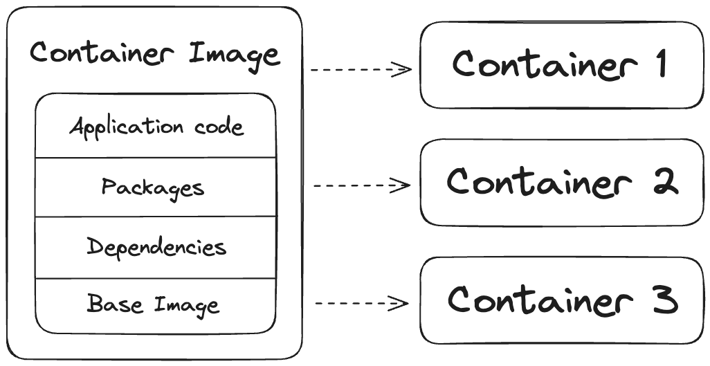
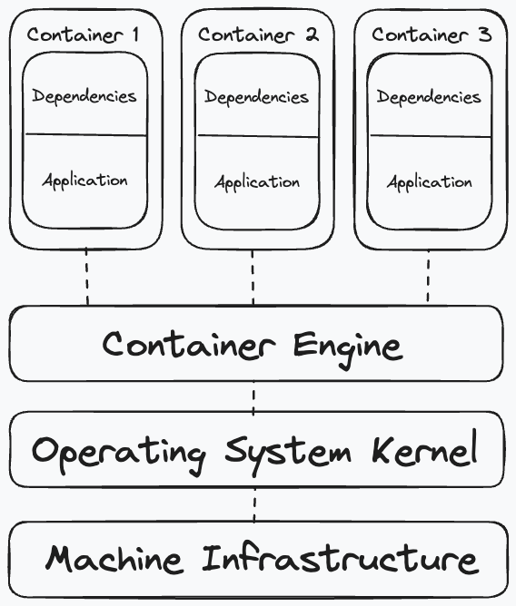

For decades, developers have sought out ways to maximize the utilization of their hardware. Dating back to the 1960s, virtual machines (VMs) were an early answer to this challenge, allowing a single computer to host multiple, isolated operating systems. VMs enable different guest users or processes to share physical infrastructure while keeping their concurrent operations separated. However, as VMs are both slow to initialize and resource-intensive, a modern solution arrived in the early 2000s: containers.

*Containers* share a common *kernel* with each other, whereas multiple VMs each require their own virtual kernel. The kernel resides at the core of an operating system and facilitates activities between hardware and software. By sharing a kernel, containers run concurrently using the same infrastructure, providing the isolation benefits of VMs without added resource taxation. Containers have become increasingly popular for their relative ease of use, reproducibility, and portability in deploying applications across systems for a low resource cost.

In this article, you will explore the structure of *container images*, the foundational unit behind containers, such as their key contents and the processes used to construct them. In addition, you will learn how containers operate on top of their container engine and associated infrastructure. You will also learn how to get started with using containers, including building, choosing and deploying container images for your applications.

## Structure of a Container Image

In order to build a container for your application, you will need to start with a *container image*. A container image is a static, immutable filesystem bundle that serves as a blueprint you can use to build containers. Inside every container image is a curated collection of the files, dependencies and code needed to run an application. At runtime, when a container is built from an image, the resultant container inherits all characteristics of the container image it is instantiated from.
<!-- Place a graphic here showing the result of instantiating a container -->

To start creating a container image, first, a *base image* must be selected. A base image is a foundational image that can be built upon through the addition of image *layers*. Typically, base images come pre-bundled with a specific Linux distribution. Every distribution differs in its size, dependencies, and functionality, making certain distributions better suited for certain images over others.

Once a base image has been selected, introducing tailored functionality (such as your application-specific code or dependencies) to the image can be done in a few different ways. Many developers today use [Docker](https://www.docker.com/), a tool used to deploy containerized applications, which ingests a [*Dockerfile*](https://docs.docker.com/engine/reference/builder/), a machine-readable configuration document containing the instructions to assemble an image with multiple layers. Aside from Dockerfiles, tools such as [apko](/open-source/apko/overview/) and [ko](https://github.com/ko-build/ko) can be used to build images, though they produce images using a single-layer construction method. 

For example, say you want to build a container to run your Python application. You can start your container image with a Python base image, such as a [Wolfi-based image](/open-source/wolfi/wolfi-with-dockerfiles/). Then, you can add your application and its relevant dependencies to the image through the layers in a Dockerfile. The resultant image is now ready to be deployed with your application bundled inside.

## Instantiating Containers

Once you have selected or assembled a container image for your application, you will use it to instantiate a running container. Deploying live containers from an image requires the use of a *container engine*, which is the software that allows for the hosting of multiple containers on one shared machine. [Docker Engine](https://docs.docker.com/engine/) is a prominent example of a container engine.

A container engine communicates with the kernel of the operating system it is being run on. Within a container engine, multiple containers run independently of each other. These containers are composed of the code, dependencies, and configurations of their parent images. The following graphic depicts this hierarchical relationship between containers and the container engine.

<!--  -->
<!-- Replace with a different, colored graphic later -->

## Getting Started with Containers

Depending on your applications, you may not need to build your own container images from scratch. Instead, you can pull a container image from a *container registry*. Container registries are centralized repositories with images available to be pulled. A popular container registry, [Docker Hub](https://hub.docker.com/), hosts hundreds of thousands of open source container images that can be pulled and used. Other container registries include the [GitHub Container Registry](https://docs.github.com/en/packages/working-with-a-github-packages-registry/working-with-the-container-registry), the [Google Container Registry](https://console.cloud.google.com/marketplace/product/google-cloud-platform/container-registry), and the [Chainguard Registry](https://console.enforce.dev/auth/login). Our [Chainguard Registry](/chainguard/chainguard-registry/overview/) offers a free public catalog of secure, minimal base images that provide a foundation for containerizing your applications.

There are many factors to consider when choosing a container image for deploying your applications. At minimum, your container image will need to have the core packages and components required to support your programs. However, with thousands of options to choose from, some images will be better for your use case than others. Choosing a container image that offers security and reliability in addition to core functionality is important. Some images may contain multitudes of unneeded components and packages, thus unnecessarily contributing to your data egress and vulnerability counts.

To learn more about choosing a container image that is right for your applications, check out our article on [selecting a base image](/software-security/selecting-a-base-image/).

## Learn More

As container technology grew in popularity, developers sought a way to standardize the format of images within the container industry. Thus, in 2015, the [Open Container Initiative (OCI)](https://opencontainers.org/) was founded to address these growing concerns by setting forth adoptable standards for image formats, runtimes, and distributions. Choosing OCI compliant images for your workloads can ensure the portability of your containers where OCI images are supported. To learn more about the OCI and their various image specifications, check out our article titled ["What is the Open Container Initiative?"](/open-source/oci/what-is-the-oci/).

In this article, you learned about the basics of container technology, including the processes behind building container images tailored to your specific needs. You learned about how you can deploy containers from images using a container engine. To get started with using containers for the first time, check out our documentation on [Chainguard Images](/chainguard/chainguard-images/), our hardened, minimal images ideal for deploying secure containerized applications. If you want to build your own images, check out [Wolfi](/open-source/wolfi/), the Linux undistro ideal as a base of lightweight containers.
