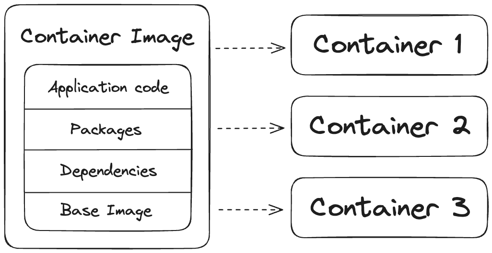
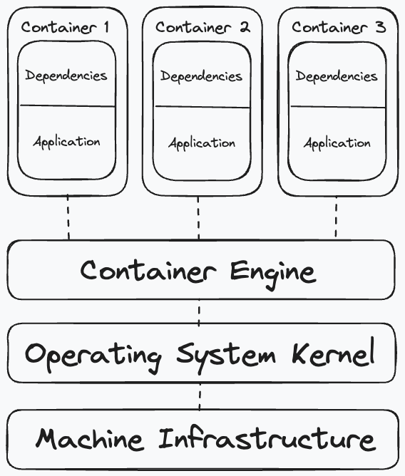

Maximizing the performance of computer hardware has been a critical undertaking for software engineers for decades. First developed in the 1960s, virtual machines (VMs) were an early answer to this challenge, allowing a single computer to host multiple, isolated operating systems. VMs enable different guest users or processes to share physical infrastructure while keeping their concurrent operations separated. However, as VMs are both slow to initialize and resource-intensive, a modern solution arrived in the early 2000s: containers.

*Containers* share a common *kernel* with each other, whereas multiple VMs each require their own virtual kernel. The kernel resides at the core of an operating system and facilitates activities between hardware and software. By sharing a kernel, containers run concurrently using the same infrastructure, providing the isolation benefits of VMs without added resource overhead. Containers have become increasingly popular for their ease of use, reproducibility, and portability in deploying applications across systems at a low resource cost. The [Open Container Initiative (OCI)](/open-source/oci/what-is-the-oci/) defines the open standards for image formats, runtimes, and distribution that make this portability possible.

This article explores the structure of *container images*, the foundational unit behind containers, including their key contents and how they're built. You'll learn how containers operate on top of a container engine and how to choose, build, and deploy container images for your applications.

## Structure of a container image

To build a container for your application, start with a *container image*. A container image is a static, immutable filesystem bundle that serves as a blueprint for building containers. Inside every container image is a curated collection of the files, dependencies, and code needed to run an application. At runtime, a container built from an image inherits all characteristics of that image.

To create a container image, select a *base image*. A base image is a foundational image that you extend by adding image *layers*. Typically, base images include a Linux distribution, though minimal or distroless images omit the full userland to reduce size and attack surface. Each distribution differs in its size, dependencies, and functionality, making certain distributions better suited for certain images than others.

After selecting a base image, you add layers containing your application-specific code and dependencies. Tools such as [Docker](https://www.docker.com/) and [Podman](https://podman.io/) ingest a [*Dockerfile*](https://docs.docker.com/reference/dockerfile/), a configuration file that specifies the instructions to assemble a multi-layer image. You can also use tools such as [apko](/open-source/apko/overview/) and [ko](https://github.com/ko-build/ko), which produce images using a single-layer construction method.

For example, say you want to build a container to run your Python application. You can start with a Python base image, such as a [Wolfi-based image](/open-source/wolfi/wolfi-with-dockerfiles/), then add your application and its dependencies through Dockerfile layers. The resulting image is ready to deploy with your application bundled inside.

## Instantiating containers

Once you have a container image, use it to start a running container. Doing so requires a *container engine*, software that hosts multiple containers on a shared machine. [Docker Engine](https://docs.docker.com/engine/), [Podman](https://podman.io/), and [containerd](https://containerd.io/) are common examples.

A container engine communicates with the host operating system's kernel. Within a container engine, multiple containers run independently of each other, each carrying the code, dependencies, and configuration of its parent image. The following diagram shows this hierarchical relationship.

## Getting started with containers

Depending on your application, you may not need to build your own container images from scratch. Instead, you can pull a container image from a *container registry*, a centralized repository of images. [Docker Hub](https://hub.docker.com/) hosts hundreds of thousands of open source images. Other registries include the [GitHub Container Registry](https://docs.github.com/en/packages/working-with-a-github-packages-registry/working-with-the-container-registry), the [Google Artifact Registry](https://cloud.google.com/artifact-registry/docs), and the [Chainguard Registry](/chainguard/chainguard-registry/overview/), which offers a free public catalog of secure, minimal base images.

When choosing a container image, consider more than just core functionality. Your image must include the packages and components your application needs, but images with many unneeded packages increase your data egress and vulnerability counts. Prefer images that balance security and reliability with a minimal footprint.

To learn more, see [Selecting a base image](/software-security/selecting-a-base-image/).

## Learn more

To get started, see [Chainguard Containers](/chainguard/chainguard-images/), hardened minimal images for secure containerized applications. To build your own images, see [Wolfi](/open-source/wolfi/), a Linux undistro designed as a base for lightweight containers. To understand the standards that govern container image formats, runtimes, and distribution, see [What is the Open Container Initiative?](/open-source/oci/what-is-the-oci/).
